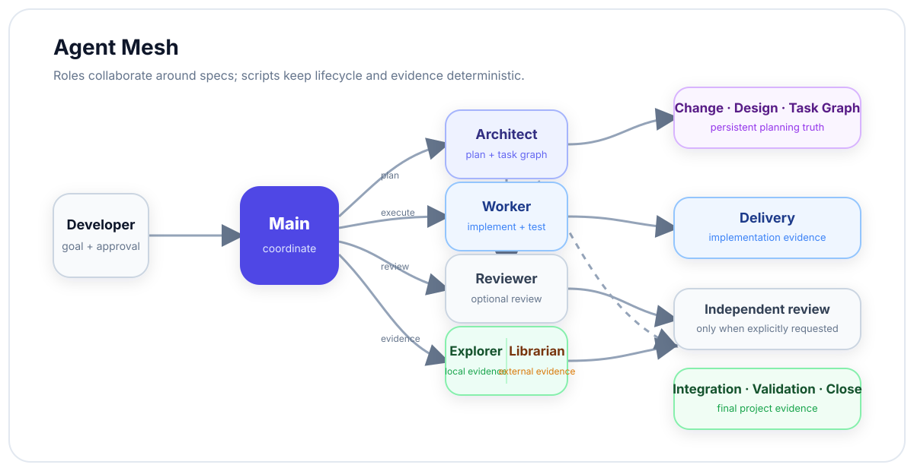

<div align="center">

# Open Spec Mesh

**Spec-Driven Multi-Agent Development**

Specs define the truth. Agents plan and execute. Scripts enforce state.

[English](README.md) · [简体中文](README.zh-CN.md)

[](docs/index.md)
[](AGENTS.md)
[](scripts/sdd_validate.py)

</div>

---

Open Spec Mesh is a lightweight **Spec-Driven Development framework for multi-agent software engineering**.

It keeps the model focused on semantic work—understanding, design, implementation and review—while deterministic scripts own lifecycle state, task contracts, evidence, validation and recovery.

## Why Open Spec Mesh?

| Principle | What it means |
| --- | --- |
| **Spec first** | Change, Design and Task contracts are the persistent source of truth. |
| **Agent mesh** | Main, Architect, Worker, Reviewer, Explorer and Librarian collaborate by responsibility—not by a rigid pipeline. |
| **Human-readable** | Documents are written for review first; machine state stays small and explicit. |
| **Deterministic control** | Scripts enforce state transitions, contract drift, workspace boundaries and validation receipts. |
| **Lean by default** | Quick work stays quick. SDD is used when durable planning or independent execution actually helps. |
| **Evidence over claims** | Delivery, acceptance and closeout are tied to real revisions, tests and generated evidence. |

## Two execution modes

<table>
<tr>
<td width="50%" valign="top">

### ⚡ Quick

For work that one Main agent can complete continuously.

- implement directly
- test and self-review
- use Explorer / Librarian only when evidence is missing
- no Change or Task ceremony

</td>
<td width="50%" valign="top">

### 🕸️ SDD

For work that needs durable planning or independent execution.

- Architect produces the complete plan first
- Task Graph captures dependencies
- Workers implement isolated Tasks
- Main integrates and performs final validation

</td>
</tr>
</table>

## The mesh

<picture>
  <source media="(prefers-color-scheme: dark)" srcset="assets/agent-mesh-dark.svg">
  
</picture>

**Main coordinates. Architect owns SDD planning. Workers own implementation. Scripts own mechanics.**

## SDD flow

```text
Change
  ↓
Design
  ↓
Task Graph + Task Designs
  ↓
Freeze
  ↓
Worker execution
  ↓
Delivery
  ↓
Integration waves
  ↓
Current Truth sync
  ↓
Full validation
  ↓
Close / Release
```

The Task Graph stores topology and runtime state. Human design detail stays in Markdown.

## Quick start

### Requirements

- Python 3.11+
- Git
- Linux or macOS
- Node.js 20.18.1+ / npm when installing optional research tools

### Install

```bash
./install.sh --dry-run
./install.sh
```

Useful options:

```bash
./install.sh --skip-tools
./install.sh --include-project-docs
./install.sh --with-laya
./install.sh --without-laya
./install.sh --codex-home /path/to/runtime-home
```

The installer keeps credentials outside version control and only forwards supported environment-variable names.

## Core workflow

| Stage | Entry point | Responsibility |
| --- | --- | --- |
| Plan | `sdd-change` | Change, Design, Task Graph and Task Designs |
| Execute | `sdd-do` | Workspace preparation, Worker delivery, observation |
| Close | `sdd-close` | Acceptance, revision-bound validation, archive |
| Initialize | `sdd-init` | Canonical project structure |
| Migrate | `sdd-migrate` | Safe migration from older documentation layouts |
| Research | `sdd-research` | Evidence collection |
| Diagnose | `sdd-diagnose` | Script-only diagnostic bundles |
| Release | `sdd-release` | Release checks and records |

## Contract structure

```text
C01 Change
├── goal / scope / acceptance criteria
│
C02 Design
├── Current Truth delta
├── architecture / API / domain / schema
├── main flow / sequence
└── Task relationships
│
C03 Tasks
├── Task Graph
└── Task Design + Delivery
```

A Task is split around a meaningful business capability or independently verifiable result—not merely because files overlap.

## Validation

One canonical local entry point:

```bash
python3 -B scripts/sdd_validate.py
```

Pull requests run the core validation path. Main-branch and manual full runs add compatibility, Mermaid, Docker, runtime and research-tool checks.

## Optional semantic decision layer

Open Spec Mesh can optionally use the **System One** bridge for repeated semantic decisions.

- disabled by default
- Laya is the default optional provider
- TypeSafe Jev is explicit opt-in
- decision tools provide advice only
- they never expand permissions, approve contract changes or replace acceptance

See [typesafe-laya](typesafe-laya/SKILL.md) for the protocol and template model.

## Explore the project

| Area | Start here |
| --- | --- |
| How the workflow works | [Governance](docs/01-governance/G01-sdd-workflow.md) |
| Product model | [Product modules](docs/02-product/P02-modules/P02-01-sdd-runtime.md) |
| Technical architecture | [Architecture overview](docs/03-architecture/T01-architecture-overview.md) |
| Runtime guide | [Runtime guide](sdd-init/references/runtime-guide.md) |
| Writing standards | [Document contract](sdd-init/references/document-contract.md) |
| Agent responsibilities | [AGENTS.md](AGENTS.md) |
| Operations | [Local toolkit](docs/04-operations/O02-applications/O02-01-local-toolkit.md) |
| Full project documentation | [docs/index.md](docs/index.md) |

---

<div align="center">

**Open Spec Mesh**

*Spec-Driven Multi-Agent Development*

</div>
