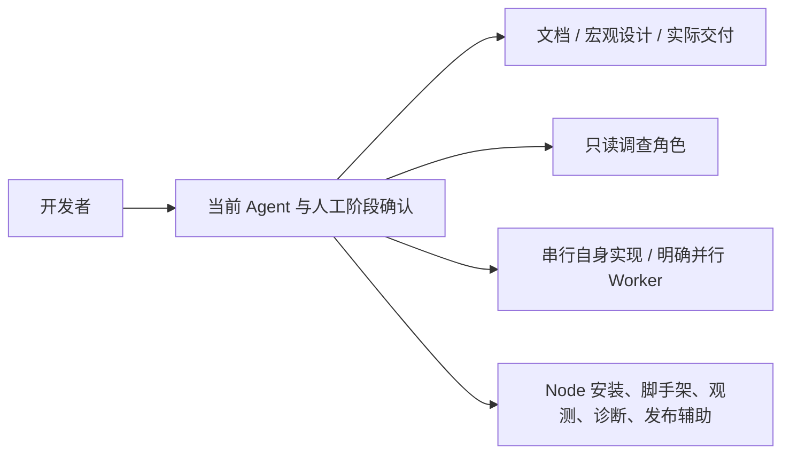

# 产品架构

```mermaid
flowchart LR
 User["开发者"] --> Agent["当前 Agent 与人工阶段确认"]
 Agent --> Docs["文档 / 宏观设计 / 实际交付"]
 Agent --> Read["只读调查角色"]
 Agent --> Code["串行自身实现 / 明确并行 Worker"]
 Agent --> Tools["Node 安装、脚手架、观测、诊断、发布辅助"]
```
