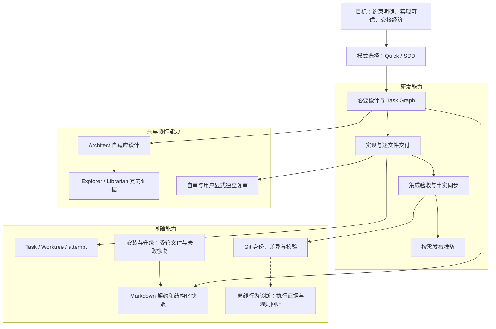

# 产品能力分层

Quick 不创建 SDD 工件，但可按需使用 Explorer / Librarian。SDD 由 Architect 先规划，设计重量由任务本身决定；Graph 就绪后 Main 才派发 Worker。Reviewer 仍只有用户明确要求时启用。

共享交付能力：[安装与升级](../P02-modules/P02-03-installation.md)；属于本地工具包，不代表新增常驻应用。
