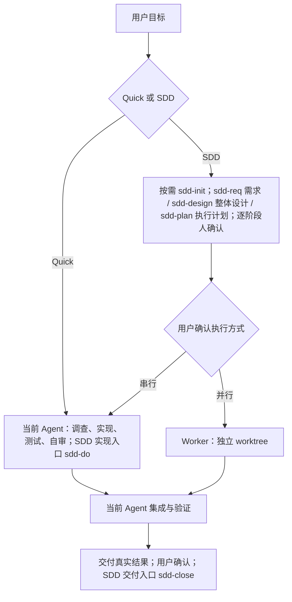

# 主用户流程

```mermaid
flowchart TD
 U["用户目标"] --> Q{"Quick 或 SDD"}
 Q -->|"Quick"| M["当前 Agent：调查、实现、测试、自审；SDD 实现入口 sdd-do"]
 Q -->|"SDD"| R["按需 sdd-init；sdd-req 需求 / sdd-design 整体设计 / sdd-plan 执行计划；逐阶段人确认"]
 R --> E{"用户确认执行方式"}
 E -->|"串行"| M
 E -->|"并行"| W["Worker：独立 worktree"]
 W --> V["当前 Agent 集成与验证"]
 M --> V
 V --> D["交付真实结果；用户确认；SDD 交付入口 sdd-close"]
```
