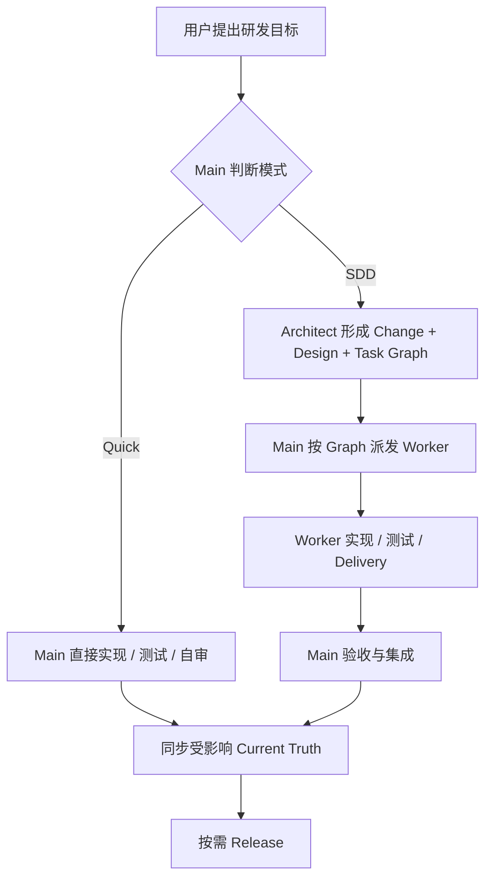

# 主用户流程

```mermaid
flowchart TD
  A[用户提出研发目标] --> B{Main 判断模式}
  B -->|Quick| C[Main 直接实现 / 测试 / 自审]
  B -->|SDD| D[Architect 形成 Change + Design + Task Graph]
  D --> E[Main 按 Graph 派发 Worker]
  E --> F[Worker 实现 / 测试 / Delivery]
  F --> G[Main 验收与集成]
  C --> H[同步受影响 Current Truth]
  G --> H
  H --> I[按需 Release]
```

Quick 不创建 Change/Task 工件；SDD 的 Task Graph 由 Architect 直接产出，Main 不二次拆分。
