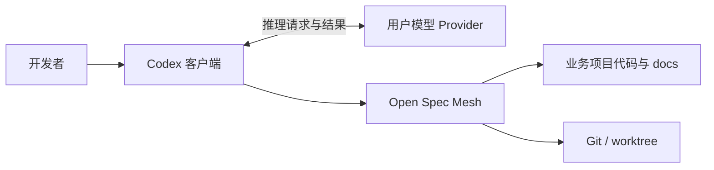

# System Context

```mermaid
flowchart LR
  User[开发者] --> Codex[Codex 客户端]
  Codex <-->|推理请求与结果| Provider[用户模型 Provider]
  Codex --> Toolkit[Open Spec Mesh]
  Toolkit --> Project[业务项目代码与 docs]
  Toolkit --> Git[Git / worktree]
```

本仓库提供本地 SDD 配置、角色、Skill 与 CLI，不提供常驻业务服务。Codex 客户端与模型 Provider 属于外部运行环境。
