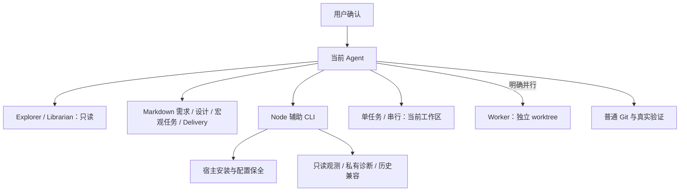

# 应用架构

```mermaid
flowchart TB
 User["用户确认"] --> Main["当前 Agent"]
 Main --> Read["Explorer / Librarian：只读"]
 Main --> Docs["Markdown 需求 / 设计 / 宏观任务 / Delivery"]
 Main --> Tools["Node 辅助 CLI"]
 Main --> Serial["单任务 / 串行：当前工作区"]
 Main -->|"明确并行"| Worker["Worker：独立 worktree"]
 Tools --> Install["宿主安装与配置保全"]
 Tools --> Evidence["只读观测 / 私有诊断 / 历史兼容"]
 Main --> Git["普通 Git 与真实验证"]
```

没有自动审批或派发状态服务。
