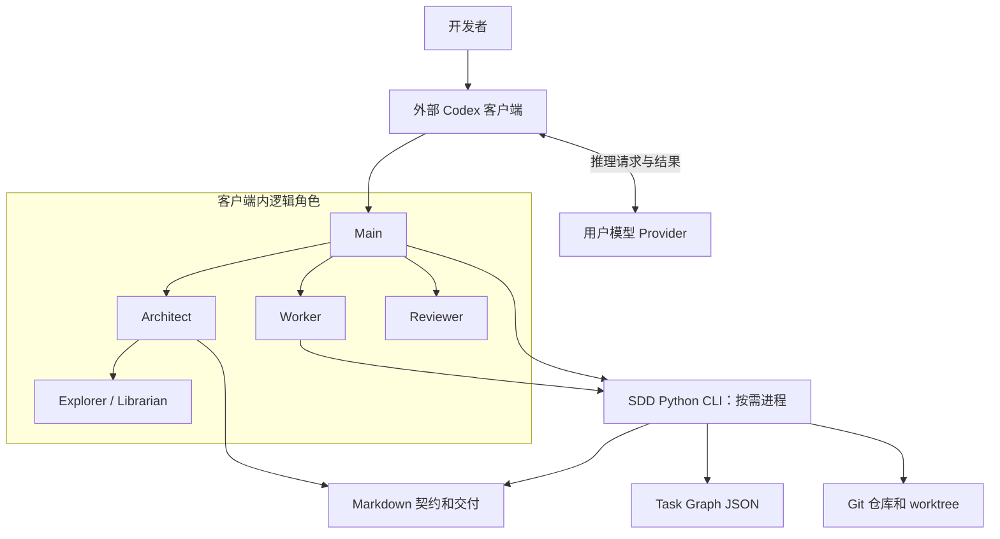

# 应用架构

```mermaid
flowchart TB
  User[开发者] --> Codex[外部 Codex 客户端]
  subgraph Roles[客户端内逻辑角色]
    Main[Main] --> Arch[Architect]
    Arch --> Research[Explorer / Librarian]
    Main --> Worker[Worker]
    Main --> Reviewer[Reviewer]
  end
  Codex --> Main
  Codex <-->|推理请求与结果| Provider[用户模型 Provider]
  Main --> CLI[SDD Python CLI：按需进程]
  Worker --> CLI
  CLI --> Markdown[Markdown 契约和交付]
  CLI --> Graph[Task Graph JSON]
  CLI --> Git[Git 仓库和 worktree]
  Arch --> Markdown
```

无自建常驻业务应用；单个应用职责和边界见技术总览。
