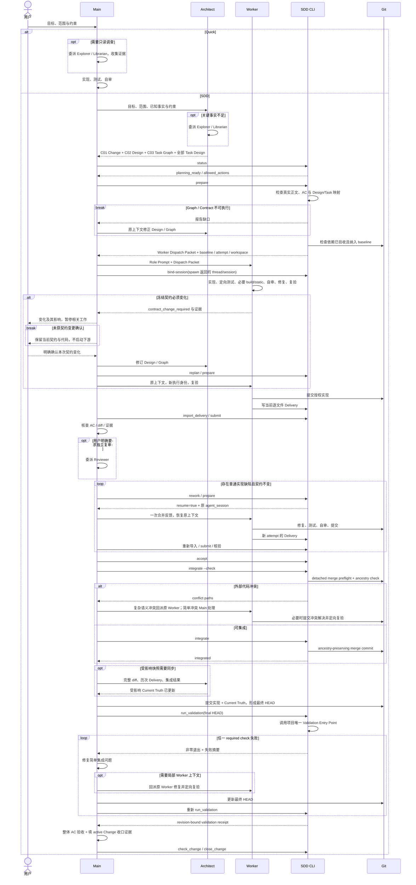

# Change 主流程时序

Quick 允许 Explorer / Librarian 调查，但不进入 SDD Task 生命周期。SDD 有依赖时按 Execution Wave → Integration Wave → Next Wave 推进；accepted 但未进入 HEAD 的上游不会让下游 prepare。进入 SDD 无额外模式审批；冻结契约变化与 Reviewer 显式授权仍是独立边界。

路由分层：SDD runtime 只给出当前状态与机械允许动作；Main 负责 Quick/SDD、调查类型、实现缺陷/设计缺口等语义路由；角色 TOML 负责 Agent 被唤起后的工作方法，动态 Dispatch Packet 只传当前任务的工件引用和增量上下文。
