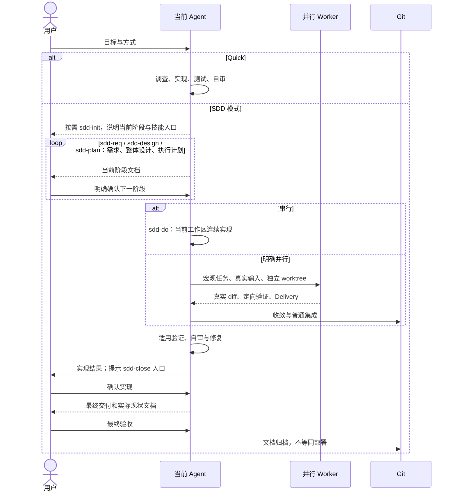

# 人工流程时序

```mermaid
sequenceDiagram
 actor User as 用户
 participant Main as 当前 Agent
 participant Worker as 并行 Worker
 participant Git
 User->>Main: 目标与方式
 alt Quick
 Main->>Main: 调查、实现、测试、自审
 else SDD 模式
 Main-->>User: 按需 sdd-init，说明当前阶段与技能入口
 loop sdd-req / sdd-design / sdd-plan：需求、整体设计、执行计划
 Main-->>User: 当前阶段文档
 User->>Main: 明确确认下一阶段
 end
 alt 串行
 Main->>Main: sdd-do：当前工作区连续实现
 else 明确并行
 Main->>Worker: 宏观任务、真实输入、独立 worktree
 Worker-->>Main: 真实 diff、定向验证、Delivery
 Main->>Git: 收敛与普通集成
 end
 Main->>Main: 适用验证、自审与修复
 Main-->>User: 实现结果；提示 sdd-close 入口
 User->>Main: 确认实现
 Main-->>User: 最终交付和实际现状文档
 User->>Main: 最终验收
 Main->>Git: 文档归档，不等同部署
 end
```

工具通过不替代人工确认；实质变化返回受影响阶段，小调整自主处理。
