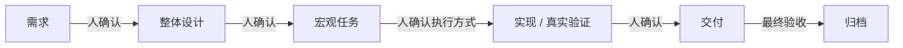

# 人工阶段示意

```mermaid
flowchart LR
 R["需求"] -->|"人确认"| D["整体设计"]
 D -->|"人确认"| T["宏观任务"]
 T -->|"人确认执行方式"| I["实现 / 真实验证"]
 I -->|"人确认"| F["交付"]
 F -->|"最终验收"| A["归档"]
```

这是人的工作流程，不是机器状态机；不存在冻结、attempt、accepted 或 receipt 的授权转换。
