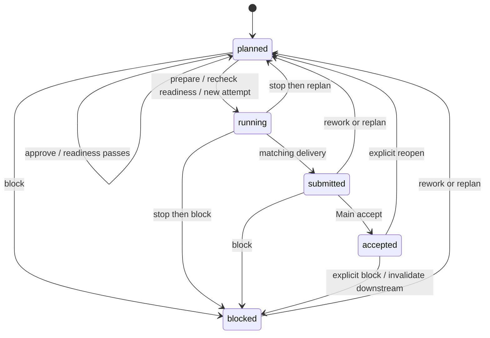

# Task 状态机

```mermaid
stateDiagram-v2
  [*] --> planned
  planned --> planned: approve / readiness passes
  planned --> running: prepare / recheck readiness / new attempt
  running --> submitted: matching delivery
  submitted --> accepted: Main accept
  planned --> blocked: block
  running --> blocked: stop then block
  submitted --> blocked: block
  accepted --> blocked: explicit block / invalidate downstream
  blocked --> planned: rework or replan
  submitted --> planned: rework or replan
  accepted --> planned: explicit reopen
  running --> planned: stop then replan
```

重新打开包含目标、契约漂移任务及传递下游；新轮次必须重新批准、准备和验证。
