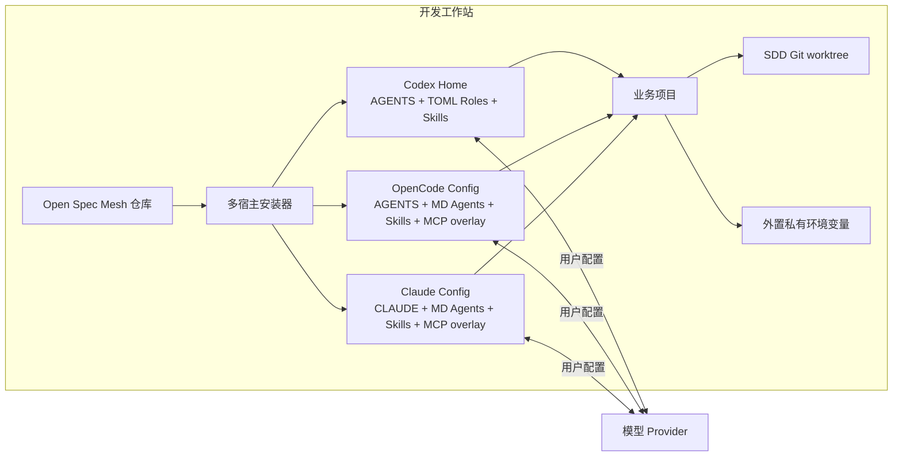

# 部署架构

```mermaid
flowchart LR
  subgraph Host[开发工作站]
    Repo[Open Spec Mesh 仓库] --> Install[多宿主安装器]
    Install --> Codex[Codex Home\nAGENTS + TOML Roles + Skills]
    Install --> OpenCode[OpenCode Config\nAGENTS + MD Agents + Skills + MCP overlay]
    Install --> Claude[Claude Config\nCLAUDE + MD Agents + Skills + MCP overlay]
    Codex --> Project[业务项目]
    OpenCode --> Project
    Claude --> Project
    Project --> WT[SDD Git worktree]
    Project --> Env[外置私有环境变量]
  end
  Codex <-->|用户配置| Provider[模型 Provider]
  OpenCode <-->|用户配置| Provider
  Claude <-->|用户配置| Provider
```

三种宿主共享同一 SDD artifacts / Git runtime；Host Adapter 不复制业务流程。真实业务项目的生产主机、容器、网络和数据卷由其自己的部署图维护。
