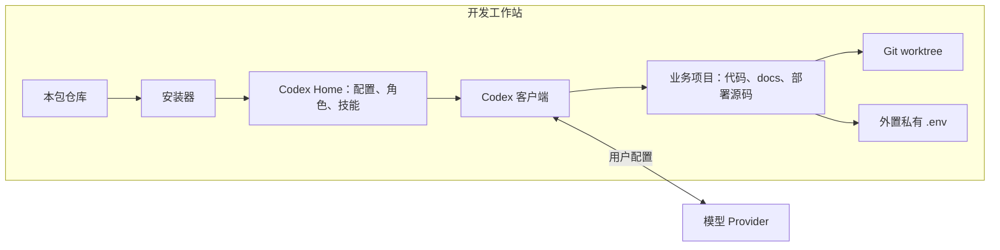

# 部署架构

```mermaid
flowchart LR
  subgraph Host[开发工作站]
    Repo[本包仓库] --> Install[安装器]
    Install --> Home[Codex Home：配置、角色、技能]
    Home --> Client[Codex 客户端]
    Client --> Project[业务项目：代码、docs、部署源码]
    Project --> WT[Git worktree]
    Project --> Env[外置私有 .env]
  end
  Client <-->|用户配置| Provider[模型 Provider]
```

真实业务项目的生产主机、应用容器、网络和数据卷由其部署图维护；不可将逻辑 Agent 当生产应用。
