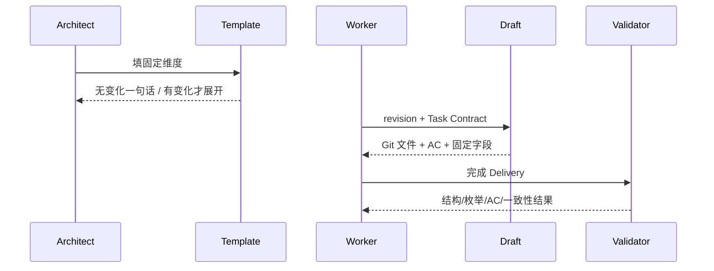
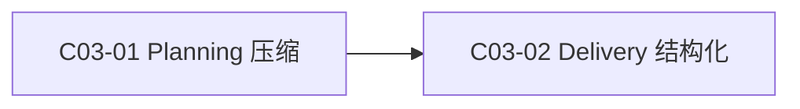

# 公共设计

> **设计结论**：保留 Planning 的固定标题与维度，只删除空表和重复说明；Delivery 保留五节并把关键结论、AC、偏差、风险、快照影响变成固定字段。

## Current 基线与变更范围

### 受影响 Current Truth

| Current 文档 / 模块 | Current | Delta | Target |
| --- | --- | --- | --- |
| Document Contract | 固定结构，但无变化章节仍易产生空表 | 明确“固定结构 + 无变化一句话 + 不重复” | 结构完整且更短 |
| Delivery | 五节自由文本 | 固定字段 + AC 骨架 | 易机械校验、易 Review |

## 总体方案与主流程

### 总体方案

Planning 模板保留所有固定维度。无变化章节直接写“无变化。”；有变化时按内容选择表格、列表或短段落，不再要求空子结构。Delivery draft 从 Task Contract 读取 AC，从 Git 读取文件，Worker 只填实际行为与证据。

### 总业务流程 / 主时序

## 产品变更

无变化。

## 接口变更

Delivery Markdown Contract 收紧；既有 CLI 参数不变。

## 领域模型与状态变更

无变化。

## 数据与表结构变更

无变化。

## 应用与组件变更

- Planning templates / document contract：只减重复，不减固定维度。
- delivery draft / validator：生成并校验固定字段。

## 关键决策

### D001｜固定结构不压缩

- **结论**：Design / Task 固定标题和设计维度全部保留。
- **原因**：标题本身是“已检查该维度”的声明，成本低且利于 Review。
- **影响**：压缩只发生在章节内部。

### D002｜Delivery 字段化而非 JSON 化

- **结论**：继续使用人类可读 Markdown 五节，关键字段与枚举固定。
- **原因**：兼顾 Review 与脚本校验，不引入第二套机器工件。
- **影响**：draft 自动生成 Git/AC 骨架，Worker 只补实际内容。

## 公共设计与不变量

- **事务 / 一致性**：无变化。
- **幂等 / 并发**：无变化。
- **失败与恢复**：不完整 Delivery 保持可重写，不推进权威状态。
- **兼容**：Main Acceptance 仍显式执行；不由 Worker 结论自动验收。

## Task 关系与设计落点

| Task | 交付结果 | 前置任务 | 关联设计 | 验收 |
| --- | --- | --- | --- | --- |
| `C03-01` Planning 压缩 | 模板与写作规则只减重复 | 无 | `D001` 固定结构不压缩 | `AC-01` 固定结构下减少重复 |
| `C03-02` Delivery 结构化 | draft + validator 固定字段 | `C03-01` | `D002` Delivery 字段化而非 JSON 化 | `AC-02` Delivery 草稿自动结构化、`AC-03` Delivery 明显错误可机械拒绝 |

## 实现自由度与停止条件

- **Worker 可自行决定**：字段解析 helper、测试组织、模板文字微调。
- **不可改变**：固定设计维度、五节 Delivery、显式 Main Acceptance。
- **必须停止并 replan**：需要删除固定维度、改成 JSON Delivery 或改变 Task 状态机时。

## 风险与未决问题

- **风险**：Markdown 字段解析必须避免把 fenced example 当正式字段。
- **未决问题**：无。
