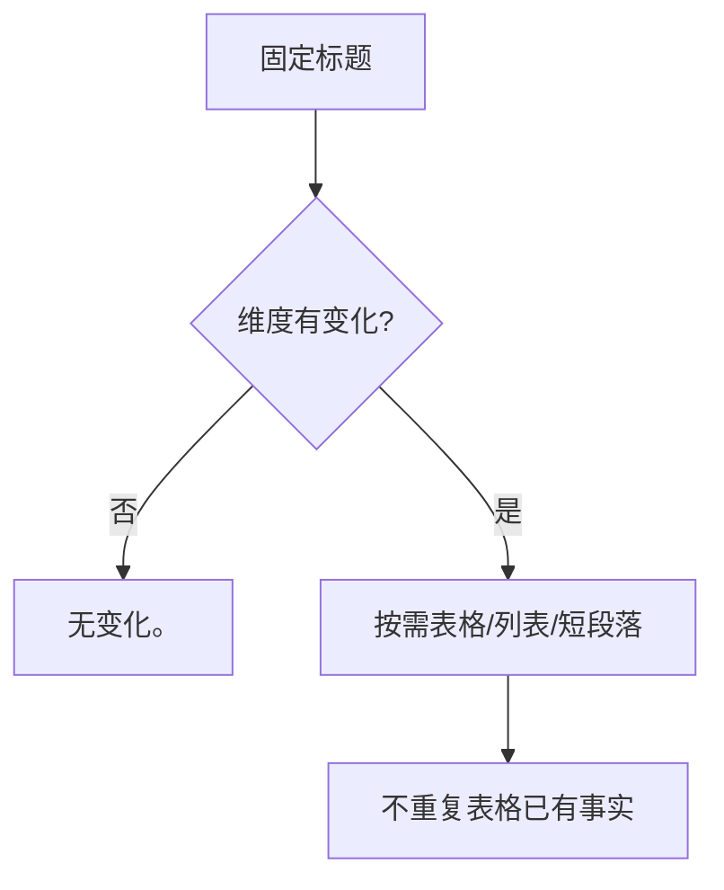

# Task `C03-01`：详细设计

> **交付目标**：保留全部固定设计维度，删除无变化章节中的空表与重复说明。
>
> **公共设计**：[Design](../../C02-design.md)

## 范围与代码落点

### 要做

- 精简 Design / Task 模板。
- 文档契约明确“不减结构，只减重复”。
- 增加 readiness 回归。

### 不做

- 不删除固定维度。
- 不修改 Delivery。

### 输入 / 依赖

- 现有文档模板与 readiness gate。

### Path Contract

| 规则 | 路径 |
| --- | --- |
| allow | `sdd-init/references/document-contract.md` |
| allow | `sdd-change/references/design-template.md` |
| allow | `sdd-change/references/sdd-task-contract-template.md` |
| allow | `tests/test_lean_contracts.py` |
| allow | `tests/test_contract_readiness.py` |
| deny | 无 |

### 代码结构 / 模块落点

| 目录 / 文件 / 类 | 计划变更 | 责任 |
| --- | --- | --- |
| references | 修改 | 缩短模板但保留结构 |
| tests | 修改 | 固定维度与“无变化。”回归 |

## Task 实现流程

## 详细设计

### 核心逻辑

落实 `D001`：结构不动，压缩章节内部。

### Components

模板与文档契约。

### 接口变化

无变化。

### 领域模型 / 状态变化

无变化。

### 数据与表结构变化

无变化。

### 失败与兼容

- **失败处理**：缺失固定标题仍由 readiness 拒绝。
- **边界场景**：单独“无变化。”视为有效覆盖。
- **兼容要求**：旧的详细写法继续有效。

### Tests

- 固定标题全部仍在。
- “无变化。”章节可 dispatch。
- 删除固定标题仍拒绝。

## 依赖与验收

### 前置任务

- 无。

### 关联设计

- `D001`：固定结构不压缩。

### 验收标准

- `AC-01`：固定结构下减少重复。

### 验证要求

- 运行模板与 readiness 定向测试。

## 实现自由度

- **可以自行决定**：示例文字、测试夹具。
- **不可改变**：固定维度。
  
## 交付要求

### Expected Output

- **预计文件**：模板、文档契约、定向测试。
- **交付结果**：结构不减、正文更短。

### Delivery

- 提交 revision、文件影响、验证、自审、剩余问题和快照影响。
