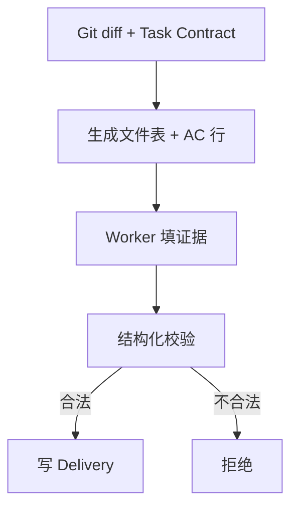

# Task `C03-02`：详细设计

> **交付目标**：让 Delivery draft 自动生成 Git/AC 骨架，并机械拒绝明显不一致的最终 Delivery。
>
> **公共设计**：[Design](../../C02-design.md)

## 范围与代码落点

### 要做

- Delivery 五节内固定字段。
- draft 自动生成文件表和 Task AC 行。
- validator 校验枚举、AC 覆盖、总体结论与失败/未验证/偏差的一致性。
- 更新 Delivery reference 和回归测试。

### 不做

- 不自动 Main accept。
- 不改 Task 状态机。

### 输入 / 依赖

- `C03-01` 完成后的模板/文档契约基线。

### Path Contract

| 规则 | 路径 |
| --- | --- |
| allow | `sdd-do/references/delivery-template.md` |
| allow | `sdd-change/scripts/delivery_evidence.py` |
| allow | `sdd-change/scripts/sdd.py` |
| allow | `tests/test_lean_contracts.py` |
| allow | `tests/test_lean_cli.py` |
| deny | 无 |

### 代码结构 / 模块落点

| 目录 / 文件 / 类 | 计划变更 | 责任 |
| --- | --- | --- |
| delivery_evidence.py | 修改 | 结构化字段解析/校验 |
| sdd.py | 修改 | draft 自动生成 |
| delivery-template.md | 修改 | 人类可读规范 |
| tests | 修改 | 正反例回归 |

## Task 实现流程

## 详细设计

### 核心逻辑

落实 `D002`：继续 Markdown 五节，但固定交付结果、验证结论、AC 结果、契约偏差、未验证项、风险、快照范围与说明。

### Components

draft generator、delivery validator。

### 接口变化

Delivery Markdown Contract 收紧；CLI 参数无变化。

### 领域模型 / 状态变化

无变化。

### 数据与表结构变化

无变化。

### 失败与兼容

- **失败处理**：不完整或矛盾字段拒绝写入。
- **边界场景**：未验证/失败/契约偏差存在时总体不能为“通过”。
- **兼容要求**：Worker 结论不自动触发 Acceptance。

### Tests

- draft 自动生成真实文件和全部 AC。
- AC 缺失/重复/未知结果拒绝。
- “通过 + 未验证项/失败/偏差”拒绝。
- 合法结构仍通过 Path Contract / Git diff 校验。

## 依赖与验收

### 前置任务

- `C03-01`

### 关联设计

- `D002`：Delivery 字段化而非 JSON 化。

### 验收标准

- `AC-02`：Delivery 草稿自动结构化。
- `AC-03`：Delivery 明显错误可机械拒绝。

### 验证要求

- 运行 Delivery 与 lean CLI 定向测试。

## 实现自由度

- **可以自行决定**：Markdown helper、枚举常量、错误文字。
- **不可改变**：五节、显式 Main Acceptance。

## 交付要求

### Expected Output

- **预计文件**：Delivery reference、draft/validator、定向测试。
- **交付结果**：更少自由作文、更强机械一致性。

### Delivery

- 提交 revision、文件影响、验证、自审、剩余问题和快照影响。
