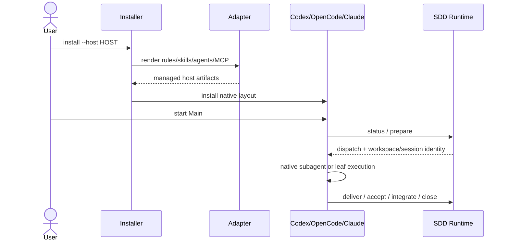
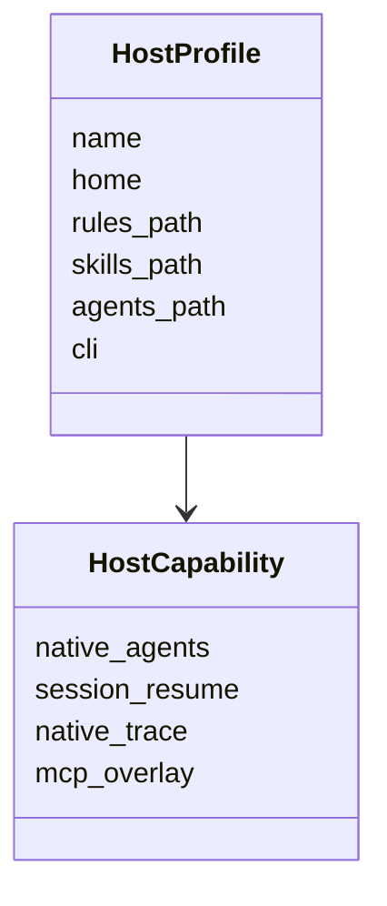
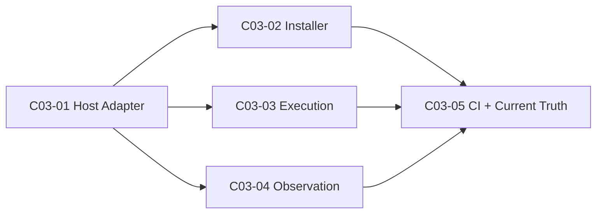

# 公共设计

> **设计结论**：建立薄 Host Adapter，把 canonical Skills / Roles / SDD CLI 映射到三种宿主的原生文件和命令；Codex 继续使用现有 TOML/runtime，OpenCode 与 Claude Code 使用 Markdown Agent 和宿主原生 session/permission 能力。

## Current 基线与变更范围

### 受影响 Current Truth

| Current 文档 / 模块 | Current | Delta | Target |
| --- | --- | --- | --- |
| Installation | Codex Home | 增加 Host Profile | 三宿主可独立安装 |
| Agent Routing | Codex V2/TOML | 渲染原生 Agent | 语义一致、宿主格式不同 |
| Leaf Execution | Codex CLI | host command adapter | 三宿主精确 session resume |
| Observation | Codex rollout / CODEX_HOME | host identity + capability | 不支持的 trace 明确 partial |

## 总体方案与主流程

### 总体方案

canonical Skill 继续使用现有 `SKILL.md`；canonical Role 继续以 `agents/*.toml` 中的 description / developer_instructions 为语义源，Codex 专属 model/effort/sandbox 只供 Codex。Host Adapter 读取 canonical 语义后生成 OpenCode / Claude Code 原生 Agent Markdown，并注入宿主自己的 Skill/Dispatch 路径。OpenCode 额外把同一 canonical Role 渲染到 package-owned overlay 的 `agents` map，以兼容 v2.0.18 的真实角色发现；这不是第二份 prompt 源。安装器负责文件所有权和 package-owned MCP 配置，执行器只负责宿主命令与 session identity。

### 总业务流程 / 主时序

## 产品变更

- README / 安装入口从“Codex runtime”升级为“Codex / OpenCode / Claude Code runtime”。
- 用户仍只理解 Quick / SDD，不新增宿主模式。

## 接口变更

- `install.sh --host codex|opencode|claude`；未指定保持 Codex。
- `run_leaf.py --host auto|codex|opencode|claude`。
- Observation 增加 host identity / capability，不改变已有 Codex 输入兼容。
- OpenCode/Claude 完整工具入口使用 package-owned MCP config，不直接重写用户 provider/model。

## 领域模型与状态变更

### 领域模型

### 状态 / 不变量变化

- Task Graph 状态无变化。
- host / session 只是运行身份，不进入业务 Task 状态机。
- Worker workspace 仍由 SDD prepare 决定。

## 数据与表结构变更

无变化。

## 应用与组件变更

- `scripts/host_adapter.py`：Host Profile、Role/Rules/MCP 渲染。
- Installer：选择 host、事务安装、兼容旧 Codex CLI。
- `run_leaf.py`：宿主命令构造与恢复。
- Observation：host-neutral 数据根和 capability。
- CI：三宿主真实 CLI smoke。

## 关键决策

### D001｜Canonical 语义不复制

- **结论**：Skill 与 Role prompt 保持单一来源，host adapter 只渲染格式与路径。
- **原因**：避免三套 prompt 漂移。
- **影响**：新增宿主首先扩 adapter，不复制 SDD。

### D002｜非 Codex 模型继承宿主

- **结论**：OpenCode / Claude Agent 不写 Codex model 名，默认 inherit。
- **原因**：provider/model 命名与可用性属于宿主/用户。
- **影响**：Codex 保持现有固定模型；其他宿主不接管用户模型策略。

### D003｜附加配置而非重写用户配置

- **结论**：OpenCode/Claude 的 MCP 使用 package-owned overlay/CLI merge；不覆盖用户主配置。
- **原因**：JSONC、provider、已有 MCP 都属于用户事实。
- **影响**：完整工具入口通过 Open Spec Mesh launcher/参数加载 overlay；OpenCode overlay 同时承载 MCP 与 canonical agent registration，但不写用户 model/provider。

### D004｜SDD worktree 仍是唯一执行隔离

- **结论**：Host Agent 从 prepare 的 workspace 启动，不再启用宿主自动 worktree。
- **原因**：避免 baseline/result_revision 与双层 worktree 冲突。
- **影响**：宿主只负责 Agent context，不拥有 SDD Git 身份。

### D005｜Observation 不伪造能力

- **结论**：Codex native trace 保持 full；OpenCode/Claude 未有稳定适配的私有事件标记 partial/unknown。
- **原因**：诊断必须基于真实证据。
- **影响**：跨宿主报告可比较 coverage，但不能把“没看到”写成“没发生”。

## 公共设计与不变量

- **事务 / 一致性**：每个 host home 的受管文件独立事务；用户未受管文件原样保留。
- **幂等 / 并发**：重复安装结果稳定；不同 host home 互不覆盖。
- **失败与恢复**：安装或渲染失败不留下半套受管文件。
- **兼容**：`./install.sh` 无参数继续安装 Codex；既有 Codex runtime/CI 不降级。

## Task 关系与设计落点

| Task | 交付结果 | 前置任务 | 关联设计 | 验收 |
| --- | --- | --- | --- | --- |
| `C03-01` Host Adapter | Host Profile + native role/rule/MCP renderer | 无 | `D001`, `D002`, `D003` | `AC-01`, `AC-04` |
| `C03-02` Installer | multi-host install/upgrade | `C03-01` | `D003` | `AC-02`, `AC-04` |
| `C03-03` Execution | multi-host leaf/session launcher | `C03-01` | `D004` | `AC-03` |
| `C03-04` Observation | host-aware storage/capability | `C03-01` | `D005` | `AC-05` |
| `C03-05` Validation | real CLI CI + docs/current truth | `C03-02`, `C03-03`, `C03-04` | `D001`–`D005` | `AC-06` |

## 实现自由度与停止条件

- **Worker 可自行决定**：renderer helper、manifest 内部字段、测试 fixture。
- **不可改变**：一套 SDD Core、Codex 兼容、用户配置不被接管、SDD worktree ownership。
- **必须停止并 replan**：需要复制三套 Skill/Role prompt、改变 Task Graph schema、或必须覆盖用户 provider/model 才能实现时。

## 风险与未决问题

- **风险**：OpenCode V2 配置仍快速演进，因此兼容目标必须由真实 CLI smoke 锁定。
- **未决问题**：无。
