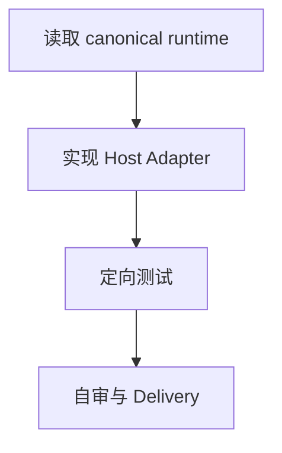

# Task `C03-01`：Host Adapter

> **交付目标**：实现 Host Profile 与 OpenCode/Claude 原生 Role/Rules/MCP renderer。
>
> **公共设计**：[Design](../../C02-design.md)

## 范围与代码落点

### 要做

- 实现 Host Profile 与 OpenCode/Claude 原生 Role/Rules/MCP renderer。
- 保持 canonical SDD 工件与状态机不变。

### 不做

- 不扩大到未列出的宿主语义。
- 不覆盖用户模型/provider 或改变 Task Graph schema。

### 输入 / 依赖

- 前置：无。

### Path Contract

| 规则 | 路径 |
| --- | --- |
| allow | `scripts/host_adapter.py` |
| allow | `tests/test_host_adapter.py` |
| deny | 无 |

### 代码结构 / 模块落点

- `scripts/host_adapter.py`
- `tests/test_host_adapter.py`

## Task 实现流程

## 详细设计

### 核心逻辑

只实现本 Task 对应的宿主适配；公共宿主语义以 C02 Design 为准。

### Components

Host Adapter 对应的 renderer/runtime/test components。

### 接口变化

按公共 Design 中对应 CLI / layout 变化实现。

### 领域模型 / 状态变化

Task 状态无变化；只增加 host/runtime 派生信息。

### 数据与表结构变化

无变化。

### 失败与兼容

- **失败处理**：无法证明宿主能力时 fail closed 或标记 unsupported/partial，不猜测成功。
- **边界场景**：Codex 既有行为必须回归。
- **兼容要求**：用户未受管配置原样保留。

### Tests

- 正常路径：目标宿主产物/命令可用。
- 异常路径：无效 host、缺 CLI、冲突文件或不支持能力明确失败。
- 回归：Codex 与 SDD lifecycle 不降级。

## 依赖与验收

### 前置任务

- 无。

### 关联设计

- `D001`、`D002`、`D003`

### 验收标准

- `AC-01`、`AC-04`

### 验证要求

- 运行当前 Task 定向测试；全仓与真实宿主 smoke 由 Main/C03-05 完成。

## 实现自由度

- **可以自行决定**：内部 helper、测试 fixture、输出字段顺序。
- **不可改变**：公共 Design 决策与 Path Contract。

## 交付要求

### Expected Output

- **预计文件**：`scripts/host_adapter.py`、`tests/test_host_adapter.py`。
- **交付结果**：实现 Host Profile 与 OpenCode/Claude 原生 Role/Rules/MCP renderer。

### Delivery

- 使用结构化 Delivery，列实际 revision、文件行为、AC 证据、风险和快照影响。
