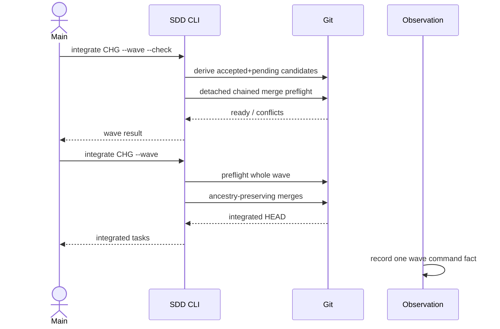
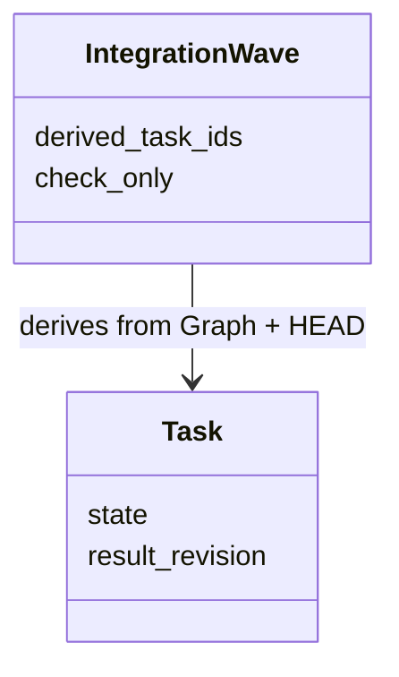
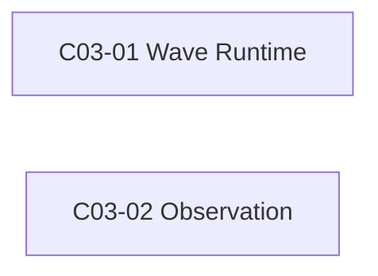

# 公共设计

> **设计结论**：在现有单 Task integration primitive 上增加只由 Git/Graph 派生的 wave orchestration；先整波链式预检，确认无冲突后再逐个调用既有集成语义，observation 只记录用户实际执行的一次 wave 命令。

## Current 基线与变更范围

### 受影响 Current Truth

| Current 文档 / 模块 | Current | Delta | Target |
| --- | --- | --- | --- |
| SDD Runtime | accepted Task 逐个 integrate | 增加 wave 选择与批量入口 | Main 可一次预检/集成当前 wave |
| Observation | 单 Task integrate 可观测 | 增加 wave 级事件 | 不展开虚构内部阶段 |

## 总体方案与主流程

### 总体方案

`integrate --wave` 不创建新状态。Runtime 从 Graph 中按原始顺序选择 `state=accepted && integration=pending` 的 Task 作为当前 wave。预检在临时 detached worktree 中按候选顺序连续 merge，因而既能发现每个 Task 对 Main HEAD 的冲突，也能发现 wave 内 Task 之间的冲突。只有整波预检通过后，实际命令才在 Main workspace 中逐个复用单 Task ancestry-preserving integration。

### 总业务流程 / 主时序

## 产品变更

| 模块 / 功能 / 规则 | Current | Delta | Target |
| --- | --- | --- | --- |
| SDD integration | Main 每个 Task 单独操作 | 增加 wave 入口 | 同 wave 机械动作一次完成 |
| Diagnostics | 记录单 Task integration | 识别 --wave | wave 行为可统计且不虚构展开 |

## 接口变更

| 接口 / 协议 | Current | Delta / Target | 兼容策略 | 关联 AC |
| --- | --- | --- | --- | --- |
| `sdd.py integrate` | 需要 --task（多 Task） | 新增互斥 `--wave`，可与 `--check` 组合 | 单 Task 参数与输出保持兼容 | `AC-01`, `AC-02` |
| observation command_fact | task.integrate / preflight | 增加 change.integrate-wave / change.integrate-wave-preflight | 旧 kind 保持不变 | `AC-03` |

## 领域模型与状态变更

### 领域模型

### 状态 / 不变量变化

| 对象 | Current | Delta / Target | 不变量 / 非法行为 |
| --- | --- | --- | --- |
| Task | planned/running/submitted/accepted/blocked | 无状态变化 | 不写 integrated 状态 |
| IntegrationWave | 无显式对象 | 运行时派生值 | 不持久化、不接受 submitted Task |

## 数据与表结构变更

### 表结构

| 表 / 存储 | Current | Delta / Target | 数据迁移 / 兼容 |
| --- | --- | --- | --- |
| Task Graph JSON | 既有最小 schema | 无变化 | 无迁移 |

### 关键字段 / 索引 / 约束

| 表 | 字段 / 索引 / 约束 | 操作 | 定义与影响 |
| --- | --- | --- | --- |
| Task Graph | 无新增字段 | 无变化 | wave 完全派生 |

## 应用与组件变更

| 应用 / 组件 | Current 职责 | Target 职责 | 依赖变化 |
| --- | --- | --- | --- |
| sdd.py | 单 Task integration | 增加 wave orchestration | 复用 Git/workflow primitive |
| observation.trace | 识别 facade 命令 | 识别 wave 命令事实 | 无新外部依赖 |

## 关键决策

### D001｜整波先预检再写 Main

- **结论**：wave 在任何真实集成前，先在一个临时 worktree 中按 Graph 顺序链式 merge 全部候选。
- **原因**：逐 Task 独立 preflight 无法发现两个 Worker 分支彼此之间的冲突，也可能产生部分集成。
- **影响**：冲突时 `--wave` 返回精确文件且 Main HEAD 不变；真正 Git merge 仍可能因外部并发变化失败并显式停止。

### D002｜Wave 只作为命令级 observation 事实

- **结论**：一次 `--wave` 只记录一个 change 级 integration 事件，不根据内部循环制造多个 task.integrate 事件。
- **原因**：observation 只描述实际调用事实，不能猜内部阶段。
- **影响**：既有单 Task kind 不变，wave 统计可单独分析。

## 公共设计与不变量

- **事务 / 一致性**：预检阶段对 Main 无写入；实际阶段每个 merge commit 保留对应 result revision ancestry。
- **幂等 / 并发**：已进入 HEAD 的 accepted Task 自动从候选排除；命令重跑只处理剩余 pending。
- **失败与恢复**：预检冲突零写入；实际执行中异常时保留已成功 Git 事实，下一次由 ancestry 重新派生剩余 wave。
- **兼容**：单 Task `integrate --task`、Task Graph schema、close ancestry 检查均不变化。

## Task 关系与设计落点

| Task | 交付结果 | 前置任务 | 关联设计 | 验收 |
| --- | --- | --- | --- | --- |
| `C03-01` Wave Runtime | wave 选择、链式预检、批量集成 | 无 | `D001` 整波先预检再写 Main | `AC-01` 当前 wave 选择稳定、`AC-02` 整波预检与集成安全 |
| `C03-02` Observation | wave 命令事实与测试 | 无 | `D002` Wave 只作为命令级 observation 事实 | `AC-03` Wave 事件可观测 |

## 实现自由度与停止条件

- **Worker 可自行决定**：内部 helper 命名、返回 JSON 的非破坏性附加字段、测试 fixture 组织。
- **不可改变**：候选选择条件、整波链式预检、Git ancestry、单 Task 兼容、observation 不虚构内部阶段。
- **必须停止并 replan**：需要新增 Graph 字段/状态、改变 accepted 语义、让 wave 自动解决冲突或自动接受 Task。

## 风险与未决问题

- **风险**：预检后到真实 merge 之间仍可能被外部 Git 写入改变；真实 merge 必须继续 fail closed。
- **未决问题**：无。
