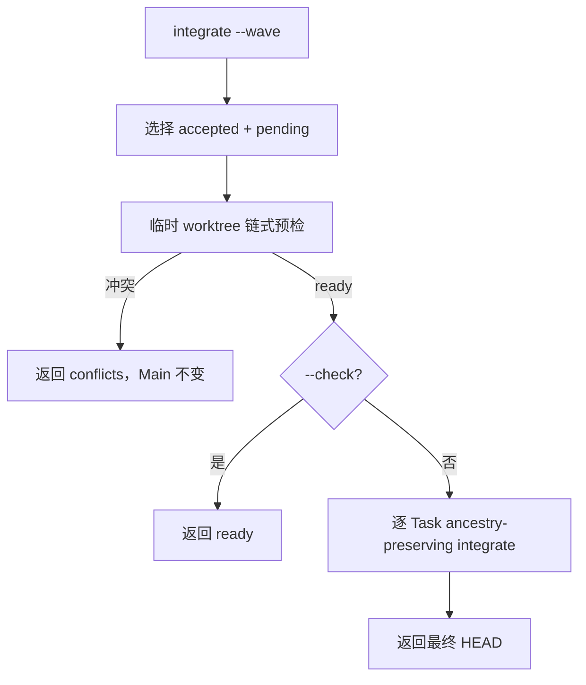

# Task `C03-01`：详细设计

> **交付目标**：实现当前 accepted/pending integration wave 的确定性选择、整波链式预检和批量 ancestry-preserving 集成。
>
> **公共设计**：[Design](../../C02-design.md)

## 范围与代码落点

### 要做

- 为 `sdd.py integrate` 增加 `--wave` 模式。
- 从 Graph + HEAD 派生当前 wave 候选。
- `--wave --check` 在临时 worktree 内链式预检整个 wave。
- 实际 wave 在整波预检通过后按确定顺序复用单 Task integration。
- 返回机器可读候选、冲突、已集成 revision 与最终 HEAD。

### 不做

- 不修改 observation adapter。
- 不新增 Task Graph 字段。
- 不自动解决冲突或接受 Task。

### 输入 / 依赖

- 现有 `integration_state`、`validate_accepted_task`、Git ancestry 与单 Task `integrate` primitive。
- 无前置 Task。

### Path Contract

| 规则 | 路径 |
| --- | --- |
| allow | `sdd-change/scripts/sdd.py` |
| allow | `tests/test_lean_cli.py` |
| deny | 无 |

### 代码结构 / 模块落点

| 目录 / 文件 / 类 | 计划变更 | 责任 |
| --- | --- | --- |
| sdd-change/scripts/sdd.py | 增加 wave selector / chained preflight / CLI 参数 | wave orchestration |
| tests/test_lean_cli.py | 增加多 Task wave 回归 | 验证选择、冲突、幂等、ancestry |

## Task 实现流程

## 详细设计

### 核心逻辑

wave selector 只读取 canonical Graph，并按 Graph 数组顺序选出 `state=accepted` 且 `result_revision` 不是当前 HEAD ancestor 的 Task。链式 preflight 从 Main HEAD 创建 detached worktree，按候选顺序依次 merge 每个 result revision；每一步仍忽略 active Change 自身的旧副本冲突，只把项目代码冲突作为失败。若任一候选冲突，整个预检结果为 conflict，Main workspace 不写入。实际 wave 先执行完整预检，再逐个调用现有单 Task integration；每次成功后下一次重跑均从 Git ancestry 推导剩余候选。

### Components

| Component / Object | Responsibility |
| --- | --- |
| wave selector | 派生稳定候选列表 |
| wave preflight | 在临时 Git worktree 链式模拟整个 wave |
| wave executor | 复用单 Task integration 并聚合结果 |

### 接口变化

| 接口 / 方法 / 事件 | 变更 | 输入 / 输出影响 |
| --- | --- | --- |
| `sdd.py integrate` | 新增 `--wave` | 多 Task 时无需 --task；返回 tasks/results/head |
| `integrate(...)` | 保持单 Task 行为 | 现有调用不变；wave 可通过独立 helper 复用 |

### 领域模型 / 状态变化

| 对象 | 变化 | 状态 / 不变量影响 |
| --- | --- | --- |
| IntegrationWave | 新增运行时派生对象 | 不持久化，不进入 Graph |
| Task | 无 | accepted 与 ancestry 语义不变 |

### 数据与表结构变化

| 表 / 存储 | 字段 / 索引 / 约束 | 操作 | 影响 |
| --- | --- | --- | --- |
| Task Graph JSON | 无 | 无变化 | 无迁移 |

### 失败与兼容

- **失败处理**：预检冲突返回精确路径且零 Main 写入；真实 merge 意外失败按既有单 Task fail-closed 语义停止。
- **边界场景**：无候选返回 empty/已完成结果；已部分集成后重跑只处理剩余 pending。
- **兼容要求**：`integrate --task` 与 `integrate --task --check` 输出/语义保持可用；`--task` 与 `--wave` 互斥。

### Tests

- **正常路径**：两个独立 accepted worktree 进入一个 wave，check 不改 HEAD，实际 wave 后二者 revision 均为 HEAD ancestor。
- **异常路径**：两个 Worker 对同一代码产生 wave 内冲突，整波预检返回冲突且 HEAD 不变。
- **边界 / 回归**：无候选、部分已 integrated、重复 `--wave` 幂等、现有单 Task 测试继续通过。

## 依赖与验收

### 前置任务

- 无。

### 关联设计

- `D001`：整波先预检再写 Main。

### 验收标准

- `AC-01`：当前 wave 选择稳定。
- `AC-02`：整波预检与集成安全。

### 验证要求

- 运行 `python3 -B -m unittest tests.test_lean_cli -v`。
- 必要时运行局部语法/static check；项目全量验证由 Main 集成后统一执行。

## 实现自由度

- **可以自行决定**：helper 拆分、内部临时目录结构、JSON 附加字段。
- **不可改变**：`D001`、`AC-01`、`AC-02`、Git ancestry、整波预检先于真实写入。

## 交付要求

### Expected Output

- **预计文件**：`sdd-change/scripts/sdd.py`、`tests/test_lean_cli.py`。
- **交付结果**：可重复、可预检的 wave integration runtime。

### Delivery

- 提交实际 revision 与逐文件行为影响。
- 提交与 AC 对应的真实验证结果。
- 完成自审并明确剩余问题 / 未验证项。
