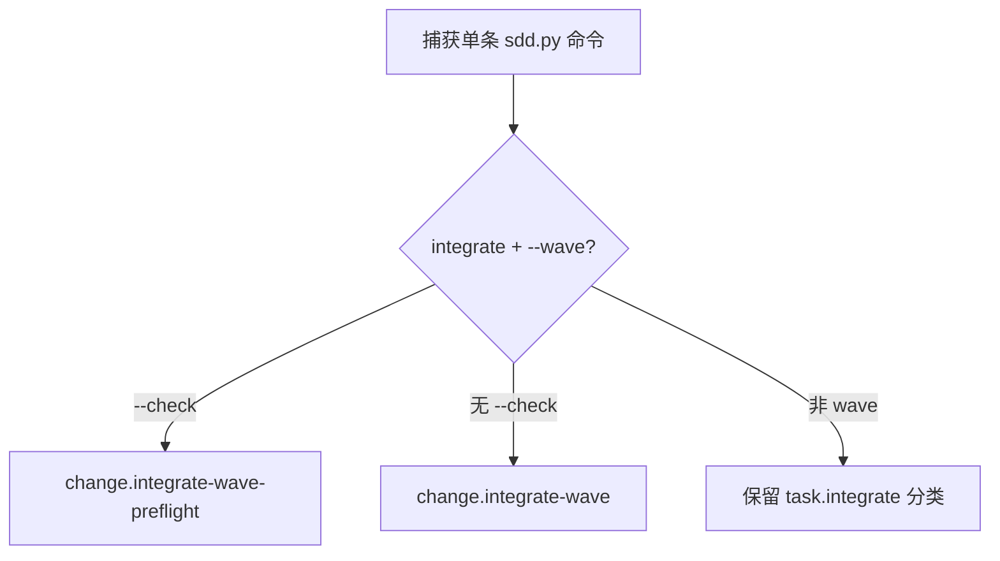

# Task `C03-02`：详细设计

> **交付目标**：让离线 observation 将 wave preflight / integration 记录为真实的 change 级命令事实，不展开虚构的逐 Task 事件。
>
> **公共设计**：[Design](../../C02-design.md)

## 范围与代码落点

### 要做

- 识别 `sdd.py integrate CHG --wave --check`。
- 识别 `sdd.py integrate CHG --wave`。
- 保持单 Task integrate kind 不变。
- 增加 command_fact 与 analyzer 级定向回归。

### 不做

- 不实现 wave runtime。
- 不根据命令输出制造内部 Task 事件。
- 不改变诊断规则授权或模型调用。

### 输入 / 依赖

- CLI syntax 已由公共 Design 冻结。
- 无前置 Task。

### Path Contract

| 规则 | 路径 |
| --- | --- |
| allow | `sdd-do/scripts/observation/trace.py` |
| allow | `tests/test_lean_observation.py` |
| deny | 无 |

### 代码结构 / 模块落点

| 目录 / 文件 / 类 | 计划变更 | 责任 |
| --- | --- | --- |
| observation/trace.py | 扩展 facade command_fact 分类 | 生成 wave 命令事实 |
| tests/test_lean_observation.py | 增加 wave 命令与 analyzer 回归 | 防止虚构/误分类 |

## Task 实现流程

## 详细设计

### 核心逻辑

在现有 `command_fact` facade 分支中先区分 `integrate` 是否包含 `--wave`。wave 命令属于 Change 级机械动作，返回 `task_id=None`；`--check` 与真实 integration 使用不同 kind。解析仍只处理单条 literal command，不读取 stdout 反推内部逐 Task merge。

### Components

| Component / Object | Responsibility |
| --- | --- |
| command_fact | 把实际 CLI 调用归一化为最小事实 |
| LeanObservationTests | 验证分类、隐私和成功命令计数 |

### 接口变化

| 接口 / 方法 / 事件 | 变更 | 输入 / 输出影响 |
| --- | --- | --- |
| observation fact kind | 新增 change.integrate-wave(-preflight) | change_id 有值，task_id=None |

### 领域模型 / 状态变化

| 对象 | 变化 | 状态 / 不变量影响 |
| --- | --- | --- |
| Observation Event | 增加两种 kind | 不授予状态、不执行动作 |

### 数据与表结构变化

| 表 / 存储 | 字段 / 索引 / 约束 | 操作 | 影响 |
| --- | --- | --- | --- |
| Observation schema | 无新持久字段 | 仅 kind 新枚举值 | 既有报告结构不变 |

### 失败与兼容

- **失败处理**：未知/复合命令继续 opaque 或 other.command，不猜 wave。
- **边界场景**：`--wave --check` 优先归类 preflight；单 Task `--check` 保持 task.integrate-preflight。
- **兼容要求**：既有 task.status/prepare/deliver/integrate/close kind 不变。

### Tests

- **正常路径**：两个 wave 命令得到预期 change 级 kind。
- **异常路径**：复合 shell / help 不被误判成 workflow step。
- **边界 / 回归**：analyzer 只计一次成功 SDD 命令，敏感命令文本不进入报告。

## 依赖与验收

### 前置任务

- 无。

### 关联设计

- `D002`：Wave 只作为命令级 observation 事实。

### 验收标准

- `AC-03`：Wave 事件可观测。

### 验证要求

- 运行 `python3 -B -m unittest tests.test_lean_observation -v`。
- 不运行项目全量测试；Main 最终集成后统一执行。

## 实现自由度

- **可以自行决定**：kind 常量组织和测试辅助函数。
- **不可改变**：`D002`、`AC-03`、不虚构内部 Task 事件、单 Task kind 兼容。

## 交付要求

### Expected Output

- **预计文件**：`sdd-do/scripts/observation/trace.py`、`tests/test_lean_observation.py`。
- **交付结果**：wave integration 可离线观测且不扩权。

### Delivery

- 提交实际 revision 与逐文件行为影响。
- 提交与 AC 对应的真实验证结果。
- 完成自审并明确剩余问题 / 未验证项。
