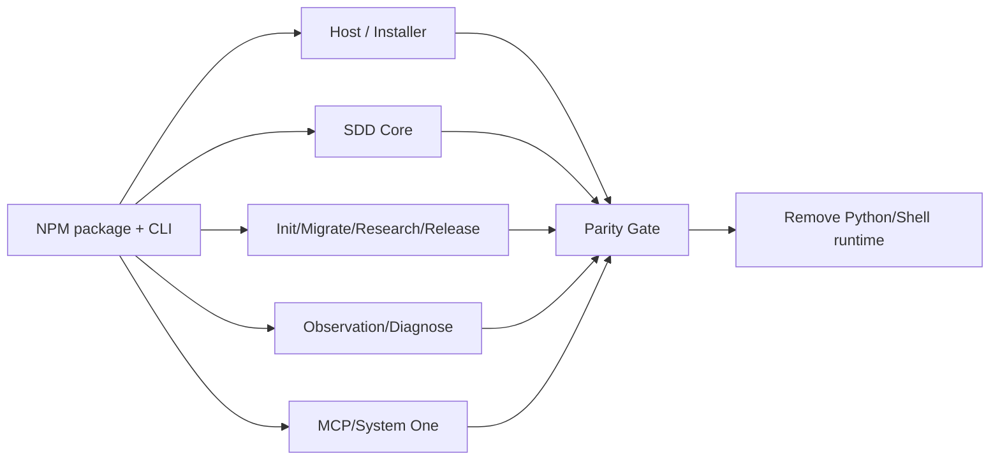
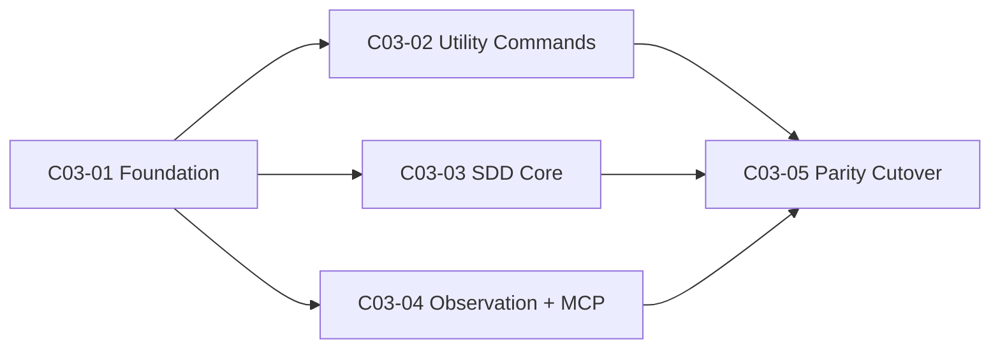

# 公共设计

> **设计结论**：采用单一 Node.js runtime + 薄 CLI；保留现有 Markdown/JSON/TOML 工件协议，先建立 JS parity oracle，再逐模块替换，最后一次性移除 Python/Shell 执行链。

## Current Truth Delta

| 模块 | Current | Target |
| --- | --- | --- |
| Installation | Bash + Python installer | NPM package + Node installer |
| Host Adapter | Python | JS，三宿主语义不变 |
| SDD Runtime | 多个 Python module | JS core，工件/schema 不变 |
| Observation | Python + sqlite | JS；对外诊断语义不变 |
| System One | Python MCP bridge | Node MCP bridge |
| Validation | Python entry | `npm test` / Node validation entry |

## 总流程

## 关键决策

### D001｜不做 1:1 文件翻译

按能力域重组 JS 模块，避免把历史 Python 文件结构机械复制到新 runtime；外部行为、文档契约、状态与 Git 不变量保持兼容。

### D002｜无隐藏运行时

正式 JS 命令不得 spawn Python、Bash、jq、curl、make、Docker 等作为自身必需依赖。允许 spawn `git`；允许通过 npm 管理 MCP/Node 工具。

### D003｜迁移分支保持双实现

在 parity 完成前，旧 Python 仅用于对照和主线稳定，不作为新 CLI fallback。JS 命令若尚未实现必须明确失败，不能偷偷转调 Python。

### D004｜工件协议优先稳定

Change/Design/Task Graph/Delivery/validation receipt 等现有可持久化格式默认不变；只有证明必要并经本 Change 更新后才允许 schema migration。

### D005｜切主条件

所有 Task 完成、JS 全量验证通过、正式入口无 Python/Shell 调用后才允许替换 main 的安装和运行文档。

## Task 关系

| Task | 交付 | 依赖 |
| --- | --- | --- |
| C03-01 | NPM/CLI、host adapter、installer foundation、init vertical slice | 无 |
| C03-02 | migrate/research/release/document helpers | C03-01 |
| C03-03 | SDD lifecycle、worktree、delivery/integration/close | C03-01 |
| C03-04 | observation/diagnose、System One、research MCP | C03-01 |
| C03-05 | 全量 parity、CI、删除 Python/Shell runtime、README/Current Truth | C03-02/03/04 |

## 不变量

- Quick / SDD only。
- Reviewer 仅用户明确要求。
- Architect 直接产出完整 Task Graph；Main 不二次拆分。
- Git revision/worktree/ancestry 是交付事实。
- Contract drift 必须阻断并走确认后的 replan。
- 未受管用户配置不得覆盖。
