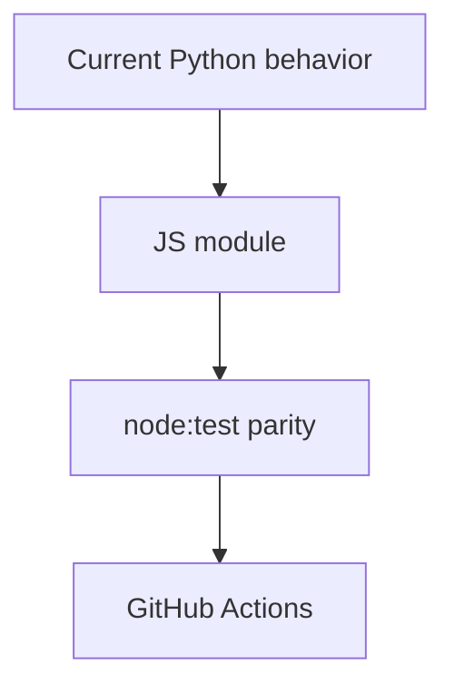

# Task `C03-01`：Node Runtime Foundation

> **交付目标**：建立可执行 NPM/CLI 基础、JS Host Adapter 与 `sdd-init` 竖切，并建立 Node CI。

## 范围与代码落点

- `package.json`、`bin/`、`src/`、`test-js/`、Node rewrite workflow。
- Host Profile/role rendering 必须保持三宿主现有语义。
- init 生成现行 numbered Markdown scaffold，不依赖 Python。

### Path Contract

| 规则 | 路径 |
| --- | --- |
| allow | `package.json` |
| allow | `bin/**` |
| allow | `src/**` |
| allow | `test-js/**` |
| allow | `.github/workflows/node-rewrite.yml` |
| allow | 本 Change 工件 |

## 实现流程

## 验收

- Node 20.18.1 与 Node 22 测试通过。
- `osm init` 不调用 Python/Shell。
- Host profile/role renderer 的 Quick/SDD 与三宿主边界不变。
- 未实现能力不 fallback 到 Python。
