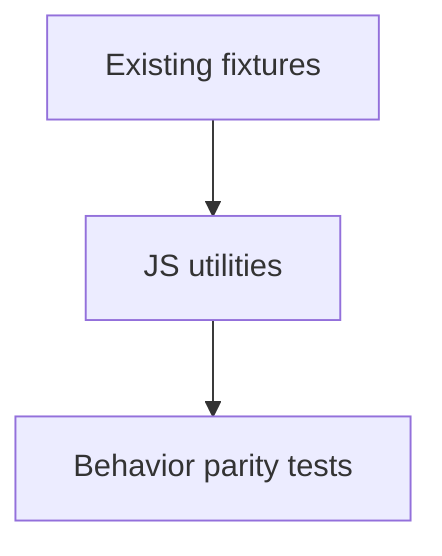

# Task `C03-02`：Utility Commands

> **交付目标**：把 migrate/research/release/document/numbering/validation helpers 迁到 JS。

## 范围

- `sdd-migrate`、`sdd-research`、`sdd-release`。
- document contract / numbering / scaffold repair / static validation。

## Path Contract

| 规则 | 路径 |
| --- | --- |
| allow | `src/commands/**`、`src/lib/**`、`test-js/**` |
| deny | SDD lifecycle schema |

## 验收

现有工具命令对应行为均有 JS 测试；不需要 Python。
