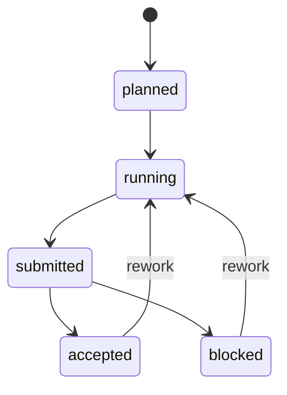

# Task `C03-03`：SDD Core

> **交付目标**：迁移 Change/Task/workflow/worktree/delivery/acceptance/integration/close 全生命周期。

## 核心设计

保持 C01/C02/C03 工件和 Task Graph 状态语义；Git 命令由 Node `child_process` 调用，Git 是唯一允许的系统级执行依赖。

## Path Contract

| 规则 | 路径 |
| --- | --- |
| allow | `src/sdd/**`、`src/git/**`、`test-js/**` |
| deny | Task Graph 产品语义变化 |

## 验收

status/prepare/bind-session/deliver/integrate/close、contract drift、dependency、wave integration、worktree cleanup 与 revision-bound evidence 行为等价。
