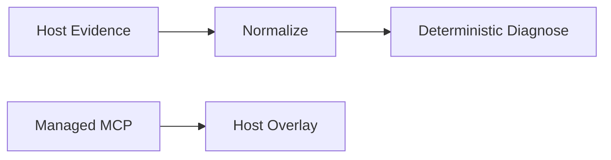

# Task `C03-04`：Observation + MCP

> **交付目标**：迁移 observe/diagnose/System One/Laya/research MCP 管理。

## 核心设计

Codex 继续 full trace；OpenCode/Claude 保持 artifact snapshot/partial，不虚构 trace 等价。MCP 安装优先 npm/package-owned 目录，凭据只引用环境变量名。

## Path Contract

| 规则 | 路径 |
| --- | --- |
| allow | `src/observation/**`、`src/mcp/**`、`test-js/**` |
| deny | host capability 虚假升级 |

## 验收

诊断包、coverage、Laya typed decisions/batch/fallback/circuit、MCP bootstrap 与现行安全边界等价。
