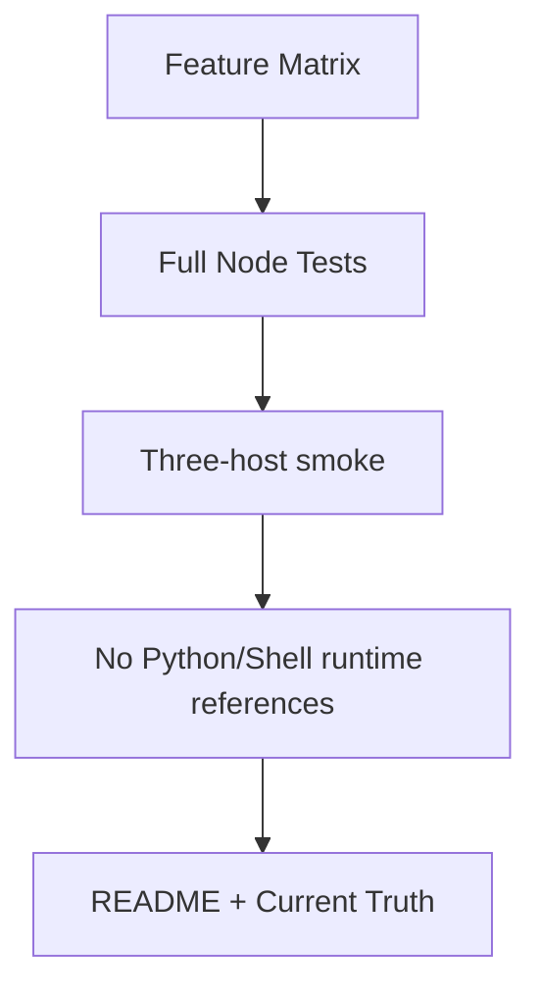

# Task `C03-05`：Parity Cutover

> **交付目标**：用行为矩阵证明当前 main 能力均迁移完成，再移除 Python/Shell 运行依赖并切换正式入口。

## 流程

## Path Contract

| 规则 | 路径 |
| --- | --- |
| allow | 全仓迁移收口 |
| deny | 未通过 parity 就删除旧实现或切 main |

## 验收

- 现有有效测试语义全部有 JS 对应。
- 正式安装/运行文档只要求 Node.js + npm + Git。
- 静态 gate 证明正式入口不调用 Python/Shell。
- 三宿主 smoke 与全量测试全绿。
