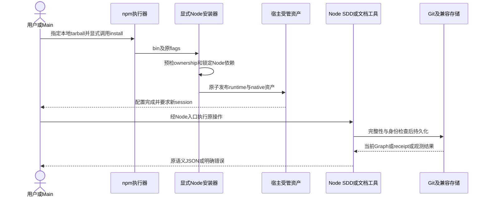
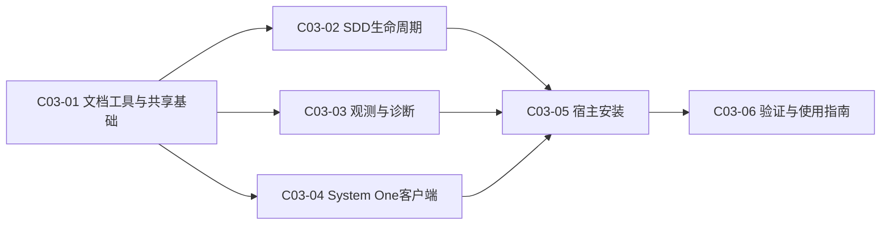

# 公共设计

> **设计结论**：以 Node ESM 和纯 JS/WASM 依赖迁移消费端；保留 canonical 文档、Git 身份、精确摘要、SQLite 与 MCP 协议，通过显式 npm install CLI 和稳定已安装 runtime 提供同一平台能力。独立 GPU Python 服务不进入消费包。

## Current 基线与变更范围

### 受影响 Current Truth

基线为 `dc9ba409fb17632b333be679ab7b7c5b364aa4e1`。复用只读审计，不重复全仓发现：75 个 Python 文件中，36 个 Skill 工具文件、4 个安装/Adapter文件、3 个System One客户端/共享文件需替换；质量辅助8个另由验证Task迁移，22个测试模块和Docker fixture不是隐藏消费实现。GPU服务是独立例外。

| Current 文档 / 模块 | Current | Delta | Target |
| --- | --- | --- | --- |
| [产品总览](../../../02-product/P01-product-overview.md)、[SDD Runtime](../../../02-product/P02-modules/P02-01-sdd-runtime.md) | 本地Python工具集、完整SDD保护 | 实现语言与入口更新 | 同一产品/角色/权限/状态能力的Node消费工具集 |
| [安装](../../../02-product/P02-modules/P02-03-installation.md)、[Routing](../../../02-product/P02-modules/P02-02-agent-routing.md) | shell→Python；三宿主共用canonical roles | npm显式CLI、Node runtime、旧受管布局迁移 | 默认Codex、原flags、native角色/overlay/模型继承保持 |
| [观测](../../../02-product/P02-modules/P02-04-behavior-observation.md) | Codex full，其他partial；实际host-neutral state root | Node采集和SQLite WASM持久化 | 现有trace/unknown/coverage/数据保持 |
| [T01](../../../03-architecture/T01-architecture-overview.md)、[T02](../../../03-architecture/T02-api.md) | Python脚本/API与Git | ESM/bin/稳定wrapper与显式验证argv | 公开动作/flags/JSON语义及项目自有命令 |
| [T03](../../../03-architecture/T03-database.md)、[T04](../../../03-architecture/T04-domain-model.md) | Graph/manifest/receipt、SQLite、原状态机 | 实现替换；不改schema/ID；修正快照失配 | 已有数据不重建；原状态机及精确摘要 |
| [Operations](../../../04-operations/O01-operations-overview.md)、[Local toolkit](../../../04-operations/O02-applications/O02-01-local-toolkit.md)、[Quality](../../../08-quality/Q01-validation.md) | Python前置与CI/验证入口 | Node前置、显式npm、orderly upgrade、Node测试 | 消费端无Python；独立GPU/fixture lane明确 |

**证据优先级**：T03仍写 CODEX_HOME/sdd-observe，但 `sdd-do/scripts/observe.py:32–43` 和P02-04已使用 OPEN_SPEC_MESH_STATE_HOME → XDG_STATE_HOME/open-spec-mesh → ~/.local/state/open-spec-mesh。按实际源码迁移，绝不恢复过期默认。Current Truth的最终修订留给已集成diff同步，不在规划时写成事实。

### 当前兼容敏感实现

- `workflow.py:62–94` 对 scoped Change/Design/Own Task文本以 `\n---SDD-CONTRACT---\n` 拼接后SHA-256；Python文本读取的通用换行、rstrip及引用抽取影响精确结果。
- `observation/store.py:55–68` 的scope投影使用Python默认JSON空格、sort_keys、ensure_ascii行为；JS默认JSON.stringify不能直接替代这个hash输入。
- `install_toml.py:137–180` 手术式编辑后检查非受管值不变；不能把整个用户TOML parse→stringify重写。
- `validation_receipt.py:19–47`只接受.py、`run_validation.py:74–79`用当前Python执行；既有receipt schema=1且原path+raw SHA必须继续可验证。
- `numbering.py:13–23`及install锁使用flock；新Node不能依赖带Python构建前置的native addon。

## 总体方案与主流程

### 总体方案

源码新增 `bin/open-spec-mesh.js`、`lib/{cli,runtime,documents,workflow,release,observation,diagnostics,systemone,installation}/`，保留各Skill目录的 `.js`入口/模板/参考。CLI路由是固定command→模块映射，延迟加载对应能力，禁止任意模块路径/动态用户代码替代平台操作。共享机制放runtime，业务实现按能力落点。

消费包不捆绑node_modules或Python；随包包含package参考docs，供原--include-project-docs显式选项完整复制，默认不写Home/docs。installer将包的runtime/resources复制到stage，使用锁定package-lock执行 `npm ci --omit=dev --ignore-scripts --no-audit --no-fund`，验证资源后与host资产一起发布到 `<host-home>/open-spec-mesh/runtime/`。因此不依赖npm exec临时cache生命周期、源码cwd、全局npmroot或Python安装。

已安装Skills仍位于 `<host-home>/skills/<skill>/`；其脚本调用共享 `sdd-init/scripts/node_runtime.js` bootstrap：源码优先固定包根lib；installed布局选择Home/open-spec-mesh/runtime。校验package身份和必要文件，依赖从该runtime/node_modules解析，不以进程cwd猜测。入口语义的完整映射见“接口变更”。

### 总业务流程 / 主时序

## 产品变更

产品模块/功能规则不扩展：Quick/SDD、角色delegation allowlist、显式Reviewer、Task完整设计前置、Path Contract和人工Acceptance均无变化。改变的是运行前置、入口和版本升级边界。

- 消费端统一Node；Research keys仍是原真实工具安装前置，--skip-tools可单命令安装core。
- npm package获取不代表宿主已经配置；只有显式install会写Home。
- 已有Python项目验证仍由用户声明命令，缺其解释器是业务验证失败，不是平台偷偷安装Python。
- 升级时停止旧writer和相关leaf，保全脏工作区，安装后重启session；不自动修改活动Task/Graph或重建观测。
- GPU服务仍是可选外部部署，不提供新的监听服务或把GPU依赖加进客户端。

## 接口变更

### 公共命令与原脚本映射

所有CLI保留原positionals、flag含义、互斥、默认、JSON字段和退出类别：参数错误非零、业务保护失败非零，status/delivery/dispatch等机器stdout不混入日志。错误原文不必逐字符相同，但标识和语义可测试；help不得显示不存在的成功能力。

| 公共command | Node脚本映射 / 能力 | 原输入保留 |
| --- | --- | --- |
| install | scripts/install.js；install.sh改为exec node | --host/--host-home/--codex-home/--dry-run/--skip-tools/--include-project-docs/--with-laya/--without-laya |
| sdd | sdd-change/scripts/sdd.js | status/prepare/bind-session/deliver/integrate/close及所有现有flags |
| task-graph | sdd-change/scripts/task_graph.js | graph位置参数及--action approve/submit/block/rework/replan、原确认flags |
| new-change / new-task / ensure-design | 对应sdd-change/scripts/*.js | title/change_id/root/depends-on，不恢复已移除的--from-change |
| init-project / migrate-project / new-document / validate-docs | 对应init/migrate脚本.js | 既有root/parent/title/extension等输入 |
| new-research / new-adr / new-release / check-release | 对应research/release脚本.js；Release薄入口分别保持路由到 `lib/release/new-release.js` / `lib/release/check-release.js` | 原title/version/directory/root等输入 |
| prepare-workspace / record-delivery / import-delivery / record-acceptance / run-leaf | 对应sdd-do脚本.js | 既有workspace、attempt、revision、evidence/session/host等输入 |
| check-change / close-change / run-validation | 对应sdd-close脚本.js | 原Change、root、revision、accept/archive/evidence等输入 |
| observe / diagnose | observe.js / sdd-diagnose/scripts/bundle.js | 原host/db、collect/scan/report/group/summary及bundle输入 |
| systemone | mcp/laya_http_mcp.js | 缺省stdio；--input一击JSON模式，无SDK之外的解释器 |
| recover-lock | runtime维修入口 | 显式namespace/root或Home/db、owner token及--writers-stopped；不接受任意锁路径 |

对应的底层helper不承诺Python import API。迁移后的Skill示例使用 `node "$SKILL_ROOT/.../script.js"`；便捷new_change/init/close/new_release shell脚本继续存在且调用Node。Node wrappers只做固定路由，不内置第二份业务逻辑。

### 项目验证声明

Q01仍要求唯一 `## Validation Entry Point`，取首个非空声明：

1. 既有反引号内 `.py`相对路径：仅因用户已有显式声明而调用python3；descriptor仍 `{path, sha256(raw file bytes)}`，保持旧receipt验证。缺Python明确失败，绝不pip安装。
2. 新 `.js/.mjs/.cjs`相对路径：用 `process.execPath`执行；descriptor同上。
3. 显式单行JSON对象，例如 `{"argv":["npm","run","check"],"path":"package.json"}`：argv为非空字符串数组，path为项目内版本化常规文件；不调用shell。descriptor仍两字段，sha256明确为UTF8字节 `\n---SDD-VALIDATION-ARGV-v1---\n` + legacyJson(argv, ensureAscii=false, sortKeys=true, separators=[comma,colon]) + 单个LF + path原字节的SHA-256，使command变化失效；path另由descriptor精确比对。

三种声明均要求绑定文件已tracked/committed、在待验证HEAD；拒绝absolute/../symlink。receipt根schema仍1，新声明的摘要算法在声明种类内固定；旧script receipt保持原算法，不添加argv到Graph或receipt必需字段。revision绑定覆盖其他已提交checks文件；不把receipt视为用户身份认证。

## 领域模型与状态变更

**业务领域/状态机无变化**：Change、Task、Contract、ExecutionIdentity、Delivery、Acceptance、Integration、ObservationRun及其边界保持；Task状态仍planned/running/submitted/accepted/blocked，integrated只由Git ancestry推导。原history字段、attempt增长/session不可改绑、submitted不解锁下游不变。

新增的RuntimeLocation、InstallStage、DirectoryLockOwner和SqliteSession是内部运行对象，不成为Graph字段或新业务状态。MCP建议仍不触发Task动作。不同宿主能力继续由Adapter/coverage表达，不写入Task状态。

## 数据与表结构变更

### 权威存储无schema迁移

| 存储 | 保持的结构与身份 | 新实现约束 |
| --- | --- | --- |
| Markdown/index | C01/C02/C03编号、metadata、markers、设计/交付正文、导航 | 通用换行与原字节保全用途分别处理；不批量重写历史 |
| Task Graph | 根仅tasks；原fields/state/history/ID/digest/baseline/attempt/session/revisions | 原字段校验、原子写；不增加runtime/version/path合同字段 |
| 安装manifest | 已有package/schema/skills/roles及两种历史读取 | Node布局固定路径由同一package ownership派生；host manifest仍同字段/schema，paths增加固定runtime资产；新runtime ownership marker独立保存，不借旧manifest接管未知新目录 |
| validation receipt | schema1、change/revision/entrypoint/passed/exit_code/stdout_sha256/stderr_sha256 | 旧script descriptor原SHA；新argv种类采用上述绑定，失败先覆盖旧成功 |
| observations.sqlite3 | application_id=0x5344444F；user_version1；runs(run_id PK,scope_key,schema_version=1,report_json) | sql.js读入/事务/export/原子替换；run_id和Python scope_key兼容 |
| System One | JSON模板、settings、现有env名、进程缓存及metrics | 模板digest/encode兼容；进程缓存换进程自然清空，不作数据迁移 |

SQLite不改表/列/索引/约束，不将数据转成JSON或新DB；不自动升级未知schema。旧锁文件与Python工具cache不是数据权威，新版不猜测删除。GPU Pythonhelper独立迁出客户端后不在npmfiles中。

## 应用与组件变更

### 公共接口与跨Task契约

- `resolveRuntime(entryUrl) -> {packageRoot, resourceRoot, version}`：仅源码/固定installed布局；由文档Task提供，所有wrapper复用。
- `runCommand(command, argv, {cwd, env, stdout, stderr}) -> exitCode`：固定延迟路由，不执行未经登记的平台模块；同一参数解析/JSON输出约定。
- `withProjectLock(root, fn)`、`withInstallLock(home, fn)`、`withStoreLock(dbPath, fn)`：命名域不同、canonical path hash一致；禁止锁内再取得反向锁。
- `atomicWrite(path, bytes, {mode, preserveMode})`、`safeInside(root, relative)`、`readTextCompat(path)`、`sha256(bytes)`：安全路径、原子/原权限、Python读取兼容。原字节保全使用bytes API而非readTextCompat。
- `legacyJson(value, {sortKeys, ensureAscii, separators, indent})`、`parseLosslessJson(text)`：hash/wire场景不使用不受控JSON.stringify；Python code-point排序、surrogate转义、空格、数值kind/负零/指数表示须黄金向量验证；普通JSON输出可以同字段不同空白。
- `graphSchema.load/validate/save`：文档创建只写planned schema；workflow实现状态迁移/readiness，其他模块不能复制状态机。
- workflow导出 `planningComplete/readContractDigest/runValidation/checkChange`；Release实现位于 `lib/release/{new-release,check-release}.js`，前者复用document allocator建工件，后者消费workflow的closure/checkChange语义；既有registry路由不变。
- observation导出 `collect/normalize/diagnose/report/summarize`；bundle只调用这些纯采集/诊断接口，不能fork CLI或加模型调用。
- systemone导出 `clientConfig/managedLaunchShape/toolSchemas/runDecision`；installer消费同一工具/launch/env描述，不重新定义四工具或权限过滤。

选定依赖：sql.js 1.14.2、@modelcontextprotocol/sdk 1.30.1、smol-toml 1.4.2、jszip 3.10.2、lossless-json 4.3.1；由文档Task建立精确dependencies和lockfile。SDK使用v1实际包API，禁止复制v2拆分包示例。全部采用registry已编译JS/WASM资源；消费者不运行构建/生命周期。传递依赖通过lock固定；所有五项属于普通compiled Node artifact依赖，default-off仅保证不执行System One专属安装/加载transport/检测Provider，不承诺npm包下载不含SDK字节。后续Task不得无依据引入native/编译依赖。

## 关键决策

### D001｜Node与显式npm artifact边界

- **结论**：Node>=24.21.0、ESM、bin名open-spec-mesh、本地artifact package名open-spec-mesh、初始artifact version 0.1.0；package private=true以防误发布；无preinstall/install/postinstall/prepare宿主写入。消费命令为AC-10所列npm exec；--ignore-scripts是显式消费约束。
- **原因**：统一现代稳定Node基础；registry名称/发布不能由E404推断所有权，不依赖publish凭据规划。
- **影响**：npm pack/tarball是本Change验证对象。未来公共发布先核对包名/许可/版本并解除private，经独立release执行；指南不得把registry命令写成当前可用事实。

### D002｜精确兼容编码而非默认JS重序列化

- **结论**：所有影响摘要/对齐/旧数据的字节流使用公共compat codec与基线golden fixtures；文本通用换行、rstrip、code-point排序、ASCII转义、Python float/int区分和unsafe integer不丢精度。非受管TOML只作局部lexer编辑+语义guard，不全量stringify。
- **原因**：默认JSJSON/UTF-16长度/Date和数字精度会改变冻结或scope key；用户没有授权重置。
- **影响**：golden必须含CRLF、BMP/astral、控制符、NaN/日期TOML、大整数及1.0/指数/负零。lossless数值仅在codec边界解包，不把BigInt直接JSON.stringify；无法保持时停止，不能约束用户输入来规避；TOML保持原1.0语法边界，合法__proto__/constructor等键须用own-property/null-prototype处理而不是新拒绝。

### D003｜无native依赖的锁与崩溃保全

- **结论**：新Node同版本writer用exclusive mkdir目录锁，owner含随机token/pid/namespace，0700；原子bytes写使用同目录temp、fsync/rename及权限保全。不用超时/mtime偷锁，不混用旧flock。
- **原因**：flock native addon可能增加Python编译前置；时间过期不能证明writer已死。
- **影响**：正常finally按token释放；SIGKILL/owner缺损锁保留并fail closed。recover-lock仅在明确--writers-stopped、精确token匹配且pid不存在后释放；存活/不明/权限异常拒绝。需人工维修owner缺损，不自动删除用户状态。明确一版本升级使旧/新锁互通不在承诺内。

### D004｜稳定模块布局和薄入口

- **结论**：lib是单一实现；各Skill .js wrapper经bootstrap找到源码或已安装open-spec-mesh/runtime；installer自包含发布package+锁定deps，不能指向npmcache/symlink。
- **原因**：单次npm exec可清理cache；消费Skills不应依赖clone/cwd和全局模块搜索。
- **影响**：package files白名单含bin/lib、canonical rules/roles/config、Skill references/templates/Node scripts、mcp JSON/JS、assets SVG、package参考docs和许可资源；不含tests、Python实现、GPU服务或node_modules。参考docs内历史记录不是消费脚本，保持原--include-project-docs能力；默认安装只发布runtime资源和Skills，不写Home/docs。引用重定位验证跨installed布局。

### D005｜SDD生命周期和Git身份不重设计

- **结论**：原readiness/冻结/scoped digest、五状态/attempt/session、Delivery/AC/Path Contract、rework/replan、wave ancestry原样移植；git使用argv子进程，不用shell拼接。
- **原因**：语言迁移不能削弱保护或把accepted当integrated。
- **影响**：公共graphSchema来自文档Task，状态业务由workflow独占；跨Task不得引入第二份transition或修改schema。

### D006｜业务验证命令仍归用户

- **结论**：支持旧.py声明、新Node脚本及显式argv+tracked path；shell=false，receipt envelope/schema保持，旧script摘要原样。
- **原因**：Node平台不代表下游项目必须改语言；同时必须取消平台硬编码Python入口。
- **影响**：Node生成指引、archive receipt校验、测试runner必须统一调用同一解析器；显式外部解释器缺失只失败，不下载、不降低AC。

### D007｜WASM SQLite保持真实SQLite文件

- **结论**：不用node:sqlite RC/实验成熟度API或nativebinding；sql.js导入旧字节、相同schema执行事务，export验证后原子替换原文件，0600。一次CLI store session持锁，逐run提交/export。
- **原因**：避免解释器/编译前置，同时保留用户已有SQLite数据格式。
- **影响**：读/写都持新store锁以读取最新snapshot；失败不替换旧文件。未知DB/应用ID/schema/权限、hot journal/WAL伴随文件须fail closed，升级前由旧版本完整关闭/正常checkpoint，不能删除恢复文件。完整内存载入是性能风险，不能静默截断或导出丢行。

### D008｜MCP客户端与GPU推理解耦

- **结论**：Node使用SDK1.30.1低层Server及ListTools/CallTool schema、stdio transport；保留FastMCP现有工具输入/返回envelope。Laya/Jev HTTP使用Node fetch，禁重定向、限时限体积、typed validation/fallback；GPU Python服务及专用contracts helper在消费包之外。
- **原因**：只迁移client不迁移推理；SDK包名/版本线和工具结果契约必须一致。
- **影响**：stdio必须保持数字/JSON内容，必要时对SDK transport作lossless适配而非先JSON.parse丢精度；所有工具/HTTP返回以旧baseline vectors验证。stdout只允许MCP frame；debug/metrics脱敏且无state/key泄漏。

### D009｜原ownership和宿主差异约束安装

- **结论**：原Codex默认/flags、marker/manifest/手术式TOML、非Codex overlay、custom MCP保留、旧受管Pythonlaunch识别仍适用；Node runtime作为固定package-owned目录纳入同一stage/rollback。默认Research keys规则不变。
- **原因**：不能以语言更新为由改用户provider/模型、覆盖同名私人文件或静默改变宿主能力。
- **影响**：非Codex --with-laya仍fail closed。旧pip/cache仅在确认package ownership时退休，否则留作未消费遗留并报告；新包/launcher不引用它。工具网络安装沿原边界可重试，不承诺把已有外部toolcache变成全局事务。

### D010｜回归映射和最终快照时机

- **结论**：Node测试/validator是消费端required路径；422原静态方法逐项映射到实际Node case或独立GPUlane。移植职责跟能力Task；最后verificationTask聚合覆盖、CI和操作指南，不代替Main最终验收。
- **原因**：保留失效Python测试或大量skip不能证明功能保留；计划不应预写现状。
- **影响**：最终Node全量入口和明确GPU/fixture外部lane均须真实验证；失败无豁免。全部集成后Main再交Architect按diff同步受影响Current Truth，尤其state home失配；不是新增Worker任务来伪造现状。

## 公共设计与不变量

- **事务 / 一致性**：Graph及文档保持原步骤边界，单个文件原子写不冒称跨文件DB事务；installation具stage/rollback；SQLite在旧库不变的前提下commit/export/验证新bytes再replace。验收、集成、receipt、归档仍是不同事实。
- **幂等 / 并发**：锁顺序为能力的外层域锁→文件写；workflow不取store/install锁，store不取project锁；bundle不写项目。相同Graph/runtime/schema操作保持幂等。不同Task worktree允许并行，但同一Task不能并发执行；新/旧runtime禁止并写。
- **失败与恢复**：失败必须非零/原fallback，不能假通过或补造历史时间；保留旧数据/temp恢复信息。不自动replan/reset/rebase/prune脏workspace。crash残锁按D003显式恢复。
- **兼容**：canonical持久formats/IDs/schema保持；lossless/legacy codec以基线golden为准。旧Python命令/私有importAPI不兼容；GPU Python不是fallback。安全输入边界不因JS prototype pollution、symlink或shell注入放宽。
- **安全**：研究工具和runtime依赖安装的子进程移除provider/API key；日志隐藏registry可能凭据，保留env变量名不保存值；系统建议不能扩权，session/receipt/flags不冒充认证。

## Task 关系与设计落点

| Task | 交付结果 | 前置任务 | 关联设计 | 验收 |
| --- | --- | --- | --- | --- |
| `C03-01` 文档工具与共享基础 | package/bin/compat/锁/allocator、Node文档创建与迁移 | 无 | `D001` npm边界、`D002`精确编码、`D003`锁与保全、`D004`稳定布局 | `AC-01` 公共基础、`AC-02` 文档工具 |
| `C03-02` SDD生命周期 | readiness/状态、执行/交付/集成、验证/归档/Release（`lib/release/**`） | `C03-01` 文档与公共接口 | `D002`精确编码、`D003`锁与保全、`D004`稳定布局、`D005`Git身份、`D006`项目验证 | `AC-03` 冻结状态、`AC-04` 执行集成、`AC-05` 验证归档 |
| `C03-03` 观测与诊断 | trace/coverage、兼容SQLite和离线ZIP | `C03-01` codec/IO/锁及resources | `D002`精确编码、`D003`锁与保全、`D004`稳定布局、`D007`WASM SQLite | `AC-06` 观测数据、`AC-07` 私有诊断 |
| `C03-04` System One客户端 | Node MCP/HTTP/template/runtime与外部GPU隔离 | `C03-01` codec/依赖/入口 | `D002`精确编码、`D004`稳定布局、`D008`客户端解耦 | `AC-08` MCP协议、`AC-09` GPU隔离 |
| `C03-05` 宿主安装 | 完整tarball消费、native资产、自包含runtime及升级回滚 | `C03-02` workflow、`C03-03` observation、`C03-04` System One | `D001` npm边界、`D002`精确编码、`D003`锁与保全、`D004`稳定布局、`D008`客户端解耦、`D009`ownership | `AC-10` 显式单命令、`AC-11` 宿主安全 |
| `C03-06` 验证与使用指南 | Node全量/CI、回归映射、操作引用、完整纯Node消费证据及根 `.gitignore` 依赖产物忽略配置 | `C03-05` 完整installed产物 | `D001` npm边界、`D004`稳定布局、`D006`项目验证、`D009`ownership、`D010`回归与快照时机 | `AC-12` 消费验证 |

**过渡编排**：本Change实施期间Main固定使用既有已安装协调器写权威Change；旧源码只保留为基线/编排直到C03-06统一退休。候选Node操作只在隔离fixture或各自受控项目验证，不能与旧协调器并写本Change。全部集成后停止旧writer，再切换完整Node读取既有Graph和执行最终验证/收口；不能因源码退休破坏中途协调器，也不能通过Python后台提供新消费能力。

**ready waves**：先C03-01；其result revision集成后C03-02/03/04在独立worktree并行；三个revision均集成后C03-05；C03-05集成后C03-06。全部Contract此刻就完成，不等ready补设计。相邻Skill参考可能低度重叠，按Path Contract合并；T5必须消费真实客户端/观测/workflow产物，T6必须验证真实安装，是语义依赖而非路径互斥。

## 实现自由度与停止条件

- **Worker可自行决定**：模块内部函数/类、等价parser组织、test fixture分布、不影响schema/协议的日志措辞；可在局部提出更清晰文件拆分，但必须留在Path Contract。
- **不可改变**：上述依赖/版本与跨Task接口、公开行为/数据/摘要/权限、GPU例外、单显式npm安装、无Python/native消费前置、one-version upgrade和验收责任。
- **必须停止并replan**：需换SQLite数据格式/receipt schema/冻结算法、取消旧scope兼容、引入native构建或Pythonfallback、改变provider/host默认、扩大GPU/registry发布、改变Task边界/依赖或越Path Contract；取得用户确认后原Architect修订。

## 风险与未决问题

- **风险**：Python/JS数字和换行差异；sql.js整库内存/export成本；异常锁owner需要明确维修；npmcache、资源/wasm定位和依赖安装失败；旧ownership复杂TOML；SDK stdioJSON envelope差异。各风险有对应golden/故障/打包用例，不用猜测或放宽AC。
- **未决问题**：无影响设计的用户选择。public registry发布/名称许可/凭据、真实服务认证和GPU硬件是独立release/环境条件，不阻塞本地artifact或计划。

### 定向外部证据（2026-09-28）

Librarian按只读Dispatch Packet完成核对；使用仓库明确支持的独立leaf fallback（当前上下文无V2 spawn工具），role模型/effort来自配置，不新增Worker。只取事实，架构决策仍由本Architect负责。

- [Node v24.21.0官方发布](https://nodejs.org/en/blog/release/v24.21.0)及[sqlite版本文档](https://nodejs.org/docs/v24.21.0/api/sqlite.html)：LTS基线；node:sqlite非Stable成熟度，不选为隐含依赖。
- [npm exec](https://docs.npmjs.com/cli/v11/commands/npm-exec/)、[package.json](https://docs.npmjs.com/cli/v11/configuring-npm/package-json/)、[package spec](https://docs.npmjs.com/cli/v11/using-npm/package-spec/)：bin/files、cache、exec与tarball分发；本地tarball单次调用最终必须由安装Task真实验证，不用文档推断代替smoke。
- [sql.js官方项目](https://github.com/sql-js/sql.js)、[API](https://sql.js.org/documentation/)、[registry 1.14.2](https://registry.npmjs.org/sql.js/1.14.2)：Uint8Array旧库输入/export bytes、异步WASM初始化；无应用级锁/持久化保证。LibrarianRelease页看到1.14.1，随后直接registry metadata+tarball只读检查证实1.14.2实际可取，故pin 1.14.2，不宣称各页面“latest”一致。
- [SDK v1](https://github.com/modelcontextprotocol/typescript-sdk/tree/v1.x)、[registry 1.30.1](https://registry.npmjs.org/@modelcontextprotocol%2fsdk/1.30.1)：直接tarball声明Node>=18、提供compiled esm/server及stdio/types；低层Server保留工具JSON schema；不采用v2拆分API。
- [smol-toml](https://github.com/squirrelchat/smol-toml)、[registry 1.4.2](https://registry.npmjs.org/smol-toml/1.4.2)：初次Librarian核对1.9.0已采用TOML1.1；为保持Python基线1.0语法边界，追加只读核实1.4.2 tarball README/compiled API明确TOML1.0、零运行依赖、Node>=18、integersAsBigInt/asNeeded和安全own __proto__处理，故pin 1.4.2而不盲选latest。对象stringify不是原文保全，仍需局部lexer。
- [JSZip文档](https://stuk.github.io/jszip/documentation/)、[registry 3.10.2](https://registry.npmjs.org/jszip/3.10.2)与[lossless-json 4.3.1](https://registry.npmjs.org/lossless-json/4.3.1)：纯JS ZIP/权限和lossless number工具。直接metadata及选定tarball检查未发现install/postinstall/native binding；完整传递依赖lock与无编译保证仍由Node定向安装测试验证。

以上只读网络核对不代表已安装、通过协议测试或已公开发布。基线Python脚本只用于本次canonical规划创建/readiness，不是目标实现。

### 规划完整性证据

2026-09-28，现有canonical Python规划工具完成本Change的只读检查：planning_complete与sdd status均返回planning_ready=true；task_graph校验6个planned Task、仅C03-01 ready、其余等待本图真实依赖；validate_docs返回docs: valid，git diff --check通过。12个AC/10个Dxxx均有Task落点，全部6份详细Contract均已生成并校验。检查未运行approve/prepare/bind-session、未写冻结digest/baseline/attempt/workspace/session，未执行目标实现或最终验收。这些是规划工件完整性证据，不是Node迁移已经通过的测试证据。
