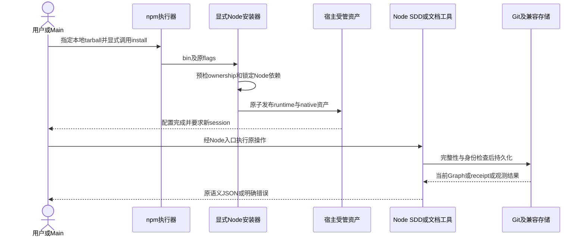
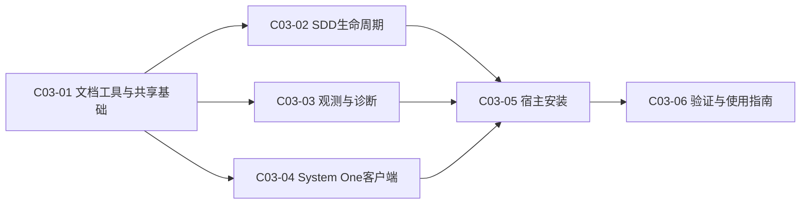

# 公共设计

> **设计结论**：以 Node ESM 和纯 JS/WASM 依赖迁移消费端；保留 canonical 文档、Git 身份、精确摘要算法、SQLite 与 MCP 协议，并取消 Task 文件路径授权器及其全链路依赖，通过显式 npm install CLI 和稳定已安装 runtime 提供同一平台能力。独立 GPU Python 服务不进入消费包。

## Current 基线与变更范围

### 受影响 Current Truth

基线为 `dc9ba409fb17632b333be679ab7b7c5b364aa4e1`。复用只读审计，不重复全仓发现：75 个 Python 文件中，36 个 Skill 工具文件、4 个安装/Adapter文件、3 个System One客户端/共享文件需替换；质量辅助8个另由验证Task迁移，22个测试模块和Docker fixture不是隐藏消费实现。GPU服务是独立例外。

| Current 文档 / 模块 | Current | Delta | Target |
| --- | --- | --- | --- |
| [产品总览](../../../02-product/P01-product-overview.md)、[SDD Runtime](../../../02-product/P02-modules/P02-01-sdd-runtime.md) | 本地Python工具集、完整SDD保护 | 实现语言与入口更新 | 同一产品/角色/权限/状态能力的Node消费工具集 |
| [安装](../../../02-product/P02-modules/P02-03-installation.md)、[Routing](../../../02-product/P02-modules/P02-02-agent-routing.md) | shell→Python；三宿主共用canonical roles | npm显式CLI、Node runtime、旧受管布局迁移 | 默认Codex、原flags、native角色/overlay/模型继承保持 |
| [观测](../../../02-product/P02-modules/P02-04-behavior-observation.md) | Codex full，其他partial；实际host-neutral state root | Node采集和SQLite WASM持久化 | 现有trace/unknown/coverage/数据保持 |
| [T01](../../../03-architecture/T01-architecture-overview.md)、[T02](../../../03-architecture/T02-api.md) | Python脚本/API与Git | ESM/bin/稳定wrapper与显式验证argv | 公开动作/flags/JSON语义及项目自有命令 |
| [T03](../../../03-architecture/T03-database.md)、[T04](../../../03-architecture/T04-domain-model.md) | Graph/manifest/receipt、SQLite、原状态机 | 实现替换；不改schema/ID；修正快照失配 | 已有数据不重建；原状态机及精确摘要 |
| [Operations](../../../04-operations/O01-operations-overview.md)、[Local toolkit](../../../04-operations/O02-applications/O02-01-local-toolkit.md)、[Quality](../../../08-quality/Q01-validation.md) | Python前置与CI/验证入口 | Node前置、显式npm、orderly upgrade、Node测试 | 消费端无Python；独立GPU/fixture lane明确 |

**证据优先级**：T03仍写 CODEX_HOME/sdd-observe，但 `sdd-do/scripts/observe.py:32–43` 和P02-04已使用 OPEN_SPEC_MESH_STATE_HOME → XDG_STATE_HOME/open-spec-mesh → ~/.local/state/open-spec-mesh。按实际源码迁移，绝不恢复过期默认。Current Truth的最终修订留给已集成diff同步，不在规划时写成事实。

### 本轮重规划的真实起点与授权

本轮只读起点为 Main HEAD `b8328f5c7ddd5590717badf58a3f2c9aef3ac403`。runtime 的权威状态是 C03-01 accepted/integrated（attempt 2）、C03-02/03/04 accepted/integrated（attempt 3/2/3），C03-05 blocked（attempt 1、无改动/交付），C03-06 随依赖 block 为 blocked（从 planned 传播而来）。根 `node_modules/` 物理存在且尚未永久忽略。用户已批准整个文件路径授权删除、发行清单/发布锁和依赖产物忽略；本轮不再把旧路径门当兼容承诺。

| 受影响面 | Current | Delta | Target |
| --- | --- | --- | --- |
| Task 生成与写作 | 模板/规范必填 Path Contract 和 allow/deny | C03-01 删除生成与必填要求 | 保留业务范围、代码落点与完整局部设计，无文件路径授权清单 |
| SDD runtime 与 packet | readiness/草稿/evidence 调用路径解析/匹配，间接传播至验收/集成/收口；packet 提示 diff 需授权 | C03-02 删除授权模块、入口和依赖 | 全链路只有真实 diff/AC/身份/冻结/依赖等保留门，不按路径 glob 拒绝 |
| 角色/Skill/规则/质量 | 写入路径边界被当作授权；测试断言越界拒绝 | C03-02 修改活动执行规则，C03-06 做完整消费审计 | 业务范围仍冻结；文件选择不再触发授权/replan，角色能力和安全边界不变 |
| 本地 artifact | package.json files 只含文档骨架；根开发锁不等于可消费发布锁 | C03-05 扩充发行资源并生成 npm-shrinkwrap.json | tarball 完整、自包含、依赖树锁定且不依赖源码 checkout |
| 根依赖产物 | 未跟踪 node_modules 使清洁检查受干扰 | C03-01 先加入根限定 .gitignore，C03-06 验证 | 用户目录原地保留，两个 lockfile 可跟踪 |

受影响 Current Truth 还包括 P02-02 的运行边界、T02 的 deliver 规则、T03 的 Task 文本说明与 O01 的路径授权操作。快照仍保持真实既有事实，本轮只记录最终同步清单。

### 当前兼容敏感实现

- `workflow.py:62–94` 对 scoped Change/Design/Own Task文本以 `\n---SDD-CONTRACT---\n` 拼接后SHA-256；Python文本读取的通用换行、rstrip及引用抽取影响精确结果。
- `observation/store.py:55–68` 的scope投影使用Python默认JSON空格、sort_keys、ensure_ascii行为；JS默认JSON.stringify不能直接替代这个hash输入。
- `install_toml.py:137–180` 手术式编辑后检查非受管值不变；不能把整个用户TOML parse→stringify重写。
- `validation_receipt.py:19–47`只接受.py、`run_validation.py:74–79`用当前Python执行；既有receipt schema=1且原path+raw SHA必须继续可验证。
- `numbering.py:13–23`及install锁使用flock；新Node不能依赖带Python构建前置的native addon。

## 总体方案与主流程

### 总体方案

源码新增 `bin/open-spec-mesh.js`、`lib/{cli,runtime,documents,workflow,release,observation,diagnostics,systemone,installation}/`，保留各Skill目录的 `.js`入口/模板/参考。CLI路由是固定command→模块映射，延迟加载对应能力，禁止任意模块路径/动态用户代码替代平台操作。共享机制放runtime，业务实现按能力落点。

消费包不捆绑node_modules或Python；随包包含package参考docs，供原--include-project-docs显式选项完整复制，默认不写Home/docs。installer将包的runtime/resources复制到stage，使用由根开发锁派生并随包发布的 npm-shrinkwrap.json 执行 `npm ci --omit=dev --ignore-scripts --no-audit --no-fund`，验证资源后与host资产一起发布到 `<host-home>/open-spec-mesh/runtime/`。因此不依赖npm exec临时cache生命周期、源码cwd、全局npmroot或Python安装。

已安装Skills仍位于 `<host-home>/skills/<skill>/`；其脚本调用共享 `sdd-init/scripts/node_runtime.js` bootstrap：源码优先固定包根lib；installed布局选择Home/open-spec-mesh/runtime。校验package身份和必要文件，依赖从该runtime/node_modules解析，不以进程cwd猜测。入口语义的完整映射见“接口变更”。

### 总业务流程 / 主时序

## 产品变更

Quick/SDD、角色 delegation allowlist、显式 Reviewer、Task 完整设计前置和人工 Acceptance 无变化。用户已明确取消 Task 文件范围锁定：不再要求 Path Contract，不按 allow/deny 或 changed paths 判断是否可以交付。业务目标/范围/AC/依赖和设计仍冻结，改变业务行为仍需批准；新增文件落点本身不再要求路径扩权。安全路径、ownership 与互斥域锁不是该机制，不得一起删除。

- 消费端统一Node；Research keys仍是原真实工具安装前置，--skip-tools可单命令安装core。
- npm package获取不代表宿主已经配置；只有显式install会写Home。
- 已有Python项目验证仍由用户声明命令，缺其解释器是业务验证失败，不是平台偷偷安装Python。
- 升级时停止旧writer和相关leaf，保全脏工作区，安装后重启session；不自动修改活动Task/Graph或重建观测。
- GPU服务仍是可选外部部署，不提供新的监听服务或把GPU依赖加进客户端。

## 接口变更

### 公共命令与原脚本映射

除 Path Contract 私有解析/匹配 helper 整体删除、路径越界错误整体取消外，所有CLI保留原positionals、flag含义、互斥、默认、JSON字段和退出类别：参数错误非零、业务保护失败非零，status/delivery/dispatch等机器stdout不混入日志。错误原文不必逐字符相同，但标识和语义可测试；help不得显示不存在的成功能力。

| 公共command | Node脚本映射 / 能力 | 原输入保留 |
| --- | --- | --- |
| install | scripts/install.js；install.sh改为exec node | --host/--host-home/--codex-home/--dry-run/--skip-tools/--include-project-docs/--with-laya/--without-laya |
| sdd | sdd-change/scripts/sdd.js | status/prepare/bind-session/deliver/integrate/close及所有现有flags |
| task-graph | sdd-change/scripts/task_graph.js | graph位置参数及--action approve/submit/block/rework/replan、原确认flags |
| new-change / new-task / ensure-design | 对应sdd-change/scripts/*.js | title/change_id/root/depends-on，不恢复已移除的--from-change |
| init-project / migrate-project / new-document / validate-docs | 对应init/migrate脚本.js | 既有root/parent/title/extension等输入 |
| new-research / new-adr / new-release / check-release | 对应research/release脚本.js；Release薄入口分别保持路由到 `lib/release/new-release.js` / `lib/release/check-release.js` | 原title/version/directory/root等输入 |
| prepare-workspace / record-delivery / import-delivery / record-acceptance / run-leaf | 对应sdd-do脚本.js | 既有workspace、attempt、revision、evidence/session/host等输入 |
| check-change / close-change / run-validation | 对应sdd-close脚本.js | 原Change、root、revision、accept/archive/evidence等输入 |
| observe / diagnose | observe.js / sdd-diagnose/scripts/bundle.js | 原host/db、collect/scan/report/group/summary及bundle输入 |
| systemone | mcp/laya_http_mcp.js | 缺省stdio；--input一击JSON模式，无SDK之外的解释器 |
| recover-lock | runtime维修入口 | 显式namespace/root或Home/db、owner token及--writers-stopped；不接受任意锁路径 |

删除 `parsePathContract/validateChangedPaths/matchesPath` 与 Python 对等 helper，不留 stub/default allow/环境开关。`validateEvidence`/`validateDelivery` 的 Task 文本输入保留供逐 AC 校验，label 改为 Delivery 语义；`changedFiles` 仍读取实际 Git diff。packet 无路径匹配约束或新增 allow/deny 字段，保留 artifacts、runtime、dependencies 和业务 scope。

对应的底层helper不承诺Python import API。迁移后的Skill示例使用 `node "$SKILL_ROOT/.../script.js"`；便捷new_change/init/close/new_release shell脚本继续存在且调用Node。Node wrappers只做固定路由，不内置第二份业务逻辑。

### 项目验证声明

Q01仍要求唯一 `## Validation Entry Point`，取首个非空声明：

1. 既有反引号内 `.py`相对路径：仅因用户已有显式声明而调用python3；descriptor仍 `{path, sha256(raw file bytes)}`，保持旧receipt验证。缺Python明确失败，绝不pip安装。
2. 新 `.js/.mjs/.cjs`相对路径：用 `process.execPath`执行；descriptor同上。
3. 显式单行JSON对象，例如 `{"argv":["npm","run","check"],"path":"package.json"}`：argv为非空字符串数组，path为项目内版本化常规文件；不调用shell。descriptor仍两字段，sha256明确为UTF8字节 `\n---SDD-VALIDATION-ARGV-v1---\n` + legacyJson(argv, ensureAscii=false, sortKeys=true, separators=[comma,colon]) + 单个LF + path原字节的SHA-256，使command变化失效；path另由descriptor精确比对。

三种声明均要求绑定文件已tracked/committed、在待验证HEAD；拒绝absolute/../symlink。receipt根schema仍1，新声明的摘要算法在声明种类内固定；旧script receipt保持原算法，不添加argv到Graph或receipt必需字段。revision绑定覆盖其他已提交checks文件；不把receipt视为用户身份认证。

## 领域模型与状态变更

**业务领域/状态机无变化**：Change、Task、Contract、ExecutionIdentity、Delivery、Acceptance、Integration、ObservationRun及其边界保持；Task状态仍planned/running/submitted/accepted/blocked，integrated只由Git ancestry推导。原history字段、attempt增长/session不可改绑、submitted不解锁下游不变。

Path Contract 不再是执行授权对象；Task 的 Included/Excluded、代码结构和 AC 仍是人类 Review 与冻结的业务设计。旧文本即使留有 Path Contract，也只是历史/过渡正文：新 runtime 不解析其 allow/deny，但全文仍参与既有摘要算法，不能静默剥离来沿用旧 digest。

新增的RuntimeLocation、InstallStage、DirectoryLockOwner和SqliteSession是内部运行对象，不成为Graph字段或新业务状态。MCP建议仍不触发Task动作。不同宿主能力继续由Adapter/coverage表达，不写入Task状态。

## 数据与表结构变更

### 权威存储无schema迁移

| 存储 | 保持的结构与身份 | 新实现约束 |
| --- | --- | --- |
| Markdown/index | C01/C02/C03编号、metadata、markers、设计/交付正文、导航 | 通用换行与原字节保全用途分别处理；不批量重写历史 |
| Task Graph | 根仅tasks；原fields/state/history/ID/digest/baseline/attempt/session/revisions | 原字段校验、原子写；不增加runtime/version/path合同字段 |
| 安装manifest | 已有package/schema/skills/roles及两种历史读取 | Node布局固定路径由同一package ownership派生；host manifest仍同字段/schema，paths增加固定runtime资产；新runtime ownership marker独立保存，不借旧manifest接管未知新目录 |
| validation receipt | schema1、change/revision/entrypoint/passed/exit_code/stdout_sha256/stderr_sha256 | 旧script descriptor原SHA；新argv种类采用上述绑定，失败先覆盖旧成功 |
| observations.sqlite3 | application_id=0x5344444F；user_version1；runs(run_id PK,scope_key,schema_version=1,report_json) | sql.js读入/事务/export/原子替换；run_id和Python scope_key兼容 |
| System One | JSON模板、settings、现有env名、进程缓存及metrics | 模板digest/encode兼容；进程缓存换进程自然清空，不作数据迁移 |
| npm 发布锁 | 新增 npm-shrinkwrap.json，lockfileVersion 与根 package-lock.json 一致 | 根开发锁只读为单一来源；发布锁原字节复制，全部 packages/version/resolved/integrity 与源相同；包身份/依赖不改 |

SQLite不改表/列/索引/约束，不将数据转成JSON或新DB；不自动升级未知schema。旧锁文件与Python工具cache不是数据权威，新版不猜测删除。GPU Pythonhelper独立迁出客户端后不在npmfiles中。

## 应用与组件变更

### 公共接口与跨Task契约

- `resolveRuntime(entryUrl) -> {packageRoot, resourceRoot, version}`：仅源码/固定installed布局；由文档Task提供，所有wrapper复用。
- `runCommand(command, argv, {cwd, env, stdout, stderr}) -> exitCode`：固定延迟路由，不执行未经登记的平台模块；同一参数解析/JSON输出约定。
- `withProjectLock(root, fn)`、`withInstallLock(home, fn)`、`withStoreLock(dbPath, fn)`：命名域不同、canonical path hash一致；禁止锁内再取得反向锁。
- `atomicWrite(path, bytes, {mode, preserveMode})`、`safeInside(root, relative)`、`readTextCompat(path)`、`sha256(bytes)`：安全路径、原子/原权限、Python读取兼容。原字节保全使用bytes API而非readTextCompat。
- `legacyJson(value, {sortKeys, ensureAscii, separators, indent})`、`parseLosslessJson(text)`：hash/wire场景不使用不受控JSON.stringify；Python code-point排序、surrogate转义、空格、数值kind/负零/指数表示须黄金向量验证；普通JSON输出可以同字段不同空白。
- `graphSchema.load/validate/save`：文档创建只写planned schema；workflow实现状态迁移/readiness，其他模块不能复制状态机。
- workflow导出 `planningComplete/readContractDigest/runValidation/checkChange`；Release实现位于 `lib/release/{new-release,check-release}.js`，前者复用document allocator建工件，后者消费workflow的closure/checkChange语义；既有registry路由不变。
- observation导出 `collect/normalize/diagnose/report/summarize`；bundle只调用这些纯采集/诊断接口，不能fork CLI或加模型调用。
- systemone导出 `clientConfig/managedLaunchShape/toolSchemas/runDecision`；installer消费同一工具/launch/env描述，不重新定义四工具或权限过滤。

选定依赖：sql.js 1.14.2、@modelcontextprotocol/sdk 1.30.1、smol-toml 1.4.2、jszip 3.10.2、lossless-json 4.3.1；由文档Task建立精确dependencies和lockfile。SDK使用v1实际包API，禁止复制v2拆分包示例。全部采用registry已编译JS/WASM资源；消费者不运行构建/生命周期。传递依赖通过根 package-lock 固定；C03-05 从其原字节派生发布锁，根开发锁不改；所有五项属于普通compiled Node artifact依赖，default-off仅保证不执行System One专属安装/加载transport/检测Provider，不承诺npm包下载不含SDK字节。后续Task不得无依据引入native/编译依赖。

## 关键决策

### D001｜Node与显式npm artifact边界

- **结论**：Node>=24.21.0、ESM、bin名open-spec-mesh、本地artifact package名open-spec-mesh、初始artifact version 0.1.0；package private=true以防误发布；无preinstall/install/postinstall/prepare宿主写入。消费命令为AC-10所列npm exec；--ignore-scripts是显式消费约束。
- **原因**：统一现代稳定Node基础；registry名称/发布不能由E404推断所有权，不依赖publish凭据规划。
- **影响**：npm pack/tarball是本Change验证对象。未来公共发布先核对包名/许可/版本并解除private，经独立release执行；指南不得把registry命令写成当前可用事实。

### D002｜精确兼容编码而非默认JS重序列化

- **结论**：所有影响摘要/对齐/旧数据的字节流使用公共compat codec与基线golden fixtures；文本通用换行、rstrip、code-point排序、ASCII转义、Python float/int区分和unsafe integer不丢精度。非受管TOML只作局部lexer编辑+语义guard，不全量stringify。
- **原因**：默认JSJSON/UTF-16长度/Date和数字精度会改变冻结或scope key；用户没有授权重置。
- **影响**：golden必须含CRLF、BMP/astral、控制符、NaN/日期TOML、大整数及1.0/指数/负零。lossless数值仅在codec边界解包，不把BigInt直接JSON.stringify；无法保持时停止，不能约束用户输入来规避；TOML保持原1.0语法边界，合法__proto__/constructor等键须用own-property/null-prototype处理而不是新拒绝。

### D003｜无native依赖的锁与崩溃保全

- **结论**：新Node同版本writer用exclusive mkdir目录锁，owner含随机token/pid/namespace，0700；原子bytes写使用同目录temp、fsync/rename及权限保全。不用超时/mtime偷锁，不混用旧flock。
- **原因**：flock native addon可能增加Python编译前置；时间过期不能证明writer已死。
- **影响**：正常finally按token释放；SIGKILL/owner缺损锁保留并fail closed。recover-lock仅在明确--writers-stopped、精确token匹配且pid不存在后释放；存活/不明/权限异常拒绝。需人工维修owner缺损，不自动删除用户状态。明确一版本升级使旧/新锁互通不在承诺内。

### D004｜稳定模块布局和薄入口

- **结论**：lib是单一实现；各Skill .js wrapper经bootstrap找到源码或已安装open-spec-mesh/runtime；installer自包含发布package+锁定deps，不能指向npmcache/symlink。
- **原因**：单次npm exec可清理cache；消费Skills不应依赖clone/cwd和全局模块搜索。
- **影响**：package files 是发行资源选择，不能与已删除的 Task 写入授权混同；它仍必须完整、精确。白名单含 npm-shrinkwrap.json、install.sh/scripts 安装 Node 入口、bin/lib、canonical rules/roles/config、Skill references/templates/Node scripts、mcp JSON/JS、assets SVG、package参考docs和许可资源；不含tests、Python实现、GPU服务或node_modules。参考docs内历史记录不是消费脚本，保持原--include-project-docs能力；默认安装只发布runtime资源和Skills，不写Home/docs。引用重定位验证跨installed布局。

### D005｜SDD生命周期和Git身份不重设计

- **结论**：原readiness（仅去掉 Path Contract 必填与解析）/冻结/scoped digest 算法、五状态/attempt/session、Delivery/AC、rework/replan、wave ancestry保持；取消所有 Task 文件路径匹配门；git使用argv子进程，不用shell拼接。
- **原因**：语言迁移不能削弱保护或把accepted当integrated。
- **影响**：公共graphSchema来自文档Task，状态业务由workflow独占；跨Task不得引入第二份transition或修改schema。

### D006｜业务验证命令仍归用户

- **结论**：支持旧.py声明、新Node脚本及显式argv+tracked path；shell=false，receipt envelope/schema保持，旧script摘要原样。
- **原因**：Node平台不代表下游项目必须改语言；同时必须取消平台硬编码Python入口。
- **影响**：Node生成指引、archive receipt校验、测试runner必须统一调用同一解析器；显式外部解释器缺失只失败，不下载、不降低AC。

### D007｜WASM SQLite保持真实SQLite文件

- **结论**：不用node:sqlite RC/实验成熟度API或nativebinding；sql.js导入旧字节、相同schema执行事务，export验证后原子替换原文件，0600。一次CLI store session持锁，逐run提交/export。
- **原因**：避免解释器/编译前置，同时保留用户已有SQLite数据格式。
- **影响**：读/写都持新store锁以读取最新snapshot；失败不替换旧文件。未知DB/应用ID/schema/权限、hot journal/WAL伴随文件须fail closed，升级前由旧版本完整关闭/正常checkpoint，不能删除恢复文件。完整内存载入是性能风险，不能静默截断或导出丢行。

### D008｜MCP客户端与GPU推理解耦

- **结论**：Node使用SDK1.30.1低层Server及ListTools/CallTool schema、stdio transport；保留FastMCP现有工具输入/返回envelope。Laya/Jev HTTP使用Node fetch，禁重定向、限时限体积、typed validation/fallback；GPU Python服务及专用contracts helper在消费包之外。
- **原因**：只迁移client不迁移推理；SDK包名/版本线和工具结果契约必须一致。
- **影响**：stdio必须保持数字/JSON内容，必要时对SDK transport作lossless适配而非先JSON.parse丢精度；所有工具/HTTP返回以旧baseline vectors验证。stdout只允许MCP frame；debug/metrics脱敏且无state/key泄漏。

### D009｜原ownership和宿主差异约束安装

- **结论**：原Codex默认/flags、marker/manifest/手术式TOML、非Codex overlay、custom MCP保留、旧受管Pythonlaunch识别仍适用；Node runtime作为固定package-owned目录纳入同一stage/rollback。默认Research keys规则不变。
- **原因**：不能以语言更新为由改用户provider/模型、覆盖同名私人文件或静默改变宿主能力。
- **影响**：非Codex --with-laya仍fail closed。旧pip/cache仅在确认package ownership时退休，否则留作未消费遗留并报告；新包/launcher不引用它。工具网络安装沿原边界可重试，不承诺把已有外部toolcache变成全局事务。

### D010｜回归映射和最终快照时机

- **结论**：Node测试/validator是消费端required路径；422原静态方法逐项映射到实际Node case或独立GPUlane；仅用户授权取消的路径行为按“有意行为替换”映射到新反向测试并注明 R06/D011，其他场景不允许豁免。移植职责跟能力Task；最后verificationTask聚合覆盖、CI和操作指南，不代替Main最终验收。
- **原因**：保留失效Python测试或大量skip不能证明功能保留；计划不应预写现状。
- **影响**：最终Node全量入口和明确GPU/fixture外部lane均须真实验证；失败无豁免。全部集成后Main再交Architect按diff同步受影响Current Truth，尤其state home失配；不是新增Worker任务来伪造现状。

### D011｜取消 Task 文件路径授权，不取消业务 Contract 与安全保护

- **结论**：删除 Task Path Contract 生成/必填/解析/allow-deny/glob 匹配、changed-path authorization 与所有消费者；不是 `allow **`、默认允许或隐藏开关。业务范围和完整设计仍冻结；路径选择不是独立授权门。
- **保留**：Git diff/Delivery 文件表集合与操作精确相等、全部 AC 的结构化结果、baseline/revision/attempt/workspace/session、scoped digest/漂移、history/replan、Git ancestry/依赖状态、人工 Acceptance、用户文件保全、symlink/path traversal、ownership、角色委派 allowlist、project/install/store 域锁及 rollback。
- **兼容**：Graph/Delivery/receipt 的 schema 无变化，旧合同正文仍参与原摘要，不篡改旧 Delivery/历史工件或重置数据。含旧 Path Contract 的 Task 可被新 runtime 读取，缺该节的新 Task 也可正常冻结；两者都没有文件路径授权。所有本轮旧冻结身份按机械 drift + 依赖传播撤销。
- **过渡边界**：当前已安装协调器仍要求 Path Contract。仅本 Change 六份既有 Contract 保留精确路径表作为旧协调器启动格式，不用全路径授权替代；它们不是目标模板、目标 runtime 的限制或全局质量豁免。新模板直接不生成该节。C03-02/03/04 wave 复验集成完成后，Main 停止旧 writer，再切到已集成 Node 协调器；新协调器不执行这些历史表。无需届时再补设计或改合同/摘要，旧表永久留作本 Change 过渡记录即可。目标删除验收必须在没有路径节及含故意冲突旧表的隔离项目两种场景中证明，不能只用本 Change 旧格式证明。

### D012｜完整发行清单与唯一来源的 npm 发布锁

- **结论**：C03-05 修订 `package.json.files` 并新增 `npm-shrinkwrap.json`，根 `package-lock.json` 原字节为唯一来源；包名/version/private/engine/bin 与五个直接依赖和传递树不改。禁止在 Main 根执行 `npm shrinkwrap`、`npm install/ci`，也不能重解析最新依赖；派生与打包验证用隔离目录。
- **发行语义**：`package-lock.json` 是开发来源，不假定它会出现在 npm tarball。发布锁须实际出现在 tarball，RuntimeStager 复制并使用它进行 `npm ci --omit=dev --ignore-scripts --no-audit --no-fund`。源码若同时有两个锁，打包前验证原字节相同；缺失/分叉/资源不全明确失败，不无锁 install/fallback。
- **完整边界**：除现有文档骨架，还包含 installation/workflow/release/observation/diagnostics/systemone、Node 薄入口/便捷 shell、canonical Rules/roles/dispatch/config、所有被引用 Skill 模板/reference/JSON、MCP JS/模板/settings、SVG 和 package 参考 docs。files 可预声明 C03-06 的 Node 质量文件模式，但 C03-05 不伪造未实现文件；C03-06 最终 tarball 审计所有消费能力。
- **排除与保全**：tests、Python/GPU 实现、node_modules、真实凭据/状态/临时包不入消费 artifact；仅获取 artifact 不写 Home，公开发布仍独立 release。C03-01 前移 `/node_modules/` 忽略以保证工作区可协调，C03-06 验证根限定规则、两个锁仍跟踪和用户目录未变。package 参考 docs 在最终同步前仍描述既有真实 Current Truth；C03-05 验证显式复制完整树/导航和操作资源，不能为中途打包修改快照。全局 Current Truth 的 Node/路径规则及源码链接待最终真实同步，再由 Main 全量验证。

## 公共设计与不变量

- **事务 / 一致性**：Graph及文档保持原步骤边界，单个文件原子写不冒称跨文件DB事务；installation具stage/rollback；SQLite在旧库不变的前提下commit/export/验证新bytes再replace。验收、集成、receipt、归档仍是不同事实。
- **幂等 / 并发**：锁顺序为能力的外层域锁→文件写；workflow不取store/install锁，store不取project锁；bundle不写项目。相同Graph/runtime/schema操作保持幂等。不同Task worktree允许并行，但同一Task不能并发执行；新/旧runtime禁止并写。
- **失败与恢复**：失败必须非零/原fallback，不能假通过或补造历史时间；保留旧数据/temp恢复信息。不自动replan/reset/rebase/prune脏workspace。crash残锁按D003显式恢复。
- **兼容**：canonical持久formats/IDs/schema保持；lossless/legacy codec以基线golden为准。旧Python命令/私有importAPI不兼容；GPU Python不是fallback。安全输入边界不因JS prototype pollution、symlink或shell注入放宽。
- **文件选择与真实范围**：不以路径 glob 判断越界，不重引入 path ownership 作为 Task 授权器。新增实现落点只需符合当前业务目标/Included/Excluded、设计与 AC；改变业务 Contract 仍须 replan。保护 Git/workspace/报告目的路径及安装 ownership 的 allowlist 是真实数据/执行安全，不是 Task 文件范围门。
- **用户根依赖**：Main 根 node_modules 只读，任何 Task 都不能移动/删除/清理/覆盖/暂存；依赖安装与测试数据仅在隔离 workspace/temp/Home。永久忽略由 C03-01 修改根 .gitignore；提交前若旧协调器被根 untracked 产物阻挡，Main 只可临时采用根限定 Git exclude（不忽略任何其他改动），不能通过清理用户目录使检查变绿，临时 exclude 不能代替版本化规则。
- **安全**：研究工具和runtime依赖安装的子进程移除provider/API key；日志隐藏registry可能凭据，保留env变量名不保存值；系统建议不能扩权，session/receipt/flags不冒充认证。

### 返工、复验和撤销范围

| Task | 是否撤销旧验收 | 本轮执行要求 | 旧身份/工作区 |
| --- | --- | --- | --- |
| C03-01 | 是，共享需求/自身生成设计变化，且作为其他 Task 上游传播 | 原 Worker replan 后实现模板/规范与 ignore，复跑 AC-01/02，不能只复用旧锁修复 Delivery | attempt 2 和原 session/工作区保留历史 |
| C03-02 | 是，路径授权实际仍存在，AC/局部设计变化 | 原 Worker 修改全链路删除并复跑 AC-03/04/05；不是只 revalidation | attempt 3、既有源码/revision/Delivery 不回滚 |
| C03-03 | 是，共享需求、D004/D011/自身过渡正文变化与 C03-01 依赖传播 | 原 Worker 新 attempt 下定向复验 AC-06/07；无证据要求新业务改动；有缺陷仅在原业务范围修复 | attempt 2/session/原 worktree 保留 |
| C03-04 | 是，同上；取消 Task 文件授权不取消候选角色权限 | 原 Worker 新 attempt 定向复验 AC-08/09，包含原 GPU factory lane；不因此改 provider/SDK/权限 | attempt 3/session/原 worktree 保留 |
| C03-05 | 无旧验收；撤销旧冻结/blocked identity | 原 Worker 从用户确认的新 Contract 继续，新 attempt、完整 pack/发布锁/安装证据 | attempt 1、无实现/交付；保留 root workspace/session |
| C03-06 | 尚未执行，随下游失效后 planned | 实现质量/指南/退休，验证 C03-01 已交付的 ignore，不再负责写 ignore | 无 attempt/session，不伪造身份 |

共享 Change 规划正文、Design 公共不变量/停止条件和被引用决策变化，五个既有 frozen digest 必然漂移。调用合法 `task_graph.py --action replan --task C03-01 --user-confirmed --workers-stopped` 一次，脚本收集目标 + 所有 drift + 依赖后继，全部回 planned；旧 baseline/revision/report/contract_digest 存入 history，workspace/attempt/session 依脚本保留。新摘要只做只读计算以证明范围，不在规划期手填/approve。Main 按整图重冻和派发；代码已经在 HEAD 中并不代表新 Contract 已验收。纯复验 Task 可在新 baseline 上没有实现 diff，但必须有新 attempt/revision 绑定的真实逐 AC 证据与 Delivery，不能冒用旧报告。

## Task 关系与设计落点

| Task | 交付结果 | 前置任务 | 关联设计 | 验收 |
| --- | --- | --- | --- | --- |
| `C03-01` 文档工具与共享基础 | 既有基础复验、去路径清单的生成模板/写作规范、根 .gitignore | 无 | `D001` npm边界、`D002` 精确编码、`D003` 锁与保全、`D004` 稳定布局、`D011` 取消路径授权 | `AC-01` 公共基础、`AC-02` 文档工具 |
| `C03-02` SDD生命周期 | Node/Python 路径授权模块与全链路门删除、packet/角色/Skills 更新、完整身份与 Delivery 复验 | `C03-01` 文档与公共接口 | `D002` 精确编码、`D003` 锁与保全、`D004` 稳定布局、`D005` Git身份、`D006` 项目验证、`D011` 取消路径授权 | `AC-03` 冻结状态、`AC-04` 执行集成、`AC-05` 验证归档 |
| `C03-03` 观测与诊断 | 新 Contract/attempt 下复验既有 trace/SQLite/ZIP；无预设业务实现改动 | `C03-01` codec/IO/锁及resources | `D002` 精确编码、`D003` 锁与保全、`D004` 稳定布局、`D007` WASM SQLite、`D011` 保留数据安全 | `AC-06` 观测数据、`AC-07` 私有诊断 |
| `C03-04` System One客户端 | 新 Contract/attempt 下复验既有 MCP/HTTP/GPU隔离；无预设业务实现改动 | `C03-01` codec/依赖/入口 | `D002` 精确编码、`D004` 稳定布局、`D008` 客户端解耦、`D011` 保留角色权限 | `AC-08` MCP协议、`AC-09` GPU隔离 |
| `C03-05` 宿主安装 | 完整 package files/发布锁、三宿主 tarball 单命令、自包含 runtime/升级回滚 | `C03-02` workflow、`C03-03` observation、`C03-04` System One | `D001` npm边界、`D002` 精确编码、`D003` 锁与保全、`D004` 稳定布局、`D008` 客户端解耦、`D009` ownership、`D011` 无路径门、`D012` 完整发行/发布锁 | `AC-10` 显式单命令、`AC-11` 宿主安全 |
| `C03-06` 验证与使用指南 | Node全量/CI、422项回归映射（明确行为替换）、最终发行/无路径门/根 ignore 保全审计 | `C03-05` 完整installed产物 | `D001` npm边界、`D004` 稳定布局、`D006` 项目验证、`D009` ownership、`D010` 回归与快照时机、`D011` 无路径门、`D012` 发行/锁审计 | `AC-12` 消费验证 |

**ready waves**：C03-01 → C03-02/03/04（独立原 worktree 并行复验/返工）→ C03-05 → C03-06。依赖拓扑不改：C03-05 必须消费三个真实新验收、已集成的精确结果；C03-06 必须消费完整安装。模板与 workflow 的公共重叠由已有 C03-01→C03-02 依赖解决，不新增按文件互斥的 Task。旧工作区复用必须先保全未提交内容，按既有流程集成上游真实结果，再用 reuse/base；不 reset/rebase 或创建覆盖原 session 的第二个 writer。

**过渡编排**：本轮规划和 C03-01/02/03/04 的启动可由既有已安装协调器操作权威 Change；六份兼容表满足其解析，不是最终路径策略。该 wave 集成后由 Main 停止全部旧 writer，使用兼容 Node≥24.21.0 和锁定现有依赖读取同一 Graph，核对精确摘要/状态一致后单写切换；不重新分配 attempt/session，不允许两种协调器并写。C03-05/06 的新 Node 消费从此不再执行路径门；Python 源码协调器的路径门在 C03-02 先删除，剩余过渡源码在 C03-06 退休。不得修改全局已安装 skill 来绕过当前 readiness，不能用 Python 后台提供新能力。

## 实现自由度与停止条件

- **Worker可自行决定**：模块内部函数/类、等价parser组织、test fixture分布、不影响schema/协议的日志措辞；可按同一业务 scope 选择更清晰的文件拆分；不以新增路径作为单独授权/replan 理由。
- **不可改变**：上述依赖/版本与跨Task接口、公开行为/数据/摘要/权限、GPU例外、单显式npm安装、无Python/native消费前置、one-version upgrade和验收责任。
- **必须停止并replan**：需换SQLite数据格式/receipt schema/冻结算法、取消旧scope兼容、引入native构建或Pythonfallback、改变provider/host默认、扩大GPU/registry发布、改变业务 Task 边界/AC/依赖；单纯新增实现文件落点不属停止条件；取得用户确认后原Architect修订。

## 风险与未决问题

- **风险**：Python/JS数字和换行差异；sql.js整库内存/export成本；异常锁owner需要明确维修；npmcache、资源/wasm定位和依赖安装失败；旧ownership复杂TOML；SDK stdioJSON envelope差异。各风险有对应golden/故障/打包用例，不用猜测或放宽AC。
- **未决问题**：无影响设计的用户选择。public registry发布/名称许可/凭据、真实服务认证和GPU硬件是独立release/环境条件，不阻塞本地artifact或计划。

### 定向外部证据（2026-09-28）

Librarian按只读Dispatch Packet完成核对；使用仓库明确支持的独立leaf fallback（当前上下文无V2 spawn工具），role模型/effort来自配置，不新增Worker。只取事实，架构决策仍由本Architect负责。

- [Node v24.21.0官方发布](https://nodejs.org/en/blog/release/v24.21.0)及[sqlite版本文档](https://nodejs.org/docs/v24.21.0/api/sqlite.html)：LTS基线；node:sqlite非Stable成熟度，不选为隐含依赖。
- [npm exec](https://docs.npmjs.com/cli/v11/commands/npm-exec/)、[package.json](https://docs.npmjs.com/cli/v11/configuring-npm/package-json/)、[package spec](https://docs.npmjs.com/cli/v11/using-npm/package-spec/)：bin/files、cache、exec与tarball分发；本地tarball单次调用最终必须由安装Task真实验证，不用文档推断代替smoke。
- [sql.js官方项目](https://github.com/sql-js/sql.js)、[API](https://sql.js.org/documentation/)、[registry 1.14.2](https://registry.npmjs.org/sql.js/1.14.2)：Uint8Array旧库输入/export bytes、异步WASM初始化；无应用级锁/持久化保证。LibrarianRelease页看到1.14.1，随后直接registry metadata+tarball只读检查证实1.14.2实际可取，故pin 1.14.2，不宣称各页面“latest”一致。
- [SDK v1](https://github.com/modelcontextprotocol/typescript-sdk/tree/v1.x)、[registry 1.30.1](https://registry.npmjs.org/@modelcontextprotocol%2fsdk/1.30.1)：直接tarball声明Node>=18、提供compiled esm/server及stdio/types；低层Server保留工具JSON schema；不采用v2拆分API。
- [smol-toml](https://github.com/squirrelchat/smol-toml)、[registry 1.4.2](https://registry.npmjs.org/smol-toml/1.4.2)：初次Librarian核对1.9.0已采用TOML1.1；为保持Python基线1.0语法边界，追加只读核实1.4.2 tarball README/compiled API明确TOML1.0、零运行依赖、Node>=18、integersAsBigInt/asNeeded和安全own __proto__处理，故pin 1.4.2而不盲选latest。对象stringify不是原文保全，仍需局部lexer。
- [JSZip文档](https://stuk.github.io/jszip/documentation/)、[registry 3.10.2](https://registry.npmjs.org/jszip/3.10.2)与[lossless-json 4.3.1](https://registry.npmjs.org/lossless-json/4.3.1)：纯JS ZIP/权限和lossless number工具。直接metadata及选定tarball检查未发现install/postinstall/native binding；完整传递依赖lock与无编译保证仍由Node定向安装测试验证。

以上只读网络核对不代表已安装、通过协议测试或已公开发布。基线Python脚本只用于本次canonical规划创建/readiness，不是目标实现。

### 本轮机制审计证据与计划落点

| 证据面 | 核对到的事实 | 删除或保留 / 责任 |
| --- | --- | --- |
| Node 授权器 | lib/workflow/path-contract.js 的 parsePathContract/matchesPath/validateChangedPaths，sdd-change/scripts/path_contract.js 薄入口 | C03-02 整体删除，无默认允许 stub |
| Node 直接门 | readiness.js:188 必填解析；lifecycle.js:168 草稿校验；evidence.js:148 实际 diff 授权 | C03-02 删除；实际 diff/结构/逐 AC/身份检查保留 |
| Node 间接消费者 | contract.js.validateDelivery → evidence；record/import/submit/accept/integration 调用 validateDelivery；closure/check/close 复核身份/报告 | C03-02 逐入口验证不再经过授权器，不能删掉整个 validator |
| packet | lifecycle.js.workerDispatchPacket 第 100 行的 diff/Path Contract 约束；workspace 同步 Task 正文 | C03-02 去提示，保留 artifacts/runtime/dependencies/scope、planning mirror 与用户报告保全 |
| Python 直接与间接门 | path_contract.py；contract_readiness.py:369；sdd.py:270 draft；delivery_evidence.py:204；workflow.py.validate_delivery；record/import/accept/check/close 共用 | C03-02 删除路径门与 helper/import/错误文案，保留过渡身份/真实文件证据；C03-06 退休其余 Python 源码 |
| 生成与规范 | sdd-task-contract-template.md；sdd-init/references/document-contract.md 的 Task 格式；runtime-guide/workflow-policy 中路径约定 | C03-01 修改模板/写作规范；C03-02 修改 runtime/protocol 规则，保留业务范围与全部必需局部设计 |
| 活动执行规则 | AGENTS.md；agents/{architect,worker}.toml；sdd-change/SKILL.md、references/task-graph.md；sdd-do/SKILL.md、references/delivery-template.md；dispatch-contract 的 scope 为业务范围 | C03-02 去路径清单依赖，不改 model/effort/可委派角色、V2/session 或 scope 业务停止语义 |
| 既有测试 | Node workflow/contracts.test.js 的两类路径断言；Python test_contract_readiness/test_lean_contracts/test_sdd/test_process_modes 的 Path Contract 断言/fixtures | C03-01 新生成模板测试；C03-02 将 removed behavior 逐项替换为无路径门正例，保留混合用例中的文件完整性负例；C03-06 422项映射/static 聚合 |
| 历史/兼容文本 | completed Changes、Delivery、legacy golden 以及本 Change 六份启动格式 | 不批量重写；新 runtime 不把它们当授权。全文 digest 仍敏感，新的无路径正文必须有独立 fixture |
| Current Truth | P02-01/02、T02/T03、O01 仍描述路径规则；其他 Node 化快照与 state-home 失配亦受影响 | 本轮不改，最后按真实 integrated diff/Delivery 同步 |

### 规划完整性证据

2026-09-28，本轮完成所有六份局部详细设计和 C01/C02 对齐后，以已获用户授权执行一次正式 replan；不是手工改 Graph 状态。记录如下：

- 已安装 Python 协调器和已集成 Node 只读 reader 均返回 `graph_ready=true`、`planning_ready=true`、`planning_error=null`。
- 六个 Task 的当前 scoped digest 经两种实现只读计算逐项相等；五个旧冻结在修订前与旧正文相等、修订后全部漂移，replan 后 `frozen_contract_drifts=[]`。当前六个 Task 均 planned、**未重新冻结**；旧 digest/baseline/revision/report 身份在 history 的 previous 中完整保留，Main 才可 approve/prepare 新 Contract。
- C03-01 的唯一下一机械动作是 prepare；C03-02/03/04 等待 C03-01，C03-05 等待三者，C03-06 等待 C03-05。Graph 拓扑、Task ID/path、原 attempt/workspace/agent_session 均保留。
- `validate_docs.py --root /home/fatfei/code/open-spec-mesh` 返回 `docs: valid`；`git diff --check` 通过。这些是规划/readiness/格式检查，不是实现测试或最终验收。
- Main HEAD 仍为 `b8328f5c7ddd5590717badf58a3f2c9aef3ac403`；Git worktree 登记及三个原 Worker 工作区 status 与调查前逐项相同。六份 Main Delivery SHA-256 相同，未覆盖其正文。
- 根 package.json/package-lock.json/.gitignore 原字节、inode/mtime 均未变；根 node_modules 目录 inode/mode/mtime、内部 .package-lock.json 原字节/inode/mtime 均未变。未执行安装、shrinkwrap、打包、实现测试、Worker 派发、approve/prepare、接受/集成或任何清理。
- 只读审计快照和计算结果位于 `/tmp/architect-path-scope-replan-mtdynrae`：before.json/原规划字节备份、status-python.json、status-node.json、scoped-digests-node.json、after.json；运行态仍以项目 Graph/脚本为准，不将这份快照作为新冻结或 Delivery。

全部局部设计在此次交付前一次性完成；Main 不需要再次拆分/翻译 Graph。六份 Path Contract 表是明确标记的旧协调器过渡格式；目标删除在 C03-01/02 的实现与新/旧正文反向用例中验收，不能宣称本次规划已删除实现代码或已重新验收旧结果。执行环境需沿用已验证的 Node≥24.21.0；当前 shell 默认 v24.19.0 仅用于本轮只读摘要/status 对照，不作为目标 engine 合规或测试通过证据。
