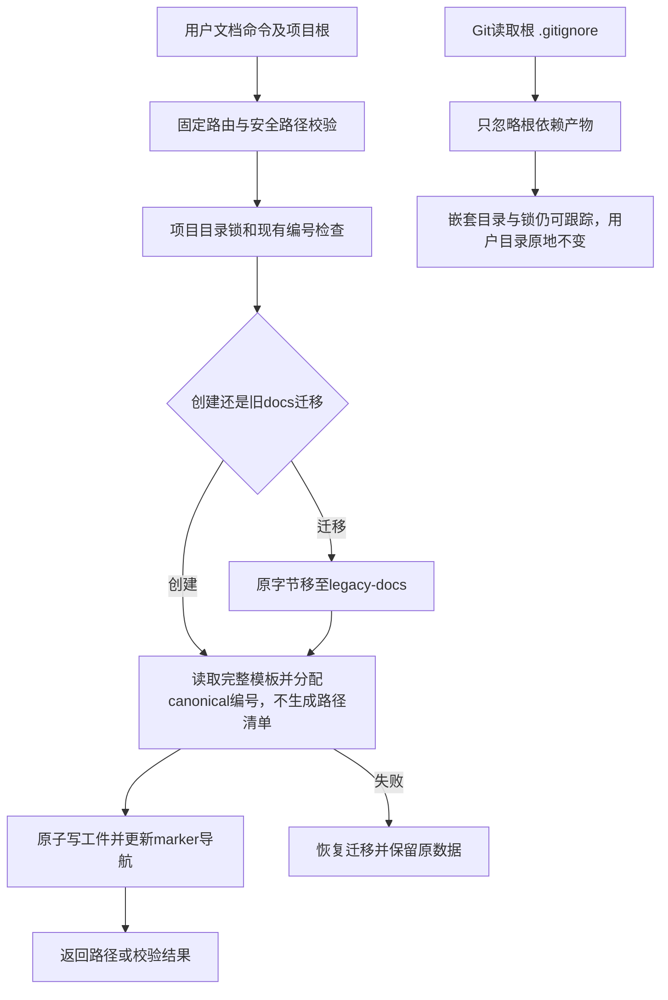

# Task `C03-01`：详细设计

> **交付目标**：让用户在Node中独立完成文档初始化、编号、迁移和规划工件创建，并为其他能力提供唯一的package/入口/兼容编码/安全持久化基础。
>
> **公共设计**：[Design](../../C02-design.md)

## 范围与代码落点

### 要做

- 建立ESM package、精确纯JS/WASM依赖和lock、显式bin、固定命令registry及源码/installed bootstrap。
- 移植sdd_common、numbering、markdown_contract的公共能力，提供graph schema而不实现transition；建立兼容字节golden。
- 移植init/migrate/new_document/validate_docs/new_change/new_task/ensure_design/new_research/new_adr及便捷shell入口。
- 更新本Task直接拥有的Skill/参考内Node调用和生成的验证指引；创建自己的Node回归与基线case映射。
- 本轮在已有实现上修订新 Task 模板和写作契约，删除 Path Contract/allow-deny 生成与必填指导；Included/Excluded、代码结构、流程、局部接口/Domain/Data、失败/测试、AC/预期输出保持完整。
- 前移根 `.gitignore` 的 `/node_modules/` 配置：用户已有目录只读原地保留，两份锁继续版本控制；这是包骨架/协调环境改动，不实施 npm 安装。

### 不做

- 不实现SDD执行/收口/Release、Observation、System One或安装业务；固定registry可声明这些模块，但不存在时必须非零，不能实现空成功stub。
- 不安装到真实Home、不运行npm publish、不提前写Current Truth；不删除其他能力尚需的旧Python实现。

### 输入 / 依赖

- 基线revision及现有canonical模板/文档编号规则；旧函数行为是兼容oracle，调用位置与用户模板原语义保持。
- 无前置Task；交付给下游的是可调用的公共接口和真实Node文档能力，不是设计草稿。

### Path Contract

> **D011 过渡格式**：下表仅供当前已安装协调器解析本 Change，保留具体路径而不改为全允许；不作为目标模板或目标 runtime 的文件授权。C03-02 交付后新 runtime 不解析/执行 allow/deny，旧正文仍按原算法参与 digest。业务边界见“要做/不做”和下方局部设计；不得为删除路径门同时删除用户文件保全、安全路径或身份检查。

| 规则 | 路径 |
| --- | --- |
| allow | `package.json` |
| allow | `package-lock.json` |
| allow | `.gitignore` |
| allow | `sdd-change/references/sdd-task-contract-template.md` |
| allow | `bin/**` |
| allow | `lib/cli/**` |
| allow | `lib/runtime/**` |
| allow | `lib/documents/**` |
| allow | `sdd-init/**` |
| allow | `sdd-migrate/**` |
| allow | `sdd-research/**` |
| allow | `sdd-change/scripts/new_change.js` |
| allow | `sdd-change/scripts/new_change.sh` |
| allow | `sdd-change/scripts/new_task.js` |
| allow | `sdd-change/scripts/ensure_design.js` |
| allow | `tests/node/runtime/**` |
| allow | `tests/node/document-tooling/**` |
| allow | `tests/fixtures/migration/document-tooling/**` |
| allow | `docs/05-changes/C01-进行中/CHG-20260928-nodejs-migration/C03-tasks/C03-01-document-tooling/C03-01-02-delivery.md` |
| deny | `docs/02-product/**` |
| deny | `docs/03-architecture/**` |
| deny | `docs/04-operations/**` |
| deny | `docs/05-changes/C02-已完成/**` |

### 代码结构 / 模块落点

| 目录 / 文件 / 类 | 计划变更 | 责任 |
| --- | --- | --- |
| package.json / package-lock.json / bin/open-spec-mesh.js | 新建ESM/bin、files白名单、engine、精确依赖、private保护 | 发行为可执行artifact而不是Python外壳 |
| lib/cli/{registry,args,output}.js | 固定command映射、原flags解析、stdout/exit封装 | 公共CLI一致性、延迟加载 |
| lib/runtime/{location,paths,io,locks,compat-json,text,graph-schema}.js | 公共安全/持久化/编码模块 | 跨能力唯一机制 |
| sdd-init/scripts/node_runtime.js | 共享薄入口bootstrap | 源码/installed资源与依赖固定定位 |
| lib/documents/{common,numbering,markdown,init,migrate,create,validate}.js | 移植文档域 | 模板、命名、索引、原字节迁移 |
| 对应Skill scripts/*.js 与 shell | 同名Node入口 | 无重复业务、无Pythonfallback |
| sdd-change/references/sdd-task-contract-template.md 与 sdd-init/references/document-contract.md | 去掉新 Task 的路径节/清单，保留完整详细设计固定维度 | 生成器与写作单一契约 |
| .gitignore 与 tests/node/document-tooling | 根限定依赖产物忽略与 Git fixture | 用户目录保全、lock 仍跟踪 |
| tests/node及migration fixture | golden/创建/迁移测试 | 记录旧case→新case、baseline和来源 |

## Task 实现流程

## 详细设计

### 核心逻辑

本轮恢复原 Worker，在已集成基础上只完成上述模板/规范和 ignore 增量并重新验证全部本 Task AC；不重写已修复的共享锁，不改 package 身份/engine/依赖或根开发锁。new_task 从去路径节的 canonical 模板创建完整 Task；allocator/Graph schema 无新字段、无路径规则存储或替代授权。兼容模板历史的原正文保全承诺不包括用户明确取消的路径规则。

根 `.gitignore` 仅追加缺失的 `/node_modules/`，保留其他既有字节与规则，不加 `*.json`/lock 忽略。用临时 Git fixture 验证根依赖产物不被追踪、嵌套同名目录不被该新规则忽略、两个 lockfile 可被跟踪以及目录哨兵未移动/改写。Main 根目录不放测试哨兵、不 npm install/ci、不 stash/clean；后续质量 Task 只复核这一实际产物。

入口将argv解析为固定业务输入，取得canonical root并拒绝逃逸/symlink。分配前检查模板存在、父目录分类/编号、重复编号和index markers；项目锁内完成编号和索引写。文档metadata/parser必须复用既有visible-lines、fenced example、evidence分割语义，不把示例或注释当要求。

new_change固定C01/C02/C03结构和active index；new_task 生成不带 Path Contract/allow-deny 的 Task，仍保留完整范围/局部设计/流程/依赖/AC；仅向当前Graph追加id/path/depends_on/state=planned/history=[]，验证已知依赖/重复/环并生成Task/Delivery/index；不批准、不计算冻结、不启动执行。ensure_design只返回合法mapped Design，不造Task。allocator允许中英文标题并保持原位数/分类/排序。

init保留现有文件/用户正文和repair边界；Q01生成文档改为Node入口示例但未配置checks仍fail closed，不能生成空“全部通过”。migrate先确认不是canonical、无已有migration marker，然后保全旧docs原字节、初始化、写mapping；失败恢复原树并报告不能完全回滚的恢复路径。

公共compat模块明确区分raw bytes和Python-compatible text；对冻结/摘要输入实现universal newline、rstrip及UTF8，JSON按调用方配置复现Pythoncode-point排序/ASCII转义/separators/数值kind。lossless-json负责捕获任意精度输入，公共codec负责Python兼容输出，不依赖默认JS Number和JSON.stringify。golden由基线实现产生并记录revision/输入/预期摘要，最终Node测试只读golden，不需要Python。

锁采用D003目录owner方案，正常异常finally仅释放自己的token；不存在owner、仍活pid、EPERM或token变化不偷锁。recover-lock不得接受任意路径，其namespace/path由root/Home/db派生；明确停止writers后校验owner再修复，不能更改Graph或数据。

### Components

RuntimeLocation管理package和resource根；Args保持argparse式positionals/--foo=value/--/互斥与错误类别；GraphSchema只负责合法数据。DocumentAllocator/IndexEditor控制写路径；TemplateLoader读取包内固定资源；MigrationTransaction保全原bytes。

公共接口按Design的resolveRuntime/runCommand/with*Lock/atomicWrite/safeInside/legacyJson/parseLosslessJson/graphSchema冻结。下游可以新增业务模块，不能复制或旁路公共机制。package锁定选定五个依赖及传递树；npm依赖安装--ignore-scripts验证。无Home写入lifecycle，不把本地build脚本误作consumer前置。

### 接口变化

提供init-project、migrate-project、new-document、validate-docs、new-change、new-task、ensure-design、new-research、new-adr和recover-lock。原输入/输出语义保留，新增统一command名和Node薄脚本；所有其他能力registry只延迟引用目标模块，缺模块报错。

源码wrapper通过同一bootstrap加载；installed定位不能依赖cwd或npmcache。模块接口签名见公共Design，不要求执行者冻结无关函数名。

### 领域模型 / 状态变化

文档域与Task状态无变化。Task创建仍planned；allocation/migration/lock owner是内部对象，不写Graph附加字段或提前填契约摘要。

### 数据与表结构变化

无schema变化。Markdown/index/Graph创建结构保持；模板仅按本轮授权取消路径规则，其余正文保持原写作语义。旧docs备份只用byte复制/移动，不使用换行正规化。当前项目文件未拥有时不覆盖。

### 失败与兼容

- **失败处理**：模板/路径/编号/marker预检失败不分配半成品；多文件操作沿原恢复语义，记录不完整恢复路径而不假称事务完成。
- **边界场景**：并发创建、已存在migration目录、当前cwd在嵌套目录、路径有空格/Unicode、锁进程中止、owner缺损、文件权限、prototype关键名、大整数和指数数字。
- **兼容要求**：遵循D001–D004；此阶段旧.py仅保留给基线/过渡编排，不得从任何新增Node入口调用，消费package白名单排除.py和tests。最终退休由质量Task处理。

### Tests

- **正常路径**：`node --test tests/node/runtime/*.test.js tests/node/document-tooling/*.test.js`；创建/校验全套canonical文档、依赖Task、Research/ADR，源码和模拟installed定位。
- **异常路径**：缺模板/坏metadata/Graph、重复依赖和环、编号耗尽/markers损坏、symlink/../、迁移move/init失败、不能覆盖用户文件、异常锁恢复。
- **边界 / 回归**：对照test_scaffold_repair、test_sdd_migrate、test_lean_contracts的创建模板部分、test_process_modes/test_consolidation中文档部分、test_sdd的markdown/graph schema部分；compat vectors包含CRLF/BMP/astral/空白/浮点/大整数；两进程并发编号与kill后的fail-closed。
- **本轮增量反例**：new-task 生成正文没有 Path Contract/allow-deny，局部设计固定维度及 planned Graph 数据仍在；旧文档/历史不被重写。Git fixture 检查根 ignore/嵌套目录/两个锁/哨兵，断言不触碰实际 root node_modules。
- **发行定向检查**：只在临时目录安装锁定deps并进行本Tasktarball/resources smoke；检查no native binding/lifecycle、compiledJS/WASM实际可加载。别把本Tasksmoke表述为完整安装验收。

## 依赖与验收

### 前置任务

- 无。

### 关联设计

- `D001`：Node与显式npm artifact边界。
- `D002`：精确兼容编码。
- `D003`：目录锁与崩溃保全。
- `D004`：稳定模块布局与薄入口。

- `D011`：取消文件路径授权，保留业务 Contract、身份与数据安全。

### 验收标准

- `AC-01`：Node公共基础与发行骨架。
- `AC-02`：文档创建与旧docs保全。

### 验证要求

- 只运行本Task定向Node测试、语法/资源/依赖检查；提交兼容fixture来源和原case映射。
- 不在Worker阶段运行项目全量或改Q01现状；回归覆盖聚合与最终Main验证分开。

## 实现自由度

- **可以自行决定**：文档内部解析/类拆分、公共函数的等价实现、测试fixture组织。
- **不可改变**：包/模块接口、依赖版本、编码/锁语义、规划状态及业务范围与 AC；不能“先用Python桥接再补”。

## 交付要求

### Expected Output

- **预计文件**：既有 package/lock 基础复验、根 .gitignore、无路径节模板/写作契约、bin/lib/runtime/lib/documents、各文档Skill Node入口/指引、Node测试和golden。
- **交付结果**：真实Node文档能力、可供三个并行分支消费的公共API和依赖；说明源码与installed定位方式、无Python路径证据、旧case映射。

### Delivery

- 提交实际revision、逐文件影响及与验收对应的定向结果；按真实diff填写本Task报告。
- 自审公共API、安全/字节兼容与资源白名单；明确残余风险，不声称未完成能力已通过。
