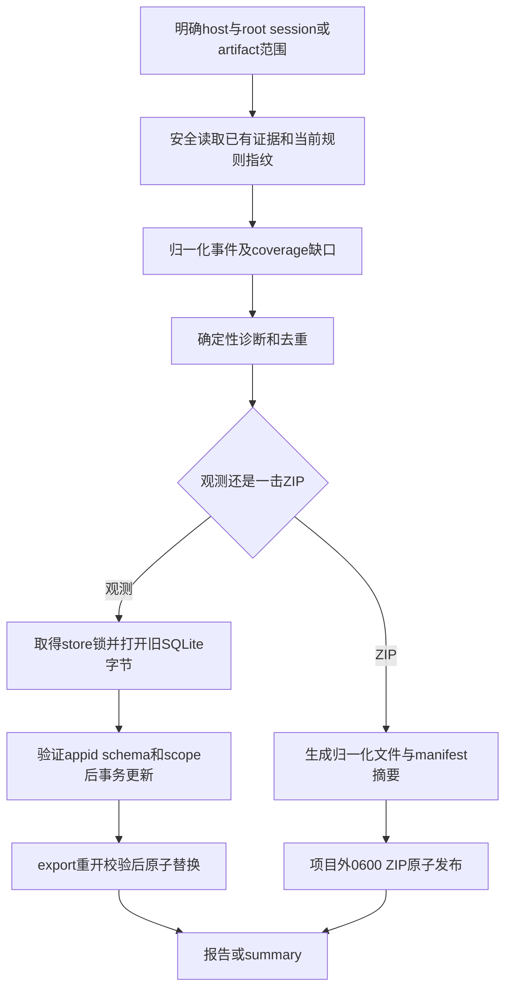

# Task `C03-03`：详细设计

> **交付目标**：Node继续读取已有宿主证据与SQLite观测，保持coverage/unknown/幂等语义，并产生同样私有、离线的诊断包。
>
> **公共设计**：[Design](../../C02-design.md)

## 范围与代码落点

### 要做

- 移植trace/collect/diagnose/store/observe及bundle；SQLite采用锁定sql.js WASM，ZIP采用JSZip。
- 读取既有SQLite、保持scope摘要/权限/幂等和跨宿主差异，保留原CLI、report/summary及ZIPmanifest。
- 更新本能力观测/诊断操作引用、golden与定向Node测试。

### 不做

- 不新增非Codex私有trace adapter、模型/网络/命令采集，不改变TaskGraph，不扩大持久化敏感数据范围。
- 不修改共享codec/依赖版本、安装实现、现状快照或真实用户DB；不用JSON替代SQLite。

### 输入 / 依赖

- `C03-01`文档工具与共享基础已集成；消费compat-json、路径/原子写/目录锁和WASM/ZIP依赖。
- 基线observation/*.py、observe.py、bundle.py及原测试；T03旧state home文字失配已由源码证据解决。

### Path Contract

| 规则 | 路径 |
| --- | --- |
| allow | `lib/observation/**` |
| allow | `lib/diagnostics/**` |
| allow | `sdd-do/scripts/observe.js` |
| allow | `sdd-do/scripts/observation/*.js` |
| allow | `sdd-do/references/observation.md` |
| allow | `sdd-diagnose/**` |
| allow | `tests/node/observation/**` |
| allow | `tests/node/diagnostics/**` |
| allow | `tests/fixtures/migration/observation/**` |
| allow | `docs/05-changes/C01-进行中/CHG-20260928-nodejs-migration/C03-tasks/C03-03-observation-diagnostics/C03-03-02-delivery.md` |
| deny | `docs/02-product/**` |
| deny | `docs/03-architecture/**` |
| deny | `docs/04-operations/**` |
| deny | `docs/05-changes/C02-已完成/**` |

### 代码结构 / 模块落点

| 目录 / 文件 / 类 | 计划变更 | 责任 |
| --- | --- | --- |
| lib/observation/{trace,collect,diagnose,report,cli}.js | 原事件/schema/规则/格式移植 | session/turn范围、归一化、unknown/coverage |
| lib/observation/store.js | sql.js兼容store session | 验证旧DB、事务、scope key、原子bytes保存 |
| lib/diagnostics/{discover,bundle,cli}.js | 一击离线诊断 | 精确范围、manifest、私有ZIP发布 |
| observe.js / bundle.js薄入口 | 对接固定registry | 原flags与stdout结果 |
| tests/node与migration/observation fixtures | 旧SQLite/JSONL/ZIP/输出golden | 兼容、故障、隐私、无网络证据 |

## Task 实现流程

## 详细设计

### 核心逻辑

collect保留明确root session/turn、parent/child关系、expectation、Change和分组成员；未知/冲突/部分JSON原生字段降级coverage而非推定不存在。用公共lossless parser处理原JSONL，不因JS数字/UTF-16丢usage/内容长度。累计usage增量、counter reset、wrapper与native事件去重、resume原session、Taskhistory缺时间保留null，严格复现原规则。

stateHome为OPEN_SPEC_MESH_STATE_HOME优先，否则XDG_STATE_HOME/open-spec-mesh，缺省~/.local/state/open-spec-mesh；默认db仍observations.sqlite3且不能写项目内。host能力保持：Codex支持scan/collect；OpenCode/Claude collect仅artifact snapshot并partial，scan/private-session输入明确拒绝。当前Rules指纹不是历史生效证明。

StoreSession在读入前取得canonical db目录锁并检查所有祖先symlink、file=regular/0600、SQLite header和恢复伴随文件；初始化sql.js使用从固定runtime依赖路径解析的sql-wasm.wasm，不能从cwd/网络取得。既有库读入Uint8Array，在修改前检查PRAGMA user_version/application_id和runs结构；外来/未知/损坏库拒绝且不导出覆盖。新空库按现有schema初始化。

save(scope)精确投影project_key/root_session/turn/expectation/change_id/members，以公共Python-compatible sort_keys/default separators/ensure_ascii计算scope key；同run不同scope拒绝。每run begin→UPSERT→commit→export，在新字节另开DB检查appid/version/同scope/行数及刚写run，再以0600同目录temp fsync/rename；任何阶段失败保留旧文件。batch逐run保存有效前缀，不声称整批事务；不因export成本合并丢run。load/all/summary在同一次store session内读取最新bytes后close/finally释放锁。

bundle仅调用纯collector/diagnosis，不写DB、不fork observe CLI、不执行Git命令/网络/model。项目定位用已有filesystem元数据，session索引选择沿原days/limit规则且披露coverage/排除/缺项；不读取无关项目或追随symlink。归一化reports/snapshots按原白名单写archive，manifest schema和SHA-256字段保持，不追加原始对话/源码/命令输出/密钥。

JSZip生成DEFLATE/UNIX metadata，单项权限0600、外层文件0600、新父目录0700；zip entry仅固定相对名称。输出必须新.zip、项目和其他Git树之外、无symlink/覆盖；同目录临时文件完成后exclusive publish，竞争已有target时拒绝并清理temp。timestamp/压缩流不要求二进制等同，但manifest/范围/JSON和权限契约等价。

### Components

TraceReader/RunNormalizer/RuleDiagnoser为纯数据变换，SnapshotReader只读取显式范围；StoreSession持有WASM DB与一次域锁，SqlitePublisher拥有唯一替换路径；RunScopeHasher消费共享codec。ReportRenderer/SummaryAggregator不重新统计未知事件。BundleSelector/ArchiveBuilder/PrivatePublisher分别控制范围/内容/安全输出。

导出collect/normalize/diagnose/report/summarize给bundle；StoreSession API保持load/save/allRuns语义，参数注入资源/时钟/transport仅供测试，不增加公开任意代码执行。

### 接口变化

observe保留host/db、collect/scan/report/group/summary flags与machine JSON字段；report格式md/json保持。bundle保留一击输入/结果字段和stderr错误语义。源码/installed入口都经共享bootstrap，依赖只从Node runtime解析。

### 领域模型 / 状态变化

无变化。ExecutionSlice、ObservationRun、显式Group、Session、Finding与Task/attempt不混同；unknown/partial不计为成功或失败。sidecar观察不能变更SDD权威状态。

### 数据与表结构变化

无schema变化：appid=0x5344444F、user_version1，runs四列/PK/CHECK保持。原report_json字段与scope key复现；不存原trace，不改变用户run_id。导出SQLite真实bytes而非另一格式；不自动迁移未知版本/删除journal。

### 失败与兼容

- **失败处理**：非法范围/foreign DB/权限/数据异常在写前拒绝；WASM/init/export/验证/rename失败不替换旧DB；archive失败清理临时物，不覆盖用户文件。
- **边界场景**：同run幂等、跨scope撞ID、并发两CLI更新、SIGKILL残锁、错误appid/version/表、hot journal/WAL、空证据、malformed JSONL、invalidheader/超索引限额、large整数usage和Unicode。
- **兼容要求**：D002/D003/D004/D007；旧库不reset，state root按实际源码，missing时间不补造。sql.js整库内存成本明确，不能静默truncate或只保存最后run。

### Tests

- **正常路径**：`node --test tests/node/observation/*.test.js tests/node/diagnostics/*.test.js`；collect/report/summary/group/scan全路径，source及模拟installedwasm定位，旧SQLite加载/更新/重开和ZIP解包。
- **异常路径**：foreign/unsupported/permission/symlink/project-internal DB、scope冲突、非Codex scan、malformed事件、导出/rename故障、竞争输出文件/路径逃逸、无owner锁。
- **边界 / 回归**：映射test_observation、test_lean_observation、test_diagnostic_bundle全部用例；golden SQLite由基线sqlite3创建、记录原scope hash，测试旧行不丢和原脚本可读格式；两进程不同run不lost update。
- **隐私证明**：fixtures含synthetic key/raw对话/命令，检查DB/ZIP/log不包含；禁止网络/model/subprocess的测试探针断言诊断未触发它们，empty/partial不伪称执行正确。

## 依赖与验收

### 前置任务

- `C03-01`：文档工具与共享基础，result已集成。

### 关联设计

- `D002`：精确兼容编码。
- `D003`：目录锁与原子保全。
- `D004`：稳定模块/资源定位。
- `D007`：WASM SQLite兼容文件。

### 验收标准

- `AC-06`：跨宿主观测与旧SQLite兼容。
- `AC-07`：私有离线诊断能力。

### 验证要求

- 只做本Task的Node测试/必要资源检查，提交SQLite和JSONL provenance及旧case映射。
- 不在Worker阶段运行项目全量、生产采集或真实私有用户trace；最终Main验收另行完成。

## 实现自由度

- **可以自行决定**：归一化函数拆分、ZIP生成内部形式、纯函数fixture组织；可优化不改变原子/逐run提交语义的内存使用。
- **不可改变**：report/scope/schema/coverage/隐私/数据保全、依赖版本与Path Contract；性能不足不能改JSON存储或省略未知。

## 交付要求

### Expected Output

- **预计文件**：lib/observation/lib/diagnostics、Node入口和本能力参考、tests/fixture。
- **交付结果**：真实SQLite字节兼容、无原始敏感载荷、Codex/非Codex准确coverage及可解包私有ZIP证据，供installer使用。

### Delivery

- 实际revision、逐文件行为、对应定向测试/故障注入与自审；披露整库内存/私有trace环境限制，不声称未运行样本通过。
