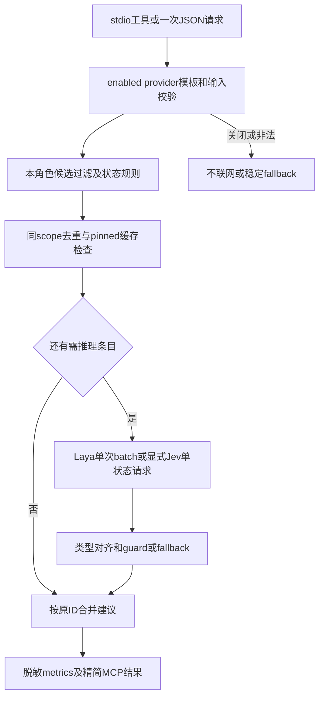

# Task `C03-04`：详细设计

> **交付目标**：Node提供完整可选System One MCP/HTTP客户端，保持建议协议和权限边界；GPU Python服务继续独立部署且不进入消费包。
>
> **公共设计**：[Design](../../C02-design.md)

## 范围与代码落点

### 要做

- 移植laya_contracts/runtime/http_mcp客户端为Node；四工具/模板/env/settings/HTTP/cache/circuit/metrics等价。
- SDK1.30.1低层stdio工具服务及无SDK单次--input模式；公开同一clientConfig/managedLaunchShape供installer使用。
- 为GPU服务分离其Python-only contracts helper并保持原服务入口/启动flags/HTTP/CUDA边界；消费者file白名单排除它。
- Node协议/策略/stdio/HTTP测试，独立GPU factory回归及操作文档。

### 不做

- 不改推理模型/CUDA/Router、不在Node实现GPU推理，不下载模型、不真实调用Laya/Jev认证服务。
- 不改变角色候选/权限/默认provider/host支持、不安装Home、不修改package依赖版本或新增未授权SDK线。

### 输入 / 依赖

- `C03-01`公共codec/依赖/布局已集成；基线mcp模块/模板、typesafe-laya和原laya测试为协议oracle。
- GPU service现有Python代码及FakeRouter用例；只分离依赖，不要求真实硬件以完成client迁移。

### Path Contract

> **D011 过渡格式**：下表仅供当前已安装协调器解析本 Change，保留具体路径而不改为全允许；不作为目标模板或目标 runtime 的文件授权。C03-02 交付后新 runtime 不解析/执行 allow/deny，旧正文仍按原算法参与 digest。业务边界见“要做/不做”和下方局部设计；不得为删除路径门同时删除用户文件保全、安全路径或身份检查。

| 规则 | 路径 |
| --- | --- |
| allow | `lib/systemone/**` |
| allow | `mcp/**` |
| allow | `integrations/laya-gpu/**` |
| allow | `typesafe-laya/**` |
| allow | `tests/node/systemone/**` |
| allow | `tests/fixtures/migration/systemone/**` |
| allow | `tests/test_laya_server.py` |
| allow | `docs/05-changes/C01-进行中/CHG-20260928-nodejs-migration/C03-tasks/C03-04-systemone-client/C03-04-02-delivery.md` |
| deny | `docs/02-product/**` |
| deny | `docs/03-architecture/**` |
| deny | `docs/04-operations/**` |
| deny | `docs/05-changes/C02-已完成/**` |

### 代码结构 / 模块落点

| 目录 / 文件 / 类 | 计划变更 | 责任 |
| --- | --- | --- |
| lib/systemone/{contracts,templates,policy}.js | schema/config/model/questions/results/角色过滤 | 单一tool/wire/env规则 |
| lib/systemone/{runtime,http,metrics}.js | true-batch、Jev、缓存/熔断/脱敏 | 有界HTTP与建议结果 |
| lib/systemone/{mcp,stdio,cli}.js | SDK low-level工具及--input | 协议frame、schema/envelope兼容 |
| mcp/laya_http_mcp.js 与JSON resources | source/installed薄入口与mutable settings | Node消费、live disable兼容 |
| integrations/laya-gpu/contracts.py / README.md、mcp/laya_batch_server.py | 独立服务helper/启动引用 | 无客户端Python依赖，服务仍可部署 |
| tests/node/systemone及Pythonserver factory测试 | 协议/权限/stdio及GPU例外证据 | 不用真实模型推理证明client正确 |

## Task 实现流程

## 详细设计

### 核心逻辑

**本轮为契约复验而非重写业务实现**：旧 accepted/integrated 身份因共享需求/引用决策/本合同过渡正文和上游传播撤销。恢复原 Worker/session/worktree，在新冻结、baseline 和递增 attempt 下复跑全部 AC-08/09 定向用例，产出新 revision 绑定的真实 Delivery；代码已在 HEAD 不等于重新通过验收。可没有新增实现 diff，不制造无意义 commit，不复用旧 attempt/report。仅复验发现实现缺陷时在既有业务范围修复。

落实 D011：取消 Task 文件路径授权不影响 候选角色 allowlist、关闭/HTTP/stdio/launch、GPU factory 与部署隔离，不得把这些真实安全/业务范围校验删除。其余模块/公开接口/数据/状态设计无变化，沿用下述完整设计。

contracts按基线解析全部env/provider/baseURL/key/model/revision/timeout/metrics/template配置；SYSTEMONE_PROVIDER缺省laya，jev须显式。忽略退休LAYA_BATCH_PATH但installer仍可识别/清理自己的旧forwarding。模板名称@version/path安全、schema/字符/字节限额、typed questions/answers、policyguard和原角色描述读取保持；Unicode字符计数按Python code points，wirebytes按UTF8。

资源分readonly模板与mutable设置：源码CLI以package/mcp为config root；installed wrapper和runtime bin识别固定Home/mcp，保持laya-settings.json live disabled检查以及用户明确LAYA_TEMPLATE_DIR等覆盖。installed薄入口固定寻找source sdd-init或Home/skills/sdd-init bootstrap，不执行任意路径。提供clientConfig/managedLaunchShape的完整env名称/Node args给installer，所有规则只有一份。

Runtime每次调用先检查enabled，off不读endpoint/key、不联网、不加载MCP transport或执行System One专属安装；统一runtime的compiled npm依赖并不代表启用Provider。保持process-cache 256、60秒TTL且必须pinned revision，provider/base/key/model/template/state/questions纳入原identity，重复state只推理一次；现有模式/角色规则先短路；circuit按原scope跨named/raw调用，不自动重试legacy endpoint或切provider。raw predict仍是原型接口，不变成默认每次决策。

Laya包括单项在内统一POST /v1/systemone/batch，1–16 requests，接受原支持envelope/raw-list并按原ID/顺序对齐；Jev只对不同state调用官方single path。Node fetch使用AbortController总timeout、redirect=error、128KiB请求/响应预算、限流/错误可控；认证header不会进入日志，HTML/非JSON/malformed/misaligned/uncertain结果fallback/partial而非应用未知建议。关闭、错误、cache invalidation和有效前缀保持。

SDK低层Server setRequestHandler ListTools/CallTool使用基线工具JSON schema和description；内容输出保持PythonFastMCP实际list/call envelope（包括text中的JSON字符串），不能“改善”为不同structuredContent。transport只在stdout写JSONRPC frame，stderr用于无密钥错误。

stdio数字必须lossless：transport层先保留请求应用payload的数值tokens供state/context/questionscodec使用；SDK验证/路由不应先把unsafe整数/1.0信息永久丢掉。可实现SDK Transport接口适配，若SDK需要规范化unsafe numeric request id，内部使用一一对应opaque string并在出站恢复原raw ID；不得碰撞/改变客户端ID。没有unsafe数字时使用标准stdio行为。HTTP state用公共lossless/legacy encode；结果建议schema仍原类型。用实际SDKclient及手写frame两种测试覆盖，不把边界留给实现者临时决定。

metrics沿原字段/backend/count/calls/cache/elapsed只存脱敏统计，不写state/IDs/key；失败写metrics不阻塞建议。GPU server只把其现用MAX_ITEMS/MAX_REQUEST/MODELS/encode/question/answer验证移动到Python专用helper，调整 import；Laya/torch只在GPU main导入、factory测试仍FakeRouter；HTTP auth/队列/单线程/shared gate/token admission/fast CUDA无fallback保持。不从Node helper反向调用Python。

### Components

ConfigResolver/TemplateRepository/LocalPolicyGuard/DecisionRuntime/BoundedHttpTransport/RedactedMetrics拥有原职责；McpToolAdapter只暴露同四工具。LosslessStdioTransport是协议适配，不是第二套业务runtime。GPU Pythonhelper只服务外部进程，与client用共享golden protocol fixture对照。

### 接口变化

Node `systemone`/mcp/laya_http_mcp.js保留--input和缺省stdio。工具名laya_templates/status/decide/predict、arguments及返回值保持；transport仍Laya batch、显式Jev single；env名/默认model/timeout/query上限保持。新增installer可消费的Node launch shape识别也包含旧Python-owned launch，不把custom endpoint当受管。

### 领域模型 / 状态变化

无变化。Decision/Template/Recommendation/Cache/Circuit只是建议域；不启动Agent、不批准Contract、不推进Task。候选必须来自调用方本角色allowlist，unknown/investigation语义不扩权。

### 数据与表结构变化

无schema变化。模板JSON/settings/metrics键保持；缓存进程退出自然失效，不迁移成持久授权。新增外部GPUhelper是源码依赖分离，不变HTTP数据结构。旧.py客户端可留到最终统一退休，但不在npm消费白名单或Node执行链上。

### 失败与兼容

- **失败处理**：bad input在HTTP前稳定fallback，outage/circuit/typed/alignment failures不冒成功；off完全不联网；metrics失败不阻塞；stdio malformed按协议错误而不stdout打印堆栈。
- **边界场景**：重复状态/跨named raw调用、cache pin/TTL变化、partial有效结果、128KiB/16项/4096code-points、大整数/负零、URL重定向、非法key、live disable、prototype keys、numeric request ID并发。
- **兼容要求**：D002/D004/D008；不自动切Jev，不削弱权限，不用v2 package API。GPU服务部署文档明确Python/CUDA与消费端隔离，npmtarball不含GPU实现。

### Tests

- **正常路径**：`node --test tests/node/systemone/*.test.js`；SDKClient经stdio真实list/call四工具，fake HTTP记录batch/single/mode/default，source和installed config-root。
- **异常路径**：认证/timeout/redirect/超体积/坏JSON/错alignment/uncertain/corrupt cache/template、off无HTTP、错误provider、不允许delegate、metrics写失败、命令路径逃逸。
- **边界 / 回归**：映射test_laya_decisions全部42方法、test_laya_mcp协议/client部分、test_laya_server五方法保留独立GPUlane、verify_laya中的client协议断言后续由验证Task迁移；golden列出原四schema/envelope、Unicode/unsafe整数/typed float/frame ID。
- **GPU定向证据**：在明确具FastAPI/httpx的开发环境运行现有factory五项（不安装真实Laya/CUDA），证明import分離后wire仍可用；记录未执行真实硬件，不把skip当通过。消费者定向Node测试不调用Python。

## 依赖与验收

### 前置任务

- `C03-01`：文档工具与共享基础，result已集成。

### 关联设计

- `D002`：精确兼容编码。
- `D004`：稳定入口与资源布局。
- `D008`：MCP客户端与GPU推理解耦。

- `D011`：取消文件路径授权，保留业务 Contract、身份与数据安全。

### 验收标准

- `AC-08`：Node System One MCP客户端。
- `AC-09`：GPU Python服务隔离且可部署。

### 验证要求

- 本轮必须提交新 attempt 的逐 AC 结果，保留旧 Delivery/history/工作区；若环境不满足，报告具体前置，不沿用旧报告当当前通过。
- 仅本Task Node/明确GPU factory定向测试，不真实调用Provider或安装本机GPU服务。
- 提交tool/wire golden和原case映射，消费者无Python及package排除证据；全项目验证由Main统一。

## 实现自由度

- **可以自行决定**：SDK adapter/transport内部组织、fake backend实现、并发不改变原顺序语义的实现。
- **不可改变**：四工具schema/envelope/数字、默认/关闭/fallback/权限、wire、资源root与GPU例外边界；兼容做不到必须回Architect，不放宽输入。

## 交付要求

### Expected Output

- **预计文件**：lib/systemone、Node MCP入口/资源/参考、外部GPUhelper及说明、Node/独立GPU回归。
- **交付结果**：installer可消费的真实Node System One模块/launch描述、无Python客户端、明确独立GPU部署和协议证据。

### Delivery

- 实际revision、逐文件影响、SDK/HTTP/factory定向结果、自审与未验证硬件/认证限制；不把外部可部署说明当已部署。
