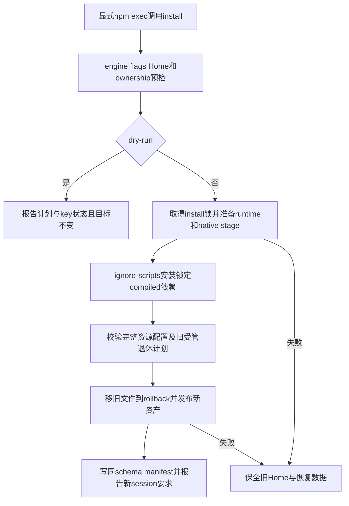

# Task `C03-05`：详细设计

> **交付目标**：用户从本地npm tarball的一条显式命令得到完整可独立运行的三宿主平台，安全升级旧受管布局而不改变用户配置/凭据或能力差异。
>
> **公共设计**：[Design](../../C02-design.md)

## 范围与代码落点

### 要做

- 移植installer、host adapter、TOML手术式更新、ownership/migrations、Research工具及System One配置为Node。
- 安装完整package/compiled依赖到固定runtime；旧manifest/Rules/roles/bridge兼容、安全stage/rollback与disabled状态保持。
- tarball单次npm exec实际smoke、安装/升级故障注入和host资产生成验证；仅改canonical Rules/Role里的平台命令引用，不改语义/模型/权限。

### 不做

- 不公开发布npm、不自动安装agent hosts、不认证Provider、不调用模型、不把npmcache当安装位置。
- 不改业务状态/数据或其他Change；不默认退休用户自定义MCP/同名目录，不覆盖privateconfig，不写Current Truth。

### 输入 / 依赖

- `C03-02`SDD生命周期、`C03-03`观测诊断、`C03-04`System One客户端的精确result revisions均已集成；不能用mock文件替代完整安装产物。
- 消费公共runtime布局/codec/锁、System One的clientConfig/managedLaunchShape、所有真实Node wrappers/resources。

### Path Contract

| 规则 | 路径 |
| --- | --- |
| allow | `lib/installation/**` |
| allow | `scripts/install.js` |
| allow | `scripts/host_adapter.js` |
| allow | `scripts/install_toml.js` |
| allow | `scripts/install_migrations.js` |
| allow | `scripts/install-legacy.json` |
| allow | `install.sh` |
| allow | `config.toml` |
| allow | `AGENTS.md` |
| allow | `agents/*.toml` |
| allow | `agents/dispatch-contract.md` |
| allow | `tests/node/installation/**` |
| allow | `tests/fixtures/migration/installation/**` |
| allow | `docs/05-changes/C01-进行中/CHG-20260928-nodejs-migration/C03-tasks/C03-05-host-installation/C03-05-02-delivery.md` |
| deny | `docs/02-product/**` |
| deny | `docs/03-architecture/**` |
| deny | `docs/04-operations/**` |
| deny | `docs/05-changes/C02-已完成/**` |

### 代码结构 / 模块落点

| 目录 / 文件 / 类 | 计划变更 | 责任 |
| --- | --- | --- |
| lib/installation/{cli,installer,transaction,runtime-stage}.js | 预检/Node依赖/stage/替换/回滚 | 显式完整安装且cache无关 |
| lib/installation/{host-adapter,toml,migrations,ownership}.js | native渲染/lexer/marker/manifest | 同canonical语义、非受管资产保全 |
| lib/installation/{tools,systemone-config}.js | Research provisioning/launch识别/env转发 | 密钥/自定义MCP/disabled安全 |
| scripts .js、install.sh、baseline config | 薄入口与Node MCP command | 原flag/default/输出 |
| AGENTS/agents TOML/dispatch命令引用 | 仅旧.py消费引用改Node | canonical角色语义/模型/effort不变 |
| tests/node/installation及fixture | tarball/native/ownership/fault回归 | 安装可重复、兼容可复验 |

## Task 实现流程

## 详细设计

### 核心逻辑

解析全部现有flags，保持--host默认codex、显式--host-home优先、Codex兼容--codex-home/env、其他host环境变量/默认Home。Nodeengine、Git/host边界、target路径/祖先symlink、manifest/markers/TOML/同名asset及System One非Codex限制在写前检查；--dry-run完整报告目标计划/缺key警告，不创建Home/配置或执行npm/endpoint。

normal install先验证真实Research所需exported key而不输出值，with-laya才解析Provider环境并检查必要名称；--skip-tools仍报告未验证状态，不探测认证。npm package自己的普通compiled依赖由runtime-stage处理，这是统一Node runtime安装，不是禁用System One时另行pip/Provider检查；MCPtransport只有启动时加载。

runtime-stage复制本package files到同filesystem stage，包含bin/lib/canonical roles/Skill脚本/模板/JSON、package/lock；不复制node_modules/测试/Python实现/GPU；package参考docs单独按原--include-project-docs处理，默认不发布到Home/docs，不指向npmcache。通过npm ci --omit=dev --ignore-scripts建锁定deps，childenv移除服务密钥，输出只报告包/退出码，不回显原npm日志；验证固定registry模块、sql-wasm、MCP compiled模块/resources、engine和角色asset。跨cwd/空格路径/清除原cache后完整runtime仍可用。

发布runtime到Home/open-spec-mesh/runtime，Skills/nativeagents/MCP wrappers保持原host布局。新增runtime ownership marker记录package/schema/version与managed files；旧manifest字段不改：Codex .open-spec-mesh-managed.json /旧.install.json继续兼容，其他host open-spec-mesh/managed-host.json仍同schema且paths数组加入固定runtime路径。已存在runtime目录必须有本package合法marker+对应ownership，未知非空同名目录拒绝，不能因旧manifest存在就推断新增目录也属于包。

Codex配置用smol-toml语义解析与原lexer策略定位whole statements，局部改受管path，NaN/date/BigInt语义比较和未改statement原bytes均验证；不整文stringify。quoted/dotted/inline tables、multiline prompt中的伪section、arrays/dates/nan/自定义provider/model/项目设置保持。Roles model/effort/description原值不变，仅消费命令引用改Node。Rules managed markers替换与历史fingerprint清理不扩大匹配范围，未识别正文保留。

OpenCode/Claude保留用户主config，渲染同canonical native Rules/Skills/Agents和package-owned overlays；OpenCode Markdown+agents map双注册、原task permissions；Claude Agent allowlist/独立MCP；不写Codex模型名。非Codex同名未受管asset拒绝覆盖，原main启动入口和nativeflag保持。

Research保持三个原包/CLI、已有PATH/managed executable验证、分tool安装目录、@latest策略及CodeGraph旧识别；Node最低研究工具基线在新engine上满足，不更改user indexing决定。安装网络子进程无service key值，失败可重试并保持未受管cache；不得声称全部外部工具状态是Home事务。

System One只消费客户端导出的launch/env/schema：managed旧Python桥接shape升级为Node绝对wrapper，currentnode shape幂等；custom url/command/env/auth不接管、不probe。with/without保持settings/skill/提示启用/关闭及live disable；Home/mcp mutableconfig root与runtime readonlyresources一致。旧pip目录仅确认ownership可退休，否则保留不消费并警告；没有Node路径调用它。

文件事务在Home附近stage/rollback，用新共享install锁包围。本次package-owned asset旧值移至rollback，atomic发布新值/manifest；异常逆序撤销新安装并恢复旧项；恢复失败保留目录/清单，非零并打印安全路径。默认不触及业务docs，仅--include-project-docs替换明确package参考docs；npm artifact包含package参考docs，选项完整复制其树并生成正确导航；默认仅运行参考，不复制Home/docs或删除其原有历史。引用迁移必须可解析。

### Components

HostProfile/CanonicalRoleLoader/RulesRenderer/NativeAgentRenderer只改变宿主表达。ManagedTomlEditor/OwnershipCatalog/ManifestReader确定允许写集合；InstallTransaction/RuntimeStager处理真实package、deps和回滚；ResearchProvisioner/SystemOneLaunchAdapter不保存key值。

跨模块只消费公共ABI和systemone descriptors，不能重写业务状态/模板或凭据规则。install.sh继续可用但exec node；公开npm exec单命令的真实行为必须用本地tgz证明，不靠假设npm文档支持推断。

### 接口变化

原install flags、mutual exclusion/default和summary/warning退出语义保持，bin install和install.sh/scripts/install.js等价。MCP配置受管Pythoncommand改Node args，custom commands保留属于用户配置。Host启动方式不变。package-only install/获取无Home写入，显式install可反复运行。

### 领域模型 / 状态变化

无业务状态变化。InstallPlan/Stage/Rollback/RuntimeMarker是内部对象，不写TaskGraph、不改Task或session。按一版本升级说明不假设旧/new锁互通。

### 数据与表结构变化

原manifest envelope/schema/字段保留，只在原host paths允许的新受管runtime路径中增加资源；新runtime marker独立，不作为身份认证。用户TOML/JSON/Markdown非受管内容保全；mutableSystemOne JSON/default关闭保持。不存在数据库迁移/Graph重建。

### 失败与兼容

- **失败处理**：缺key/坏manifest/TOML/ownership/symlink/unsupportedwith-laya写前拒绝；runtime dependency/资源失败Home不变；发布故障回滚，无法恢复保留rollback并非零。
- **边界场景**：旧manifest两格式、旧Pythonlaunch绝对/相对路径、customLaya、无Node/Git/多个host、目录含空格/Unicode、目标不在默认Home、非受管同名runtime、用户docs symlink、重复安装/disabled/重新enabled、toolpackage生命周期环境脱敏。
- **兼容要求**：D001–D004、D008/D009；不发布registry，不改变engine/依赖/默认host/权限；旧命令不支持不等于旧持久数据失效。

### Tests

- **正常路径**：`node --test tests/node/installation/*.test.js`；实际npm pack tarball和AC命令对三host隔离Home/cache无Python PATH完成--skip-tools安装；重复/改Home/dry-run/allflags/nativeoverlay、installed完整CLI/SQLite/MCP resource加载、清原cache后可运行。
- **异常路径**：npm依赖失败/缺resource/故障发布/manifestwrite失败、symlink、unmanaged资产、future/damaged manifest、缺真实Researchkey、非CodexLaya、registry E404不误标已发布。
- **边界 / 回归**：映射test_install/test_install_migrations/test_runtime_install/test_research_tools/test_host_adapter、test_laya_mcp和test_laya_decisions中的安装启闭场景；TOML特殊值与用户bytes、owned旧布局安全升级、customendpoint不probe。
- **安全与公开命令**：仅下载/安装npmartifact未调用install时Home逐文件fingerprint不变；命令不得需要先手动Python安装/执行第二个host-config命令；真实tool/host扩展smoke由质量Task/Main执行，无认证/模型请求。

## 依赖与验收

### 前置任务

- `C03-02`：SDD生命周期，result已集成。
- `C03-03`：观测与诊断，result已集成。
- `C03-04`：System One客户端与GPU隔离，result已集成。

### 关联设计

- `D001`：显式npm artifact与发布边界。
- `D002`：精确编码与TOML保全。
- `D003`：install目录锁与原子保全。
- `D004`：自包含runtime布局。
- `D008`：客户端launch/env契约。
- `D009`：ownership/宿主差异/升级安全。

### 验收标准

- `AC-10`：一条显式npm命令配置宿主并可重跑。
- `AC-11`：宿主ownership/工具/升级安全。

### 验证要求

- 只运行本Task安装定向tests/tarball/syntax/resource checks；无真实Home写入或provider认证。
- 附实际命令和tarballfile/installed-layout证据；不能声称本地包已公开发布，不能将后续完整CI替代本Task安装失败。

## 实现自由度

- **可以自行决定**：stage类和rollback清单组织、native渲染内部函数、未改变默认的安装日志措辞。
- **不可改变**：显式命令、原flags/host模型/权限/credentials、目录ownership、跨Tasklayout/launchABI、Manifest兼容和Path Contract。

## 交付要求

### Expected Output

- **预计文件**：lib/installation、Node安装/adapter入口、配置/命令引用、完整安装tests/fixtures。
- **交付结果**：本地tarball单命令实际安装、旧受管布局无数据重置升级、完整消费者独立于cache与Python的证据，供最后验证能力消费。

### Delivery

- 实际revision、逐文件/host影响、逐验收定向结果/失败恢复和自审；说明registry外部发布条件、未认证provider与无法自动清理的遗留资产。
