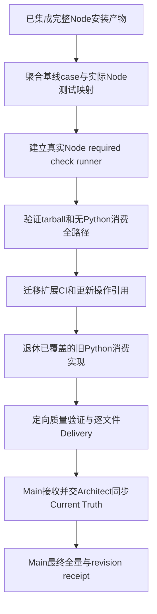

# Task `C03-06`：详细设计

> **交付目标**：为完整Node平台建立可信的消费端验证/回归映射和CI，用正确操作指南完成旧第一方Python消费路径退休；最终Current Truth和验收仍交Main。
>
> **公共设计**：[Design](../../C02-design.md)

## 范围与代码落点

### 要做

- 将scripts/sdd_validate、agent validators、render_mermaid、五个verify辅助迁移为Node；建立版本化全量入口和明确core/full质量层次。
- 聚合422个基线test方法到实际Nodecase或GPU独立lane映射；统一CI、角色/文档/包内容/static验证。
- 完整tarball/无Python消费smoke与真实host/tool兼容smoke；更新README/运行指南/Skills/Rules里的旧调用及升级/锁维修/发布边界。
- 完整能力已集成后退休第一方旧.py实现和已被等价覆盖的Python平台测试；保留GPU服务/helper/测试及Docker fixture，消费包继续无Python。

### 不做

- 不修业务实现或变更Contract/Graph；实现缺陷回原Worker，设计缺口回Architect。
- 不写产品/架构/运维Current Truth，不最终accept/archive、不对Main迁移Change运行prepare或receipt、不公开publish。
- 不把真实GPU推理/认证服务验证作为已完成事实，不改任意下游项目。

### 输入 / 依赖

- `C03-05`完整宿主安装产物已集成；其上游全部能力/fixtures和case映射随真实HEAD存在。
- 基线原22个测试模块/422方法清单、验证矩阵、CI、agent validator语义；Node业务实现必须已完成，不由本Task重写。

### Path Contract

| 规则 | 路径 |
| --- | --- |
| allow | `scripts/sdd_validate.js` |
| allow | `scripts/check_runtime.js` |
| allow | `scripts/render_mermaid.js` |
| allow | `scripts/verify_*.js` |
| allow | `scripts/*.py` |
| allow | `agents/validate_agents.js` |
| allow | `agents/test_validate_agents.js` |
| allow | `agents/*.py` |
| allow | `lib/validation/**` |
| allow | `package.json` |
| allow | `.github/workflows/**` |
| allow | `.gitignore` |
| allow | `README.md` |
| allow | `README.zh-CN.md` |
| allow | `index.md` |
| allow | `AGENTS.md` |
| allow | `agents/*.toml` |
| allow | `agents/*.md` |
| allow | `sdd-*/SKILL.md` |
| allow | `sdd-*/references/*.md` |
| allow | `sdd-*/scripts/*.py` |
| allow | `sdd-do/scripts/observation/*.py` |
| allow | `mcp/laya_http_mcp.py` |
| allow | `mcp/laya_contracts.py` |
| allow | `mcp/laya_runtime.py` |
| allow | `prd-spec/**` |
| allow | `design-overview/**` |
| allow | `typesafe-laya/SKILL.md` |
| allow | `typesafe-laya/references/*.md` |
| allow | `tests/test_*.py` |
| allow | `tests/migration-coverage.json` |
| allow | `tests/node/quality/**` |
| allow | `tests/fixtures/migration/quality/**` |
| allow | `docs/08-quality/Q01-validation.md` |
| allow | `docs/05-changes/C01-进行中/CHG-20260928-nodejs-migration/C03-tasks/C03-06-validation-guides/C03-06-02-delivery.md` |
| deny | `tests/test_laya_server.py` |
| deny | `mcp/laya_batch_server.py` |
| deny | `integrations/laya-gpu/**` |
| deny | `tests/fixtures/docker-app/**` |
| deny | `docs/02-product/**` |
| deny | `docs/03-architecture/**` |
| deny | `docs/04-operations/**` |
| deny | `docs/05-changes/C02-已完成/**` |

### 代码结构 / 模块落点

| 目录 / 文件 / 类 | 计划变更 | 责任 |
| --- | --- | --- |
| scripts/sdd_validate.js / lib/validation/runner.js | 版本化core/full单入口 | 真实check执行、首失败非零和无假成功 |
| scripts/check_runtime.js / agents/*.js | syntax/resources/package/角色策略validator | 标准/static/模型effort/dispatch约束 |
| scripts/verify_*.js / render_mermaid.js | 真实host/tool/Docker/Mermaid/client smoke | 原扩展能力不掉线、无模型请求 |
| tests/migration-coverage.json | 基线→Node/GPUcase索引 | 422场景无silent skip/delete |
| tests/node/quality与fixtures | runner/CI/无Python/tarball/引用测试 | 完整消费验证证据 |
| README/Skills/角色命令/CI/Q01 | 正确Node操作与质量配置 | 可执行入口、一版本升级与发布前置 |
| 允许的旧.py文件 | 明确退休/删除，不留下隐藏后端 | GPU与fixture例外之外的消费实现清零 |

## Task 实现流程

## 详细设计

### 核心逻辑

基线测试方法清单必须从固定baseline或已保全manifest生成，不能在删除旧测试后用新数量代替。coverage JSON含schema/baseline、每个old file+qualified class.method、target JS test名称/file或GPUlane及理由。检查唯一全覆盖、对应test真实存在/被runner发现，消费者scenario不得被分配到GPU例外；新测试数量可不同但原行为不能消失。原test_laya_server五方法属于明确GPUfactory lane；其余417方法须有Node等价证据。每个能力Worker产出的case映射/golden由本Task汇聚，不重新实现业务。

sdd_validate.js默认core：全部Node消费者tests、agent policy/config/dispatch validators、Node语法/包资源/build检查、文档validator和install dry-run/安全消费检查。它串行执行真实checks、保留stdout/stderr，首失败非零；不以npminstall成功等于build/test通过。full profile额外要求Mermaid、Docker、Codex/OpenCode/Claude实际native CLI解析/launcher flags、Research真实npm工具和NodeMCP client协议smoke，以及明确GPU Pythonfactory lane。缺所需外部工具/解释器/deps必须非零，不“未执行但通过”。

本仓库Q01声明显式full argv+tracked scripts/sdd_validate.js，使用workflow统一ValidationResolver；平台consumer的core依旧只需Node/Git/host。full里的Python是明确GPU例外测试和Docker内部fixture，不是Node平台后台；不会pip下载依赖。CI GPUlane显式setup Python+FastAPI/httpx并执行五factory场景，不导入旧Python客户端，也不宣称真实CUDA验证。CI可将独立jobs按同required矩阵拆分以并行，但Main最终receipt入口仍涵盖声明required全部checks。

Core Node test发现范围固定tests/node/*.test.js递归及agent regression；consumer回归不得出现未审批skip/only。全包static检查识别有效第一方命令引用/manifest/route/module/wasm/许可资源，扫描tarball而非源码grep计数；仅白名单GPU部署、fixture、用户业务.py兼容说明可出现Python，不允许package包含.py或Node child-process调用platform.py。

agents validator移植原canonical model/effort、职责/可委派、V2tool namespace/description镜像检查；新Node命令引用不改变角色语义或覆盖models。verification scripts继续使用真实native CLI且不发prompt/模型请求；原OpenCode/Claude最新CLI job策略和Codex pinnedfixture保留，不用mock检查冒充真实兼容。

npm tarball消费smoke用临时Home/cache/Node-only PATH执行完整安装及文档→SDD→SQLite→ZIP→SDK工具路径；生成应用fixture、接受/集成/receipt均在隔离Git项目而非迁移Change。在源码退役后重跑本Task相关smoke，证明Node不需要旧文件。旧Python代码统一移除以避免过渡中损坏协调器；保留mcp GPUentry和integrations helper、test_laya_server.py及Docker app，stage/package白名单早已排除这些文件。

指南说明当前可执行的本地tgz单命令、--skip-tools/默认keys、三宿主main启动、Node脚本、锁维修和orderly升级；registry示例必须标“发布后”，private=true当前不得publish。所有第一方Python consumption references更新到Node；历史completed Change不改。Q01属于验证配置可更新；产品/架构/运维快照留给集成后Architect，不写未来现状。

### Components

ValidationRunner/RequiredCheckRegistry驱动真实进程和失败传播；CoverageManifestValidator对照基线和实际Nodecases；RuntimePackageAuditor/FirstPartyReferenceChecker检查发行/消费，而不是屏蔽失败。HostSmoke/ToolSmoke/DiagramSmoke/DockerSmoke/ExternalGpuFactorySmoke是明确扩展lane，各返回真实结果。

UserGuide/CI配置是运行入口，不承担第二份业务设计；调用workflow验证resolver写receipt的能力不在本Task复制。业务问题只报告回Main，恢复原Worker。

### 接口变化

`scripts/sdd_validate.js --profile core|full`和必要build/static入口取代Python canonical验证器；npm scripts test/build/check固定引用Node。Q01 full JSON argv声明绑定脚本；consumer core不依赖Python，显式full例外检查有清楚环境前置。其他verify/render工具保持原输入/输出/失败语义。

### 领域模型 / 状态变化

无变化。测试结果不是自动Acceptance；所有Task最终集成后才由Main/Architect进行真实Current Truth同步和full receipt，本Task不推进状态。

### 数据与表结构变化

业务/平台schema无变化。新增coverage JSON是仓库测试索引，含baseline和case出处，不写Graph/用户DB。Q01指向Node命令会使本仓库旧receipt按规则失效，这是入口更新后的正常重新验证，不触发用户项目迁移。

### 失败与兼容

- **失败处理**：缺case/skip/无工具/错误exit/包漏resource/Python后台调用立即失败；不删除测试或改known-failure白名单；业务缺陷回原Worker，设计变化等确认replan。
- **边界场景**：无Python consumer环境、GPUfull缺deps、纯包安装/Home不变、publicE404、旧source被移除、临时cwd/缓存清除、locale/space路径、全局docs中已有受影响Current Truth代码链接。
- **兼容要求**：D001/D004/D006/D009/D010；全局Current Truth链接必须在最终同步后一起验证，不能为了T6提前绿写现状。Worker只验证其操作文档和runner自身定向fixtures，不能把尚未执行Main全量报告为已通过或维护豁免。

### Tests

- **正常路径**：`node --test tests/node/quality/*.test.js`；coverage validator、runner真实串行/首失败、完整Node-only tgz消费/SDD/observability/MCP、private/资源/route/引用审计。
- **异常路径**：删case/duplicate/错误target/GPU错误归类、skip/only、missingbinary、fake success receipt、resources缺失、oldPython fallback、npm公开包缺失错误宣称、全量lane被跳过。
- **边界 / 回归**：移植agents/test_validate_agents.py十项、test_agent_skill_routing、test_consolidation/test_process_modes跨入口约束以及verify工具自身场景；检查原422方法映射且已有Node实际运行结果随Delivery保留。其他业务测试不重写，由原Task完成。
- **扩展验证**：可按本Task所需运行具体真实host/tool/Mermaid/Docker/NodeMCPsmoke和明确GPUfactory检查；不得反复跑全项目。Main在最终同步/退役worktree后统一运行Q01 full入口，任何失败修复后重跑。

## 依赖与验收

### 前置任务

- `C03-05`：完整宿主安装产物，result已集成。

### 关联设计

- `D001`：npm artifact及外部发布边界。
- `D004`：稳定入口/resources与消费包审计。
- `D006`：项目验证声明与revision绑定。
- `D009`：安全安装/升级/宿主差异。
- `D010`：回归映射、CI和Current Truth同步时机。

### 验收标准

- `AC-12`：纯Node消费验证和完整回归证据。

### 验证要求

- 本Task提供可运行的required入口、完整case映射、定向消费/runner/static证据；AC的最终Change级full validation只由Main在最终HEAD执行，不冒称Worker已经最终验收。
- 附所有曾跑check的真实结果；未执行环境不写通过。不能借Current Truth待同步跳过最终全局检查。

## 实现自由度

- **可以自行决定**：check registry/CIjob组织、coverage索引的辅助信息、文档非业务措辞、syntax/build工具组织。
- **不可改变**：required覆盖/失败规则、原能力/字段/权限、GPU例外、当前发布状态、Task边界与Path Contract；业务修复不由本Task私自接管。

## 交付要求

### Expected Output

- **预计文件**：Node验证/verify/render/agent工具、CI/coverage/qualitytests、正确Node操作引用、第一方旧Python退休diff。
- **交付结果**：可完整验证的Node平台及真实消费证据，列出需Architect按integrated diff同步的Current Truth路径（包括statehome失配），不修改现状本身。

### Delivery

- 实际revision、逐文件影响、coverage/消费/扩展定向结果与自审；显式列明Main最终full验证/Current Truth职责，不用自然语言pass代替receipt。
