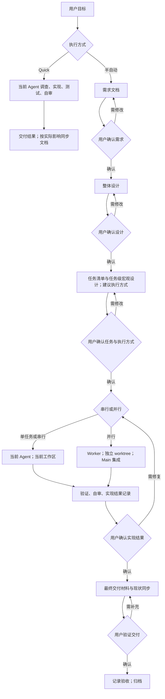

# 人工推动的研发流程整体设计

> **设计结论**：用“文档 + 人工阶段确认 + Agent 语义判断”替代自动生命周期。保留 Quick 与半自动两种方式，不建立新的冻结摘要、执行身份或审批状态机。设计止于整体方案和任务级宏观约定，实现细节由实际执行者决定。
>
> **阶段**：2026-09-29 用户已确认本文件原人工流程方案，随后新增全仓 Node.js 迁移要求。原流程设计仍有效；语言迁移设计需增补确认，原四任务计划不能直接覆盖完整迁移。本轮不实现、不生成执行 Graph。

## 基线与变更范围

需求基线为 [C01 Change](C01-change.md)。当前工作区已有 Node.js 迁移相关未提交修改，设计以源码现状与交付记录交叉核对；一些 Current Truth 仍含 Python 入口，不能据此将系统设计成重新迁回 Python。

| 受影响文档 / 能力 | Current | Delta → Target |
| --- | --- | --- |
| [SDD Runtime](../../../02-product/P02-modules/P02-01-sdd-runtime.md) | 一次性完整规划、冻结、prepare、交付门禁、集成与归档协议 | 需求、设计、任务拆分分别确认；实现与交付人工推动，工具不控制授权 |
| [Agent Routing](../../../02-product/P02-modules/P02-02-agent-routing.md) | 独立 Planning Owner；正式实现由 Worker 按 Graph 执行 | 当前 Agent 为流程 Owner；单任务/串行当前 Agent 实现，仅并行派发 Worker；Architect 可选而非必经 |
| [架构总览](../../../03-architecture/T01-architecture-overview.md) / [API](../../../03-architecture/T02-api.md) | Skills 与生命周期 CLI 强绑定；部分入口描述仍为 Python | Node CLI 留作工具集；移除自动生命周期入口，阶段推进不是 CLI API |
| [存储](../../../03-architecture/T03-database.md) / [领域模型](../../../03-architecture/T04-domain-model.md) | Graph 执行状态、摘要、baseline、attempt、receipt 参与合法性判定 | Markdown 保存意图与人工记录，Git 保存真实改动；旧状态仅作只读历史证据 |
| [运维](../../../04-operations/O01-operations-overview.md) / 安装分发 | 配置和文档推广旧生命周期 | 宿主共享新语义；升级不删除历史数据、用户修改或 worktree |

Current Truth 仅在真实实施后同步，本阶段只表达增量设计。以上路径是依据和影响定位，不是执行文件白名单。

## 总体方案与主流程

### 两模式入口

**Quick 是默认。** 当前 Agent 可以连续完成需求理解、调查、实现、测试、自审和交付，不因为文件多或技术关键词多而自动升级。陌生调用链和跨目录调查优先给 Explorer；需核对外部当前事实时优先 Librarian。已知单点问题直接处理，避免代理往返成本和重复读取。必要的 Current Truth 同步由当前 Agent 完成。

**半自动用于需要正式分阶段讨论与留档的工作。** 用户可以明确指定；Agent 也可根据需要提出采用建议，但不能借此启动全自动流程。并行实现需先完成可供人确认的任务计划；只读调查并行不视为并行实现，也不触发 worktree 或正式流程。

图中确认是人的决定，不是后台状态转换。实质需求或设计变化可返回相应阶段，不要求无关阶段全部重做。交付检查若发现实现问题，返回实现修复；不能只改交付文字掩盖问题。

### 五阶段职责

| 阶段 | 本阶段完成什么 | 人工确认后才能做什么 |
| --- | --- | --- |
| 需求 | 背景、目标、范围、不做事项、可观察 AC、主要限制 | 进入整体设计 |
| 设计 | 方案、模块职责、关键流程、必要公共约定、风险与取舍 | 开始拆分任务 |
| 任务拆分 | 业务结果为单位的任务清单、宏观思路、真实依赖、执行方式建议 | 按已确认任务和执行方式实现 |
| 实现 | 编码、定向测试、自审、修复；并行时集成；完成适用的全量验证与实现结果记录 | 在用户确认实现结果后完成最终交付材料 |
| 交付 | 汇总结果与验证、剩余风险、实际文档影响；同步 Current Truth；必要发布材料 | 在用户最终验收后归档，不等同于部署或发布 |

最后一项实现验证与交付的分界是“完成工程结果”与“整理最终对外结果”，不重复运行没有变化的相同测试。若交付期间代码、验证配置或结果受到影响，再补跑对应检查。

## 人工确认与轻量记录

### 确认不是新的机器协议

在 C01 Change 保留一个简短“阶段确认”区：日期、阶段、用户明确指令、确认对象和重要范围说明。确认针对当时展示的文档与方案；Git 提交可辅助追溯，但不要求先提交、签名、摘要或生成确认 token。

- “开始设计”等明确推进指令可以构成当前阶段确认。
- 修改意见、Agent 自审通过、Worker 完成和脚本成功均不构成用户确认。
- 无明确确认时，Agent 停留当前阶段；不由 CLI 的 allowed_actions 推断授权。
- 后续局部细节调整由执行者处理，不能因为文档文本变化自动撤销既有确认。
- 目标、验收、安全或重要公共方案实质变化时，说明受影响内容，待用户确认后修订；保留原确认的适用范围，不伪造用户接受了新方案。
- 中断恢复时读取相关阶段文档和确认记录；有不确定项先核实，不重复启动已完成阶段，也不以旧 JSON state 代替确认。

不建立独立审批文件、确认数据库、阶段 digest、attempt 或阶段调度命令。

## 文档与任务宏观设计

### 保留信息职责，取消模板门禁

沿用 `docs/01–09`、Change / Design / Task / Delivery / Research / ADR / Release 的现有信息分工。模板是写作起点，不是机器证明；简单问题短写，无变化或不适用的章节可以省略，图表按表达需要使用，不要求每个任务都有 Mermaid。

- **C01 Change** 回答为什么改、改什么、如何观察成功，并记录人工确认。
- **C02 Design** 回答整体如何改以及关键公共约定，不包含文件授权、函数清单或逐步编码计划。
- **Task Plan** 用人可读 Markdown 替代新流程的机器 Graph，说明任务清单、依赖与串并行选择。放在 `C03-tasks/C03-task-plan.md`；目录 index 仍只做导航。
- **Task 文档** 仅说明目标、纳入/排除范围、输入依赖、总体实现方向、必要共享约定、验证结果期待。路径可帮助定位，但不要求穷举，也不成为修改边界。
- **Delivery** 记录真实改动、验证结果、自审和重要调整、剩余风险及快照影响。可用 Git diff 生成文件清单作为写作辅助，但不要求文件表、操作名称或固定字段精确匹配才能交付。

仍使用独立编号 Task 目录与对应 Task / Delivery 文档，不提前生成空 Delivery；实际需要时再创建。阶段不存在时不创建空工件，也不以缺少后续工件判定当前文档失败。

### 不再生成执行 Graph

新 Change 不生成或维护 `C03-task-graph.json`。Markdown 任务计划是新的任务关系说明；可写进度和会话定位供人恢复，但这些记录不是脚本权限源，不与旧 Graph 双写。

本阶段只确定上述宏观格式，具体任务和依赖在用户确认设计后再拆分。

## 当前 Agent、Worker 与只读角色

### 当前 Agent 是连续流程 Owner

当前 Agent 负责阶段文档、人工确认、调查收敛、执行方式建议和最终交付。

| 场景 / 角色 | 目标职责与边界 |
| --- | --- |
| 单任务或串行 | 当前 Agent 直接实现、测试、自审、修复并写 Delivery；不为了满足旧角色规则另外启动 Worker，也不创建 worktree |
| 并行 Worker | 执行一个已确认的宏观任务；独立 worktree；自行完成必要细节、定向验证和 Delivery；不得改变任务的业务授权边界 |
| Explorer | 对陌生本地实现、调用链、测试和部署事实做只读调查；返回结论、证据和限制，不回传大量原始文件 |
| Librarian | 对外部当前文档、版本、协议或供应商行为做只读核对，不扩大写权限 |
| Architect | 可按需要作为独立设计/文档作者，只完成当前已授权阶段，不自动补齐任务或推进实现；不是半自动必经角色 |
| Reviewer | 仅用户明确要求独立复审时使用；复审不替代用户的阶段确认 |

保持角色不可任意扩权的原则；不以移除自动运行时为由取消宿主本身的权限和安全限制。

### 实现自由度按语义判断

执行者可以自主新增或修改必要文件、决定内部结构与函数、修复局部缺陷、调整测试、处理简单集成冲突。它们不是设计遗漏后的特殊例外，而是正常实施职责。

判断是否需要用户确认，只看变化是否影响已确认的目标、可观察结果、验收标准、安全边界或重要跨任务约定；不按文件数、行数或摘要变化判断。任务内小调整记在 Delivery 即可；仅在宏观方案发生实际变化时同步 Design / Task，不记录每次编码动作。

Worker 发现实质边界变化，向 Main 返回影响和选项，由 Main 请用户决定；串行时当前 Agent 直接请用户决定。普通实现缺陷在原上下文修复，不重新规划、不降低 AC。

## 并行隔离与集成

- 串行在当前工作区执行，保留既有用户修改；没有“工作区必须全干净才允许做任务”的一律门禁。
- 并行写任务才用独立 worktree。启动前明确真实基线、必要输入和提交结果，不能假设 worktree 自动包含当前工作区的未提交改动。
- 若未提交改动是并行任务的必要输入，先保全并明确建立可共享基线，或选择串行；不得擅自提交用户无关改动、自动 stash、reset、rebase 或删除工作区。
- 真正依赖上游实际结果的任务等待该结果集成后再执行。低度路径重叠可以并行，是否值得并行按语义冲突和集成成本判断，不把路径重叠作为授权拒绝理由。
- 给 Worker 最小上下文：目标、宏观 Task/共享 Design 引用、依赖结果、工作区/起点、预期验证与交付；不要求 prepare 生成身份、绑定 session 或增加 attempt。
- Main 通过真实 diff、验证和报告收敛 Worker 结果，集成采用普通 Git 操作，不依赖 accepted 状态或 wave 协议；必要时回到原 Worker 修复。
- 一个并行组内若有后续串行收尾，当前 Agent 完成；不因为整个 Change 曾经并行，就将之后每项工作都派给新 Worker。
- 完成后仅清理本次新建且确认结果已保全的 worktree。脏 worktree 不强删，历史 worktree 不顺带退役。

## CLI 与 Skills 的删除 / 保留边界

### 删除自动生命周期，不做新包装

退出 `sdd` 生命周期入口和 `task-graph`、`prepare-workspace`、`record-delivery`、`record-acceptance`、`run-leaf`、`check-change`、`close-change`、`run-validation` 的旧运行时链路，以及冻结/漂移传播、执行身份、状态转换、自动会话绑定、Graph 验收和 ancestry 驱动的 wave 协议。

worktree 和验证仍是实际工程能力，但由 Agent 与普通工具完成，不保留与冻结身份绑定的 launch / accept / archive 通道。删除命令后旧调用应明确报错并提示新流程，不保留成功 no-op 或隐式转发自动实现的兼容入口。

### 保留辅助工具，解除运行时依赖

| 工具 / 能力 | 目标行为 |
| --- | --- |
| `init-project` / `migrate-project` | 保留目录初始化、旧文档字节保全和人工映射；默认规则/模板改为两模式与阶段确认 |
| `new-document` / `new-research` / `new-adr` | 保留编号、导航和文档写作辅助，不推进研发阶段 |
| `new-change` | 只创建需求阶段需要的 Change 与导航，不自动填入 Design / Graph / 全部任务，也不要求未来工件齐全 |
| `ensure-design` | 显式创建整体设计草案，不隐式拆任务、不改已有方案、不代替确认 |
| `new-task` | 在任务拆分阶段创建单个宏观 Task 文档及导航，辅助维护人可读计划，不写旧 JSON 执行 Graph、不生成冻结身份 |
| `validate-docs` | 主要提示链接、命名和结构等问题；取消与旧 Graph/readiness 的强绑定，不用格式检查拒绝阶段推进 |
| `new-release` / `check-release` | 保留发布材料生成和检查；格式/清单检查供人评审，不由文档中的 pass 字样证明真正验证或发布；完成状态读取改用文档层，不依赖旧 workflow closure |
| `observe` / `diagnose` | 保留只读采集和私有离线诊断；缺少 Graph 是正常输入，旧模式/状态规则只用于分析历史 |
| `systemone` / `typesafe-laya` | 保留显式、默认关闭的可选语义工具能力；委派建议基于实际模式、当前阶段与用户确认的执行方式，不再依赖 task_graph_ready；不借其判断恢复自动生命周期 |
| `install` / Host Adapter | 保留 Node 消费端、三宿主、受管文件保全、配置渲染与升级回滚；修改分发指导与依赖清单 |

`run-validation` 随旧 receipt 授权链删除，不另造同名包装。验证直接运行项目实际命令并记录结果，不要求 Change/Graph/digest，不回写审批或决定归档。

`recover-lock` 保留为文档、安装和观测存储的资源锁恢复工具，继续要求核对 owner token 并确认写进程已停止；它不恢复旧 Graph 执行状态。通用锁、原子写入、路径保护和文档解析不属于自动生命周期，仍需保留。具体内部模块如何整理由执行者决定，不按文件名机械批量删除。

既有 `sdd-*` Skill 名称和安装标识可以继续使用，减少无关重命名与用户配置变动；内容改为半自动语义：`sdd-change` 分阶段写作、`sdd-do` 实现自由度与验证、`sdd-close` 人工交付与保全。移除它们对旧 CLI 的强制引用，不能仅改名字而留住自动链路。

## 校验、质量与交付

### 区分提示与真实失败

| 类别 | 处理 |
| --- | --- |
| 标题、字段、表格、空章节、文件命名与文档链接 | 提示并尽量修复；不生成冻结、replan 或权限拒绝，不自动使阶段确认失效 |
| 需求矛盾、关键输入缺失、对外行为或重要方案变化 | Agent 说明真实影响并请用户决定，不用正则或模板数量代替判断 |
| 测试失败、构建错误、静态检查错误 | 如实记录并修复；问题未解决不宣称验证通过，不制造旧失败豁免 |
| 路径逃逸、覆盖未受管资产、秘密泄漏、非法参数、读写失败 | 保留必要的硬错误和安全拒绝，与文档格式宽松无关 |

格式告警不应让 `validate-docs` 以失败退出阻断流程；工具仍需区分正常诊断与不能安全执行的错误。人类阶段判断不绑定任何检查退出码。

实现阶段运行定向验证；串行全部任务完成或并行集成后运行适用的项目完整测试 / build / static validation。已有完整证据在代码与环境没有相关变化时复用，不机械要求每个 Worker 重跑全量。

Delivery 可以真实描述部分完成、失败和未验证项，不因固定结构而无法写出报告。但 Agent 不得把这些内容概括成“全部通过”；用户最终决定如何处理未完成项，实质放弃目标或改变 AC 需明确确认并记录。

交付时由当前 Agent 同步真实受影响的 Current Truth，不再强制另启 Architect。用户确认最终交付后可移动 Change 至已完成目录并更新导航；归档是文档整理，不是发布，也不需要旧 validation receipt。若发现新的未解决实现问题，应修复并复验后重新交用户验证。

## 历史兼容、安装与安全

### 旧数据只读，不双写或伪迁移

保留旧 Change、Graph、Delivery、Git history、观测 SQLite、receipt 和已有 worktree。新流程不加载它们作为授权前提，也不将旧 accepted 或 receipt 自动当作用户对新流程的确认。

- 观测/诊断可以继续解析历史 Graph；将必要的历史读取与旧生命周期写入实现解耦，不能为保留观测而保留自动调度链。
- 缺少 Graph、attempt、digest 或 session 时按未提供处理，不制造坏图、卡住或缺失 Worker 等伪诊断。新 Change 没有 index frontmatter 时，可从规范目录和文档定位推导只读关联，不要求补造旧 id/status/contract/graph 映射字段；必要的安全路径检查仍保留。
- 旧 `sdd` 模式标识作为历史标签保留；新提示与诊断区分快速、半自动以及模式未知，不重写历史 SQLite 内容。
- 当前正在进行的旧 Change 不自动迁移、重置或归档。如需接续，按已有文档和实际 Git 结果明确剩余目标，再由用户选择人工推进；这是显式操作，不属于安装副作用。

发布工具当前复用了 workflow 的文档解析与完成检查；必须将必要读取能力留在通用文档层，完成依据为最终人工验收记录及已完成目录，不要求旧冻结、receipt 或强制 pass 标记。

SQLite 的现有存储与权限保护保留；本次不新增业务数据库、审批表或常驻服务。只有现有报告/诊断规则确需表达新语义时作兼容调整，不为人工阶段引入 schema 迁移。

### 分发一致性

仓库 AGENTS、安装 marker、初始化模板、Role Prompt、三个宿主适配结果、Skill、帮助和 README 必须表达相同规则。删掉自动入口的同时调整 tarball 资源、模块依赖和测试，避免“仓库已删除，但安装包仍带旧脚本”的半迁移。

配置修改只处理包受管内容；不擅改用户模型、密钥或未受管同名文件。保留历史文档与记录，不要求将历史叙述改成新流程；旧内容应明确属于历史，不再被当前入口引用为操作指导。

### 调查定位与断耦依据

- `lib/cli/registry.js` 当前注册全部公开命令；删除必须落实到实际入口、帮助和分发，而非仅删除 Skill 文案。
- `lib/documents/change.js` 当前创建 Change/Task 时仍生成 Graph；保留文档能力需要改成按阶段渐进创建。
- `lib/observation/collect.js` 的 `sddArtifacts` 已将 Graph 作为可选字段，但仍要求旧 index 身份映射；需兼容新流程的无 frontmatter 文档，同时保留历史读取。
- `lib/release/new-release.js` 与 `check-release.js` 直接导入 workflow contract/closure；应迁移通用文档读取而非保留整个自动链。
- `lib/systemone/policy.js` 仍以 sdd/task_graph_ready 过滤角色；`lib/installation` 和初始化模板仍分发旧角色/流程，需随新语义一起调整。

上述仅是当前调查证据，后续执行者可按实际调用链选择文件，不形成修改权限清单。

## 关键取舍与风险

- **不新增阶段 CLI / 状态机**：能真正消除维护和重规划成本；代价是必须靠准确的人工确认记录和 Agent 语义判断保证不越阶段。
- **任务宏观设计替代可执行细节契约**：减轻规划负担，让执行者按实际代码解决细节；重要共享约定仍应写清，不能把必需业务判断全部留给实现猜测。
- **历史只读兼容与执行删除分开**：避免损坏历史诊断；必须查清纯读取与写入依赖，不能粗暴删除所有出现 graph / sdd 字样的模块。
- **不强制干净工作区**：允许当前 Agent 连续工作；必须隔离用户既有修改，特别注意并行任务如何获得真实输入和 Delivery 如何区分本轮变更。
- **轻量检查不等于不测试**：文档问题不阻断流程，真实工程和安全问题仍需处理，不能以“人工确认”伪造质量事实。

## 验证方向与下一阶段

后续实施需要证明：需求、设计、拆分可独立进行；无人工确认不会越阶段；不因局部实现/格式变化触发旧冻结链；单任务/串行没有新 Worker/worktree；并行隔离和真实依赖正确；没有 Graph 的观测/诊断正常；旧证据可读且保全；安装后的三宿主与 CLI/帮助一致；适用测试和静态验证真实通过。

本阶段不要求旧 readiness 或冻结校验通过，也不为了旧校验补造 Task Graph。设计确认后，才按业务能力拆分本 Change 的任务并提供串并行建议，由用户确认后实施。

**阶段记录**：用户已确认本整体方案；任务拆分在独立任务计划中表达，具体代码文件和内部函数仍由实际执行者决定。

## 新增范围：全仓 Node.js 与 Python 退出

用户最新要求将原消费端迁移扩大为全部第一方维护能力的 Node.js 实现；此前独立 GPU/Laya 的 Python/CUDA 服务和 Python Docker 示例不再自动豁免。

只读盘点确认当前仍有 75 个 tracked Python 文件。主 CI 的 full job 和 GPU factory job 仍安装 Python 与 FastAPI/httpx；Docker 示例以 Python 镜像启动，GPU 服务说明也明确要求 Python/Laya 依赖。因此“消费 npm 包不依赖 Python”不等于整个仓库完成迁移。

整体处理方向：

- 已有对应 Node 实现的保留能力，确认回归后删除重复 Python 实现与旧入口，不再维护两套代码。
- 已取消的自动生命周期，直接退出相应 Python/Node 实现，不为了“迁移”重写已经决定删除的功能。
- 保留能力的 Python 测试、CI 和 Docker 示例迁移为 Node 等价场景；质量入口检查行为与安全，不继续固定旧迁移方法计数或靠 skip 取得通过。
- 独立 GPU/Laya 服务必须核实真正推理、批处理和加速的调用边界；Node HTTP client 不等于 Node GPU server。缺少等价后端时先补设计，不能删除服务后声称完成迁移，也不能在 Node 包装下继续启动 Python。
- 当前运行依赖、安装/CI 包清单、活动文档与分发资源清理 Python 前置；历史记录、Git 对象、用户解释器和虚拟环境不清理。

只读核实还确认：

- `scripts/check_runtime.js` 仍要求保留 GPU/fixture 的 Python 例外；本次必须退出该例外口径，而不是继续证明这些例外存在。
- `mcp/laya_batch_server.py` 的生产入口通过部署环境的 `laya.Router` 加载模型、批量推理、token 预算检查和严格 CUDA 加速；仓库中的 Node System One 是 HTTP/MCP 客户端，不是这一 GPU 后端。
- 原 GPU 协议测试使用 fake Router，可迁移协议、鉴权、排队、单/批共用执行路径等场景，但不证明真实模型或 CUDA 加速可由 Node 等价执行。

因此新增设计还需明确真正的 Node GPU 推理路径，并保留协议与安全行为；目前没有已存在的等价 Node 服务作为迁移证据。除非用户另外明确授权删除该独立部署能力，否则不得通过删除服务来满足语言清理目标。本增补不预设未核实的库或伪造硬件验证，补齐方案后再确认相应宏观 Task 和执行方式。

## 本阶段检查

- 已核对已确认需求、受影响 Current Truth、公开命令注册、文档创建、观测工件读取、发布工具和可选委派策略的相关事实。
- `node bin/open-spec-mesh.js validate-docs --root "$PWD"`：通过。
- 本 Change 的本地 Markdown 链接、行尾空白和 Mermaid fence 提取检查：通过。
- Mermaid 源已提取至 `/tmp/osm-human-driven-design-yUKMze/workflow.mmd`；本地无 mmdc，未运行 Mermaid 语法解析或图像渲染，不将 fence 检查声称为渲染通过。
- 未运行旧 readiness/freeze/replan，未生成 C03 任务或 Graph，未修改代码或此前已有未提交修改。文档工具通过本身不代表人工确认；设计确认来自用户后续明确回复，记录见 C01 Change。

## 实施增补：命名与串行授权

用户追加 role_desc 命名并授权直接串行实施。新代理可控名称使用实际角色前缀和 snake_case 描述；配置角色 ID、权限和历史会话保持不变。当前 Agent 连续执行四项原能力改动；GPU 等价实现与能力删除不能由语言迁移授权推断，受影响部分单独等待用户决定，不重新冻结或撤销无关结果。

## 2026-09-29：已确认的 GPU 退出方案

用户明确允许移除自托管 GPU 服务，仅保留 Node.js。此前要求核实等价 Node GPU 后端的分支停止，采用获准的能力退出，不再移植本地推理服务。删除服务、专属 Python 请求契约和测试、GPU CI/依赖及活动部署指导，从分发清单移除 GPU 资产。

Node HTTP/MCP 客户端和公开工具保持不变：Laya 通过配置的外部兼容合批服务工作，Jev 通过外部 TypeSafe 服务工作；端点、鉴权、响应验证、超时、缓存与 fallback 仍属客户端。模型/硬件/服务端推理不归本仓库负责，不新增本地模型库或 Python 回退。

验证要求变为第一方 Python 源文件为零、活动安装/CI 无 Python 前置、消费包无 GPU 部署资产，且现有客户端安全与协议回归通过。原调查和停止点只作历史证据；其余宏观设计/任务关系不变，无需文件级冻结或重验无关任务。

## Node 22 与全局安装的宏观设计补充

保持原有 Node runtime、辅助命令与人工流程。包引擎、锁根元数据、安装前置与 CI 最低版本统一为 >=22.0.0；解除包 private 分发限制，使用现有 bin 和固定 runtime 定位支持 npm 全局安装，不增加 Home postinstall。

显式处理脱离包目录的 ESM 启动：受管 Skill 内声明模块类型；MCP 独立 bootstrap 使用动态导入，避免改变用户 Home/MCP 的全局模块语义。安装事务应用已计算的退役路径，目录级替换去掉旧 Skill Python/cache，已识别旧 Python bridge 定向删除 helper/cache。先备份和隔离回归，再升级真实 Home。

实现者可补充必要文件、缓存清理和回归，不冻结文件清单。既有原授权与串行方式不变，不启动 Worker/worktree。

## 公共 npm 分发补充

保留现有 Node 22、bin、纯 JS/WASM 固定依赖和显式宿主安装语义；根版本及两份锁改为 0.0.1，publishConfig 指定公共 registry/public，补充源仓库元数据。README 优先公共 npm 命令，保留源代码/tarball 后备及多宿主、升级、卸载说明。检查实际 packed 文件而非仅 whitelist，认证后发布同一 artifact，并独立按包名消费确认；不以 dry-run 代替真实上传，不自动归档现有 Change。

## 短入口与发布门槛补充

共享 CLI entry 处理帮助、版本与分发；osm 无参数/直接安装选项注入 Codex + skip-tools 默认值，用户显式选项可覆盖，旧入口语义不变。包 bin 与两份锁根 bin 一致，真实 global tarball 验证短入口。发布门槛保存在工作约定、Skill 与 explicit-only metadata，只有当前用户显式使用 $sdd-release 并授权版本才上传，不增加机械 Graph 或摘要门禁。
