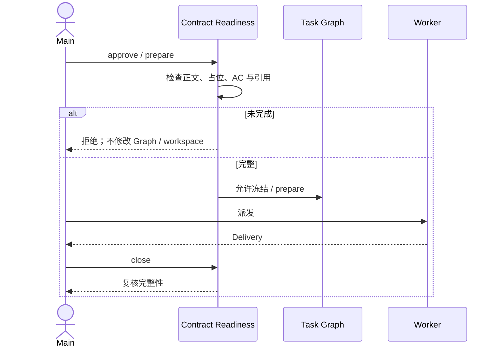
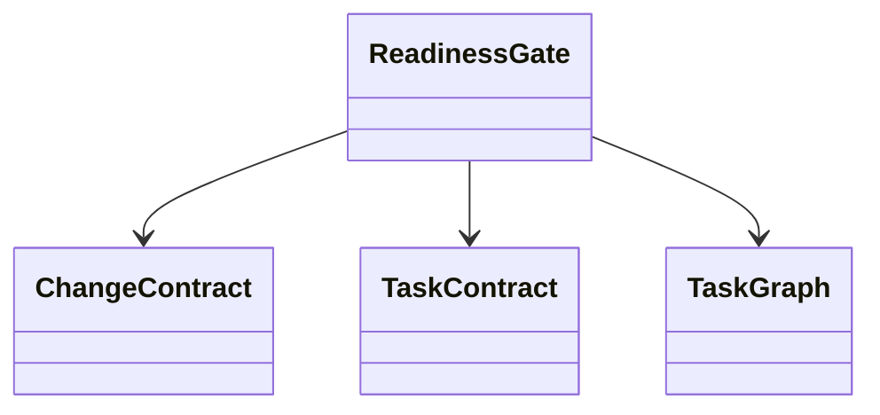
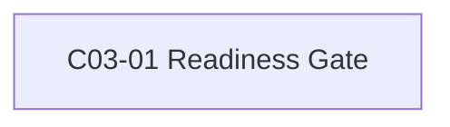

# 公共设计

> **设计结论**：在不改变 Task Graph schema、状态机和 digest 语义的前提下，将契约完整性与 AC 引用检查提升为 approve / prepare / close 共用的 readiness gate，阻止空正文、占位和无验收依据的契约进入执行。

## Current 基线与变更范围

### 受影响 Current Truth

| Current 文档 / 模块 | Current | Delta | Target |
| --- | --- | --- | --- |
| Runtime 派发 | approve 可接受部分空/占位契约 | 增加统一 planning readiness | 未完成契约在派发前失败且无状态副作用 |
| CLI / 收口 | prepare / close 校验入口分散 | 复用同一 readiness 检查 | approve / prepare / close 使用同一规则 |
| 文档契约 | AC 可被松散文本识别 | 明确 AC 定义和 Task 引用一致性 | 契约可读且可机械校验 |

## 总体方案与主流程

### 总体方案

新增确定性的 Contract readiness 解析与校验，统一接入工作流关键入口；校验只判断结构和引用完整性，不尝试证明业务语义正确。

### 总业务流程 / 主时序

## 产品变更

| 模块 / 功能 / 规则 | Current | Delta | Target |
| --- | --- | --- | --- |
| SDD Runtime | 契约完整性保护不足 | 派发前显式拒绝不完整契约 | 用户只会收到可执行 Task |
| Installation | 与 readiness 无直接关系 | 无行为变化 | 保持不变 |

## 接口变更

| 接口 / 协议 | Current | Delta / Target | 兼容策略 | 关联 AC |
| --- | --- | --- | --- | --- |
| approve | 可能冻结不完整契约 | 失败时不写摘要、不改 Graph | 保留命令入口 | `AC-01` 完整性 |
| prepare | 依赖已有冻结结果 | 再次执行 readiness 检查 | 保留命令入口 | `AC-03` 防绕过 |
| close | 纯文档 Change 可绕开部分检查 | 收口前复用 readiness | 保留命令入口 | `AC-03` 收口保护 |

## 领域模型与状态变更

### 领域模型

### 状态 / 不变量变化

| 对象 | Current | Delta / Target | 不变量 / 非法行为 |
| --- | --- | --- | --- |
| Task | 状态机已有 planned/running/submitted/accepted/blocked | 状态集合不变，只加强 planned→running 前置条件 | 校验失败不得改变状态 |
| Contract | 文本冻结 | 增加完整性和引用条件 | 不自动修规格、不自动 replan |

## 数据与表结构变更

### 表结构

无数据库或持久化表结构变化。

### 关键字段 / 索引 / 约束

无。

## 应用与组件变更

| 应用 / 组件 | Current 职责 | Target 职责 | 依赖变化 |
| --- | --- | --- | --- |
| contract_readiness.py | 不存在 | 统一正文、占位、AC 定义/引用检查 | 被 workflow / prepare / close 调用 |
| workflow.py | 生命周期与摘要 | approve 时调用 readiness | 依赖 readiness |
| prepare_workspace.py | 创建执行工作区 | 写状态前再次检查 readiness | 依赖 readiness |
| check_change.py | 集成与收口检查 | 归档前检查 readiness | 依赖 readiness |

## 关键决策

### D001｜统一 Readiness Gate

- **结论**：approve、prepare、close 共享同一确定性契约完整性检查。
- **原因**：避免不同入口产生不同语义，并保证失败无副作用。
- **影响**：历史不完整契约会被显式拒绝；不自动迁移或放宽 AC。

## 公共设计与不变量

- **事务 / 一致性**：校验必须发生在 Graph、attempt、workspace 写入之前。
- **幂等 / 并发**：不新增 Graph 字段，不改变既有锁与 attempt 语义。
- **失败与恢复**：失败只返回缺口；不自动修改 Contract。
- **兼容**：当次实现保持既有 CLI/Graph schema；本次 2026-09-26 文档体系迁移已另行统一格式。

## Task 关系与设计落点

| Task | 交付结果 | 前置任务 | 关联设计 | 验收 |
| --- | --- | --- | --- | --- |
| `C03-01` Readiness Gate | 统一契约完整性检查并覆盖回归 | 无 | `D001` 统一 Readiness Gate | `AC-01`～`AC-05` |

## 实现自由度与停止条件

- **Worker 可自行决定**：解析实现细节和测试组织方式。
- **不可改变**：Task Graph schema、状态机、digest 算法、用户确认策略。
- **必须停止并 replan**：若实现必须新增 Graph 字段或改变冻结/审批语义。

## 风险与未决问题

- **风险**：结构校验不能证明需求语义或测试充分性。
- **未决问题**：无。
