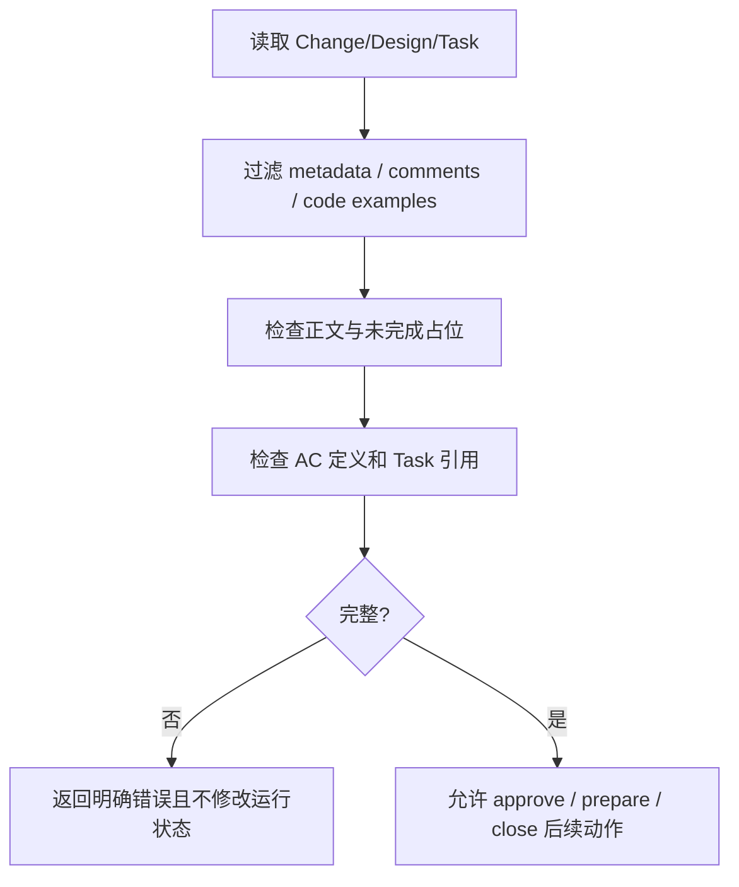

# Task `C03-01`：详细设计

> **交付目标**：实现统一契约 readiness gate，在 approve / prepare / close 前拒绝不完整或无验收依据的契约。
>
> **公共设计**：[Design](../../C02-design.md)

## 范围与代码落点

### 要做

- 实现正文、占位、AC 定义与引用完整性检查。
- 将检查接入 approve、prepare、close。
- 增加真实生命周期正反例测试。

### 不做

- 不改变 Task Graph schema。
- 不改变 Task 状态机。
- 不改变 digest 算法。
- 不新增角色、模型或审批层。

### 输入 / 依赖

- 无前置 Task。
- 输入为 Change、Task、Design 文本和现有 Graph 状态。

### 代码结构 / 模块落点

| 目录 / 文件 / 类 | 计划变更 | 责任 |
| --- | --- | --- |
| `sdd-change/scripts/contract_readiness.py` | 新增 | 共用契约完整性与引用检查 |
| `sdd-change/scripts/workflow.py` | 修改 | approve 接入 readiness |
| `sdd-do/scripts/prepare_workspace.py` | 修改 | prepare 写状态前复查 |
| `sdd-close/scripts/check_change.py` | 修改 | close 前复查 |
| `tests/test_contract_readiness.py` | 新增 | 生命周期正反例 |

## Task 实现流程

## 详细设计

### 核心逻辑

使用确定性 Markdown 解析识别规划正文、AC 定义和引用；校验失败必须发生在 Graph、attempt 或 workspace 修改之前。

### Components

| Component / Object | Responsibility |
| --- | --- |
| Planning parser | 识别实质正文、占位和可见引用 |
| Readiness gate | 汇总 Change / Design / Task 检查 |
| Workflow integration | 在 approve / prepare / close 调用 gate |

### 接口变化

| 接口 / 方法 / 事件 | 变更 | 输入 / 输出影响 |
| --- | --- | --- |
| approve | 增加 readiness 前置检查 | 不完整时返回错误，Graph 不变 |
| prepare | 增加 readiness 前置检查 | 不完整时不创建 workspace / attempt |
| close | 增加 readiness 检查 | 不完整时不归档 |

### 领域模型 / 状态变化

Task 状态集合无变化。只加强 planned → running 和归档前的前置不变量：契约必须完整且 AC 引用有效。

### 数据与表结构变化

无数据库、表、索引或持久化 Schema 变化。

### 失败与兼容

- **失败处理**：指出具体文件和缺口，不自动修订契约。
- **边界场景**：代码块/注释内示例不能充当真实规划；失败不能产生状态副作用。
- **兼容要求**：当次实现不改变 Graph schema 和 CLI 命令入口。

### Tests

- **正常路径**：完整契约可 approve / prepare / close。
- **异常路径**：空正文、占位、缺 AC、未知 AC、旧无效摘要均拒绝。
- **边界 / 回归**：中文紧邻引用、合法领域值、注释/代码示例、全量既有回归。

## 依赖与验收

### 前置任务

- 无。

### 关联设计

- `D001`：统一 Readiness Gate。

### 验收标准

- `AC-01`：未完成契约必须拒绝且无副作用。
- `AC-02`：AC 定义和 Task 引用必须完整一致。
- `AC-03`：prepare / close 不得绕过 readiness。
- `AC-04`：合法领域值、注释、代码示例不得误判。
- `AC-05`：全量回归和项目验证通过。

### 验证要求

- 先用反例证明旧实现失败，再修复。
- 跑专项测试、全量测试、角色配置、文档与安装预检。

## 实现自由度

- **可以自行决定**：解析器内部组织、测试 fixture 组织。
- **不可改变**：Graph schema、状态机、digest 算法和审批语义。

## 交付要求

### Expected Output

- **预计文件**：5 个代码/测试文件。
- **交付结果**：统一 readiness gate + 回归测试。

### Delivery

- 实际实现 revision：`fd2784fc244d72d3fbca717b645f7b1fa0691f6a`。
- 逐文件影响和验证见同目录 Delivery。
