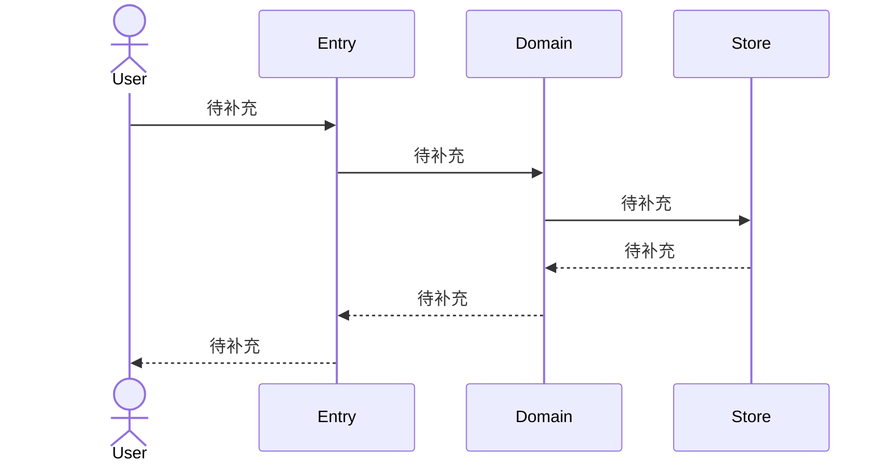
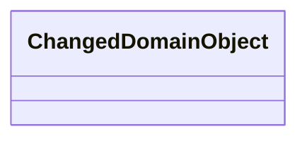
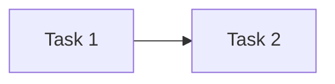

# 公共设计

> **设计结论**：待补充。

## Current 基线与变更范围

### 受影响 Current Truth

| Current 文档 / 模块 | Current | Delta | Target |
| --- | --- | --- | --- |
| 待补充 | 待补充 | 待补充 | 待补充 |

## 总体方案与主流程

### 总体方案

待补充。

### 总业务流程 / 主时序

## 产品变更

| 模块 / 功能 / 规则 | Current | Delta | Target |
| --- | --- | --- | --- |
| 待补充 | 待补充 | 待补充 | 待补充 |

## 接口变更

| 接口 / 协议 | Current | Delta / Target | 兼容策略 | 关联 AC |
| --- | --- | --- | --- | --- |
| 待补充 | 待补充 | 待补充 | 待补充 | `AC-01` 待补充 |

## 领域模型与状态变更

### 领域模型

### 状态 / 不变量变化

| 对象 | Current | Delta / Target | 不变量 / 非法行为 |
| --- | --- | --- | --- |
| 待补充 | 待补充 | 待补充 | 待补充 |

## 数据与表结构变更

### 表结构

| 表 / 存储 | Current | Delta / Target | 数据迁移 / 兼容 |
| --- | --- | --- | --- |
| 待补充 | 待补充 | 待补充 | 待补充 |

### 关键字段 / 索引 / 约束

| 表 | 字段 / 索引 / 约束 | 操作 | 定义与影响 |
| --- | --- | --- | --- |
| 待补充 | 待补充 | 待补充 | 待补充 |

## 应用与组件变更

| 应用 / 组件 | Current 职责 | Target 职责 | 依赖变化 |
| --- | --- | --- | --- |
| 待补充 | 待补充 | 待补充 | 待补充 |

## 关键决策

### D001｜待补充

- **结论**：待补充。
- **原因**：待补充。
- **影响**：待补充。

## 公共设计与不变量

- **事务 / 一致性**：待补充。
- **幂等 / 并发**：待补充。
- **失败与恢复**：待补充。
- **兼容**：待补充。

## Task 关系与设计落点

| Task | 交付结果 | 前置任务 | 关联设计 | 验收 |
| --- | --- | --- | --- | --- |
| `TASK_ID` 任务名称 | 待补充 | 无 | `D001` 决策名称 | `AC-01` 验收名称 |

## 实现自由度与停止条件

- **Worker 可自行决定**：待补充。
- **不可改变**：待补充。
- **必须停止并 replan**：待补充。

## 风险与未决问题

- **风险**：待补充。
- **未决问题**：无。
