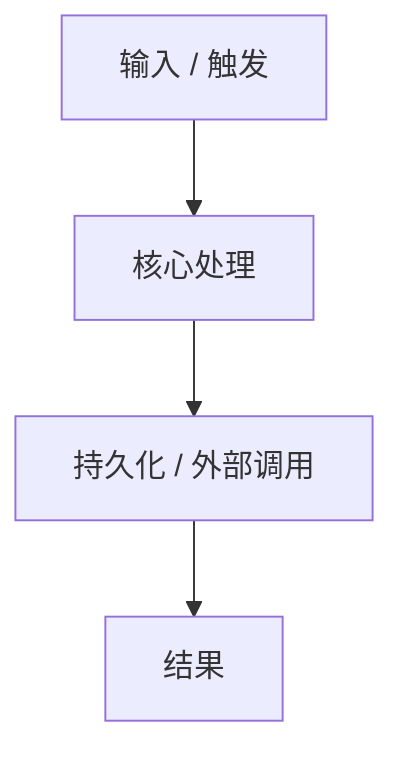

# Task `TASK_ID`：详细设计

> **交付目标**：待补充。
>
> **公共设计**：[Design](DESIGN_PATH)

## 范围与代码落点

### 要做

- 待补充。

### 不做

- 待补充。

### 输入 / 依赖

- 待补充。

### Path Contract

> Path Contract 只保护当前 Task 的写入边界；兄弟 Task 可以声明重叠路径。是否串并行由业务依赖和重合度决定，不以“路径必须互斥”为目标。

| 规则 | 路径 |
| --- | --- |
| allow | 待补充 |
| deny | 无 |

### 代码结构 / 模块落点

| 目录 / 文件 / 类 | 计划变更 | 责任 |
| --- | --- | --- |
| 待补充 | 待补充 | 待补充 |

## Task 实现流程

## 详细设计

### 核心逻辑

待补充。

### Components

| Component / Object | Responsibility |
| --- | --- |
| 待补充 | 待补充 |

### 接口变化

| 接口 / 方法 / 事件 | 变更 | 输入 / 输出影响 |
| --- | --- | --- |
| 待补充 | 待补充 | 待补充 |

### 领域模型 / 状态变化

| 对象 | 变化 | 状态 / 不变量影响 |
| --- | --- | --- |
| 待补充 | 待补充 | 待补充 |

### 数据与表结构变化

| 表 / 存储 | 字段 / 索引 / 约束 | 操作 | 影响 |
| --- | --- | --- | --- |
| 待补充 | 待补充 | 待补充 | 待补充 |

### 失败与兼容

- **失败处理**：待补充。
- **边界场景**：待补充。
- **兼容要求**：待补充。

### Tests

- **正常路径**：待补充。
- **异常路径**：待补充。
- **边界 / 回归**：待补充。

## 依赖与验收

### 前置任务

- 无。

### 关联设计

- `D001`：待补充。

### 验收标准

- `AC-01`：待补充。

### 验证要求

- 只运行当前 Task 直接相关的定向测试、必要 build / static check。
- 不在 Worker 阶段反复运行项目全量测试；全部 Task 集成后的全量验证由 Main 统一执行。

## 实现自由度

- **可以自行决定**：待补充。
- **不可改变**：待补充。

## 交付要求

### Expected Output

- **预计文件**：待补充。
- **交付结果**：待补充。

### Delivery

- 提交实际 revision 与逐文件行为影响。
- 提交与 AC 对应的真实验证结果。
- 完成自审并明确剩余问题 / 未验证项。
