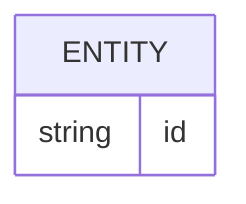

# Database

## Storage Overview

待核实。

## Table List

| Table / Store | Purpose |
| --- | --- |
| 待核实 | 待核实 |

## ER Model

待核实：替换为真实关系。

## 待核实表

### Purpose

待核实。

### Columns

| Column | Type | Nullable | Default | Description |
| --- | --- | --- | --- | --- |
| 待核实 | 待核实 | 待核实 | 待核实 | 待核实 |

### Indexes

| Index | Columns | Unique | Purpose |
| --- | --- | --- | --- |
| 待核实 | 待核实 | 待核实 | 待核实 |

### Constraints

- 待核实。

### Relations

- 待核实。

## 一致性规则

- 事务边界：待核实。
- 幂等 / 唯一性：待核实。
- 历史数据兼容：待核实。
