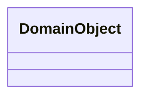

# Domain Model

## Domain Overview

待核实。

## Aggregates

- 待核实。

## Entities

### DomainObject

- **职责**：待核实。
- **关键属性 / 标识**：待核实。
- **业务规则**：待核实。

## Value Objects

- 待核实。

## Relationships

待核实。

## State Machines

[领域状态机](T05-diagrams/T05-04-domain-state.md)

## Domain Rules / Invariants

- 待核实。

## Domain Events

- 待核实。
