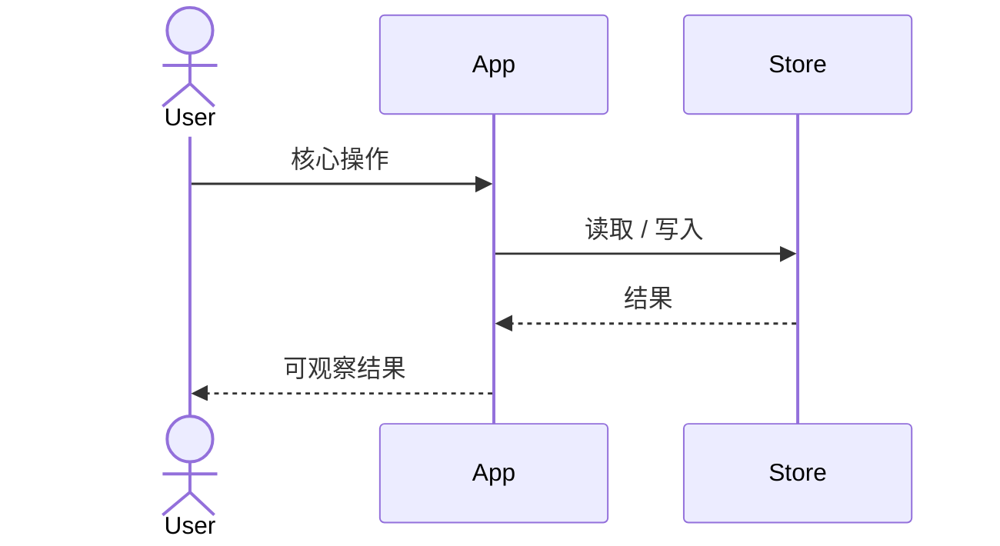

# 主流程时序

## Scenario

待核实。

## Sequence

```mermaid
sequenceDiagram
    actor User
    participant App
    participant Store
    User->>App: 核心操作
    App->>Store: 读取 / 写入
    Store-->>App: 结果
    App-->>User: 可观察结果
```

## Key Rules

- 待核实。

## Related Components

- 待核实。
