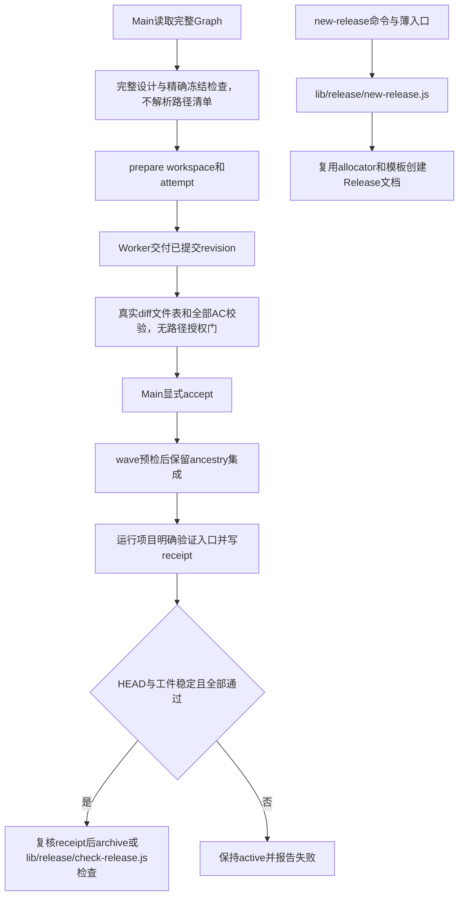

# Task `C03-02`：详细设计

> **交付目标**：在Node中完成完整SDD规划检查、执行/交付/验收/集成和revision-bound验证/归档/Release，直接续用现有canonical契约与Git身份。
>
> **公共设计**：[Design](../../C02-design.md)

## 范围与代码落点

### 要做

- 在已集成 Node 主链上删除 Task Path Contract/changed-path authorization 全机制，复验 readiness、scoped digest、Task transitions、真实 Delivery、workspace/leaf/session、sdd主CLI 和 integration wave。
- 移植receipt/项目验证、check/close及 `lib/release/**` 下的Release创建/检查；原动作flags和JSON保持。
- Node回归与旧契约/receipt/delivery黄金fixture；更新本能力Skill/协议/packet/角色规则，删除文件清单授权要求而不改角色权限/model/effort。
- Python 源码协调器的对应路径门和 helper 同步删除，避免仓库仍有可调用的授权路径；其余过渡 Python 逻辑保留至 C03-06，不新增消费依赖。

### 不做

- 不实现安装、观测或System One，不改其他Task模块/共享ABI、原业务权限/状态机。
- 不在真实项目prepare/freeze/accept/integrate迁移Task；测试只用隔离Gitfixtures，不重置用户活动数据。

### 输入 / 依赖

- `C03-01`文档工具与共享基础的result revision必须已集成；消费graphSchema/compat/lock/bootstrap/allocator。
- 现有workflow/sdd/prepare_workspace/delivery/check_change/validation/leaf/release行为及对应原测试为兼容输入。

### 代码结构 / 模块落点

| 目录 / 文件 / 类 | 计划变更 | 责任 |
| --- | --- | --- |
| lib/workflow/{readiness,contract,transition,evidence}.js | 删除路径必填/授权调用，保留状态/摘要/文件与 AC 完整性 | 整图完整性、真实交付与身份保护 |
| lib/workflow/path-contract.js、sdd-change/scripts/path_contract.{js,py} | 整体删除 parser/glob/matcher/export/helper | 无隐藏 Task 文件授权入口或空壳 |
| lib/workflow/lifecycle.js、sdd-change/scripts/{contract_readiness,delivery_evidence,sdd,workflow}.py | draft/packet/过渡源码删除路径门/文案 | 两条链路不再授权 changed paths |
| AGENTS、agents/{architect,worker}.toml、dispatch-contract、Skills/runtime/protocol references | 删除 Path Contract 依赖和路径越界停止语义 | 冻结业务范围/人工验收/角色权限仍不变 |
| lib/workflow/{workspace,dispatch,leaf}.js | 基线/attempt/session/hostargv | 唯一SDD执行身份、无第二worktree |
| lib/workflow/{cli,integration}.js | status/prepare/deliver/accept/wave | 显式动作和ancestry集成 |
| `lib/workflow/{validation,receipt,closure}.js` | 验证声明/执行/归档 | 同一revision证据与门禁 |
| `lib/release/{new-release,check-release}.js` | Release创建/检查 | 复用allocator与workflow closure，不复制状态或验收逻辑 |
| 原sdd-change/do/close/release scripts .js | 薄入口及公共registry目标 | Node消费操作 |
| tests/node/workflow 与fixtures | 原完整主链/错误/摘要用例 | 可重放Node证据 |

## Task 实现流程

## 详细设计

### 核心逻辑

#### 文件范围机制如何真正消失

删除 `lib/workflow/path-contract.js`、`sdd-change/scripts/path_contract.js` 和过渡 Python `path_contract.py`，移除所有 parse/match/validate import/export。readiness 的完整 Task 结构检查只去掉路径节必填和解析；范围/代码结构、流程图、详细维度、非占位正文、Graph/Design/AC/Dxxx 整图对齐仍强制。新模板由 C03-01 提供，不在本 Task 另起模板事实源。

lifecycle draft 和 evidence 只读取真实 Git diff，不匹配任何 allow/deny；Python contract_readiness/delivery_evidence/sdd 的对应调用和 workflow 默认标签同步删除。Task 文本仍供逐 AC 校验，不能把整个 Task/evidence 参数删掉。validateDelivery 和 record/import/submit/accept/integration/closure 的调用链保持，确保删除的是路径门而非全部交付校验。旧合同含 deny 行或非法旧 glob 不能触发新授权错误，但修改该正文仍使 digest 漂移。绝不 strip 旧节再计算 digest，不添加 allow-all/noop/CLI 开关。

workerDispatchPacket 删除文件路径匹配约束，保留 artifacts/runtime/dependencies/目标业务 scope 与不能改冻 Contract 的要求；workspace 的镜像范围、真实 git 变化保全、report destination/symlink 防护保留。AGENTS/architect/worker/Skills/协议/runtime-guide 将“文件写入范围”改为 Goal/Included/Excluded/AC 的业务约束，仅新增落点不要求路径扩权；真实需求、依赖或设计变化仍返回 contract_change_required。角色委派 allowlist、ownership 和 safeInside 不属于删除面。

#### 冻结与身份链如何保持

readiness一次读取C01/C02/Graph及全部Task Contract，按现有固定维度/真实正文/流程图/reference表校验；status/approve/prepare使用同一逻辑，不允许显式--task绕过不完整兄弟Task。scoped digest按基线提取和拼接字节，使用公共compat text；既有摘要不变，drift不能普通rework接受。

transition保持planned/running/submitted/accepted/blocked，所有撤销传播/history字段/attempt增长与确认flag保留。prepare先检查freeze/base/workspace/依赖精确ancestry，失败不写attempt或创建多余workspace；resume返回原身份和session而不是重新spawn。leaf仅固定四叶角色，Codex exact UUID、其他host exact session、原nativeargv/cwd/overlay语义；平台不派发Agent或补第二层worktree。

delivery读取真实已提交diff及当前attempt，通过文件表、structured evidence、全部AC/enums、摘要/报告校验；不得按 Task Path Contract 授权 changed paths；draft不覆盖证据、不自动claim pass。accept在Main声明之后submit/导入，失败/未执行AC、deviation/unverified等blocker拒绝；重复接受需报告仍同digest。

integration把accepted/pending结果按Graph顺序派生wave，detached临时worktree链式merge预检；冲突返回文件集合不改Main HEAD/权威Graph。正式merge保留result_revision ancestry，不squash替代身份，不新增integrated状态。异常恢复原activeChange snapshot及原Git合并边界；不能用reset/rebase丢用户修改。

validation按公共Design三种声明解析；执行argv且shell=false、cwd=root。旧.py仅显式用户业务入口调用python3；新Node用process.execPath；JSON对象按argv+tracked path domain hash绑定。所有检查前必须HEAD等于requested revision、入口已committed、dirty只允许activeChange收口证据；执行前写失败receipt使旧成功失效，退出/stdout/stderr及stable HEAD/artifact检查后再写最终receipt。archive重新核对当前入口descriptor、result ancestry、contract/report及允许的Change证据范围，失败保持active。

Release实现固定落在 `lib/release/**`：`new-release` 保持registry路由到 `lib/release/new-release.js`，使用allocator和模板创建文档；`check-release` 保持registry路由到 `lib/release/check-release.js`，调用本Task的workflow closure接口判定真实完成Change，不自动部署/生成pass。原sdd-release .js脚本仍为薄入口；适配新运行时但不改变Release字段/checklist判定。

### Components

ContractReader/ReadinessGate/TransitionService拥有唯一状态语义；ExecutionIdentity/Dispatcher仅产出身份和packet。GitAdapter使用argv subprocess并验证revision/ancestor/diff/filelist；IntegrationWave是派生集合。EvidenceValidator/AcceptanceGate保持人工判断与机械拒绝边界。

ValidationResolver生成 `{kind, argv, descriptor:{path,sha256}}` 内部对象；ReceiptStore持久格式仍schema1；ClosureChecker跨Graph/Git/receipt核对。`lib/release/new-release.js` 组合allocator与模板，`lib/release/check-release.js` 复用ClosureChecker；workflow不另设Release实现副本。所有文件写复用共享锁/atomic，禁止重复兼容编码。

### 接口变化

公开sdd six actions与原flags保持，task-graph五动作及确认flag保持；record/import/accept/check/close/validation/leaf/Release通过Node薄入口提供原语义。共享输出dispatch路径必须指向当前baseline/workspace的工件，不从未来Task摘要推断。

新验证JSON声明由同一resolver供run-validation和archive使用；描述不含command密钥值，不把argv写进Graph。项目原.py入口兼容不能传播成平台Python依赖。

### 领域模型 / 状态变化

无变化。保留原Task/attempt/history/session与所有状态转移；accepted/integrated/archived/Release分别保持。维修锁、主进程退出或新runtimeversion不自动触发replan。

### 数据与表结构变化

Graph、Markdown/Delivery和receipt schema无变化。新 Task 不再有路径授权节；旧节作为正文原样冻结而不执行。旧全文编码/hash 算法与旧 script descriptor 保持；仅未变旧正文/报告仍得原摘要，新正文/新 attempt 报告使用新的真实摘要；新argv形式的复合SHA按公共Design固定，不改变旧receipt读取。Git metadata的sdd-validation存储位置、业务仓库外证据规则保持。

### 失败与兼容

- **失败处理**：不完整/漂移/stale/dirty/error非零，不能填写伪成功；validation子进程启动失败也留下失败receipt，已accepted结果不会在未集成时解锁下游。
- **边界场景**：git filenames有空格/Unicode/rename，重复accept/integrate、wave中途冲突、脏Main/worktree、removed worktree、session歧义、无解释器、验证改变HEAD/证据、SIGKILL残锁。
- **兼容要求**：落实D002–D006。原Python命令不支持，但canonical已有数据直接续用；不读取新runtime未声明的猜测defaults或放宽旧AC。

### Tests

- **正常路径**：`node --test tests/node/workflow/*.test.js`；Node完成多Task准备→交付→显式接受→wave→真实验证receipt→归档，Release模板/check。
- **异常路径**：缺任何完整设计/reference/flow、drift、stale attempt、diff 文件表漏项/多项/重复/错误操作、失败/未验证/偏差、篡改报告、未集成依赖、冲突wave、缺解释器、receipt伪造/漂移/失败、验证改变工件。
- **边界 / 回归**：映射test_contract_readiness、test_lean_cli、test_lean_contracts的交付/Path部分、test_sdd的lifecycle/Markdown/graph transition、test_leaf_launcher及process/consolidation的执行收口用例；scoped AC/Dxxx与CRLF黄金digest；旧receipt fixture可validate且新Node receipt拒绝旧passed。
- **新机制删除用例**：无路径节的新完整 Task 走 status/approve/prepare；含冲突旧 allow/deny 的完整 Task 也可走 draft→record/deliver→import/submit→人工 accept→integrate→check/close，修改不同于旧 allow 的真实文件可交付。逐入口检查不加载授权器。真实 diff 少/多/重复/错误操作和 AC 缺失仍拒绝，冻结漂移/错误 baseline/attempt/session/依赖 ancestry 仍拒绝。安全路径/报告 symlink/用户文件/域锁/ownership 反例不得回退。
- **旧测试与黄金向量**：原 Path 必填、outside/deny wins、兄弟表重叠断言逐项改为无路径门的反向验证；混合文件完整性用例保留。test_process_modes 的角色/模板断言改为业务 Contract/局部设计完整，其他角色策略不变。legacy digest fixture 固定保存原基线全文/来源，不用重规划的新摘要覆盖旧 golden；新无路径 Task 另有独立 fixture，证明 CRLF/scoped hash 算法不变。过渡 Python 源码仅做静态/定向兼容核对，消费端 Node 测试不需要它。
- **隔离要求**：Git与业务验证fixtures只在临时目录，fake host CLIs记录argv/cwd/session；不得对迁移Change实际approve/prepare或调用模型。

## 依赖与验收

### 前置任务

- `C03-01`：文档工具与共享基础，result已集成。

### 关联设计

- `D002`：精确兼容编码。
- `D003`：锁与崩溃保全。
- `D004`：稳定模块布局。
- `D005`：SDD生命周期与Git身份。
- `D006`：用户验证声明与receipt。

- `D011`：取消文件路径授权，保留业务 Contract、身份与数据安全。

### 验收标准

- `AC-03`：完整规划、冻结与状态门。
- `AC-04`：执行、交付、验收及集成。
- `AC-05`：验证、receipt、归档与Release。

### 验证要求

- 本Task只跑workflow定向测试/必要syntax/static，给出旧case映射及digest/receipt fixture出处。
- 全量、宿主真实smoke和最终revision acceptance归Main；不提前填写Change通过。

## 实现自由度

- **可以自行决定**：内部聚合/函数拆分、Git fixture组织、非协议日志措辞。
- **不可改变**：状态/摘要/fields、public flags、人工Acceptance、Git ancestry、验证归属、依赖/业务范围；缺口回Architect，不降保护。

## 交付要求

### Expected Output

- **预计文件**：`lib/workflow/**`、`lib/release/**`、对应Node scripts/协议指引、tests/node/workflow与legacy golden。
- **交付结果**：无文件路径授权的完整 Node SDD 主链、旧正文/摘要算法/身份保护复验和新无路径设计证据，供完整安装Task消费；所有Node入口无Python后台。

### Delivery

- 实际revision、逐文件影响、逐验收真实定向结果和自审；说明旧数据续用、异常失败边界和未验证环境。
